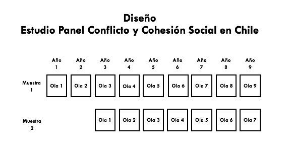

# Implementación de la Encuesta {#impenc}

COES realizó una licitación pública para la ejecución del ELSOC. El Centro Micro Datos (CMD) de la Facultad de Economía y Negocios de la Universidad de Chile se adjudicó dicho concurso y se encargará del desarrollo de la encuesta, incluyendo el trabajo de campo durante las primeras tres olas. El acuerdo conMicro Datos contempla los más altos estándares de calidad y asegura un adecuado resguardo de los datos personales de contacto de los participantes del estudio panel.

El diseño muestral fue desarrollado por la consultora internacional Stephanie Eckman y el Centro de Inteligencia Territorial (CIT) en base a los criterios definidos por COES. De todos modos, el Centro MicroDatos apoyó en el diseño muestral y planteó observaciones relevantes para la implementación del estudio. A su vez, fueron los encargados de elaborar la propuesta de aumento muestral durante el levantamiento.

## Empadronamiento {#empad}

El levantamiento de datos por parte del CMD se inicia con el desarrollo de un empadronamiento que tiene como objetivo identificar y listar todas las viviendas elegibles (USM) en las manzanas elegidas. Dentro de este proceso de empadronamiento,MicroDatos detectó que en un número de importante de manzanas existían más de 100 viviendas, motivo por el cual se desarrolló un procedimiento de visita para enumerar las viviendas y definir submanzanas. Las manzanas con menos de 100 viviendas fueron empadronadas directamente, mientras las otras fueron visitadas para su enumeración y verificación de que éstas se componen de viviendas particulares. Posteriormente se subdividen en grupos de viviendas en un rango de 40 a 50 según las características de la manzana ^[Más detalles se encuentran disponibles en el Informe Anual de Servicios para el Levantamiento del Estudio Longitudinal sobre Conflicto y Cohesión Social (COES) elaborado por MicroDatos.].

El objetivo del empadronamiento es contar con un listado actualizado de direcciones junto con información cartográfica relevante e indicaciones de referencia útiles para el trabajo del encuestador. El empadronamiento fue desarrollado de manera presencial. Los encargados contaron con pautas para el empadronamiento de viviendas.

Posteriormente se selecciona una vivienda ^[Se define operacionalmente vivienda como un espacio físico que en su interior habita una familia o grupo de personas que vive bajo el mismo techo. Existen protocolos sobre la definición de vivienda relativos a la identificación de éstas y casos específicos (viviendas pareadas, viviendas ampliadas, viviendas con más de una entrada, etc.). No se incluyen espacios físicos dónde no viven grupos familiares como locales comerciales, oficinas, iglesias, centros comunitarios, etc.] al azar por manzana y las cuatro restantes utilizando el procedimiento de salto sistemático.

El procedimiento anterior da lugar al desarrollo de croquis que permiten identificar visualmente las viviendas seleccionadas junto a indicaciones -en caso de ser necesarias- para señalizar su ubicación. Lo anterior se ve complementado con una codificación de los inmuebles incluidos en el recorrido, de modo de distinguir las viviendas particulares ocupadas de otros tipos de construcciones y de facilitar la planificación del trabajo de campo. La etapa final de este procedimiento es la georreferenciación de lamuestra seleccionada para contar con la ubicación geográfica asociada a cada levantamiento.

## Pilotaje del Cuestionario {#pilotaje}

En paralelo al proceso de empadronamiento se desarrolló la preparación definitiva del cuestionario de ELSOC. COES y CMD colaboraron en la revisión final del cuestionario, lo cual tuvo como productos la diagramación en papel del cuestionario y su posterior programación para que fuera aplicada en tablets (el cuestionario fue aplicado de manera presencial utilizando el sistema CAPI). Posteriormente se realizó una versión piloto del estudio con el fin de testear el instrumento como evaluar el funcionamiento operativo del levantamiento de datos.

El piloto se realizó con una lista de 130 direcciones, distintas a las cuales se les aplicó el cuestionario final. Dicho pre-testeo fue ejecutado exclusivamente en la regiónMetropolitana, durante 15 días corridos. Posteriormente se desarrolló un focus group con encuestadores orientado a obtener recomendaciones relevantes para el levantamiento final de la encuesta.

Los resultados de dichos estudios permitieron estimar de mejor modo los tiempos requeridos para el desarrollo de la entrevista por parte del encuestador, afinar el fraseo del cuestionario y dimensionar de mejor modo los esfuerzos requeridos para el levantamiento de datos. En caso de que desee obtener más información sobre el piloto, puede solicitar dicha información a
encuestacoes@gmail.com.

## Planificación y Ejecución del Campo {#plan}

El CMD elaboró un Manual del Encuestador para la implementación del Estudio Panel y en conjunto con COES preparó documentos orientadores y protocolos para la aplicación del cuestionario. Esto incluye:

1. **Protocolo de Visita**: primer contacto con la vivienda, primer contacto con el hogar y concertación de entrevistas en casos en que no se puede realizar entrevista al momento de visita.

2. **Protocolo ante Casos Difíciles**: escenario de negaciones, escenario de más de 4 intentos presenciales sin contacto, barreras de acceso a la vivienda, no contacto con la vivienda. También contempla estrategias de recuperación.

3. **Protocolo de Aplicación del Cuestionario**: descripción del estudio, consentimiento informado, aplicación de preguntas, manejo de interrupciones, entrega de gift cards.

4. **Protocolo de Campo**: respaldo de información, control de avances, registro de contactos.

El CMD se encargó de la selección y capacitación del personal requerido (coordinadores y encuestadores). La implementación del entrenamiento se hizo por áreas geográficas, de modo de garantizar la calidad del levantamiento de datos. Se dispuso de 4 sedes de trabajo (2 en la Región Metropolitana, una en Valparaíso y otra en Biobío) administradas por coordinadores de zona. La capacitación de los encuestadores en el levantamiento se realizó en cada sede y hubo encuestadores apoderados, quienes posteriormente se encargaron de capacitar a los encuestadores en las regiones en que no hubo sedes (áquellas con menos de 400 encuestas a realizar).

El levantamiento de información fue realizado en un período de aproximadamente 20 semanas -contadas desde la entrega de material a los encuestadores tras la capacitación-, durante los meses de Agosto, Septiembre, Octubre, Noviembre y Diciembre de 2016. Para la ejecución del terreno se contó con 132 encuestadores distribuidos en las sedes de trabajo antes referidas. Todos fueron debidamente capacitados, para posteriormente ser citados para retirar el material de trabajo (hojas de ruta, citas concertadas, croquis de ubicación y tablet).

El encuestador utiliza el protocolo de entrevista para conformar un listado de las personas que son residentes habituales de la vivienda y cumplen con los criterios de edad del estudio. En base a dicho listado, se selecciona aleatoriamente a una persona en cada vivienda que cumpla los requisitos de elegibilidad utilizando el Método de Kish. Claro está, las encuestas se realizaron cara a cara en las viviendas de los entrevistados seleccionados. Las respuestas de los entrevistados fueron almacenadas en tablets provistas por CMD. La información recolectada era subida por los encuestadores a una plataforma web utilizando la tablet de CMD.

De todos modos, ocurrieron imprevistos en el terreno. Principalmente se tuvo que extender la duración planificada del trabajo de campo (de orginalmente 8 a 12 semanas a finalmente un horizonte de entre 19 y 20 semanas). Lo anterior se debe a que producto de dificultades de acceso de la muestra y dispersión no se lograron los avances semanales planificados. Buena parte de los problemas asociados se concentraron en la Región Metropolitana. Para abordar los problemas de implementación fue necesario diseñar un aumento de lamuestra entre COES y CMD.

Por otra parte hubo problemas para la convocatoria y permanencia de los encuestadores en el proyecto. Lo anterior hizo necesario ajustar los pagos propuestos a los encuestadores.

## Supervisión del Trabajo de Campo {#supervision}

El Centro MicroDatos desarrolló un proceso de supervisión del trabajo en terreno involucrando tres etapas:

1. Supervisión del 100% de las encuestas recopiladas, realizado de manera simultánea por el Coordinador de Grupo. Para esto se utilizó una aplicación web diseñada para estos fines. Esto implicó la verificación del sujeto entrevistado, revisión de variables claves, revisión del resultado de visita y revisión de duración de entrevista.

2. Retroalimentación de encuestadores de manera periódica por parte del jefe de zona como revisión de los datos recolectados por el equipo central deMicroDatos. Esto dio lugar a reportes periódicos de avance del levantamiento de datos.

3. Supervisión de encuestas por uso de CAPI. El software desarrollado para el cuestionario
permite manejar de mejor modo la no respuesta, validar internamente el flujo del
cuestionario (evitar problemas con filtros) y recolectar información sobre el tiempo de
aplicación.

4. Revisión de casos especiales y validación ex post. Finalmente CMD revisó el funcionamiento del flujo de respuestas y descartó casos por no cumplir con elmínimo de 300 respuestas a items o por tiempos de aplicación demasiado cortos (inferiores a 30 minutos).

En paralelo a la revisión y/o eliminación de casos, CMD desarrolló un proceso de validación de los valores de entrevistados a distintas preguntas abiertas del cuestionario. Lo anterior involucró la imputación de valores o la asignación de valores perdidos. Más detalles de dicho procedimiento se encuentran en el “Reporte de Validación de datos ex post”, el cual puede ser solicitado al Equipo Encuesta COES.

## Códigos de Disposición Final de Casos {#codigos}

Siguiendo los estándares de la Asociación Americana de Investigación en Opinión Pública (AAPOR por su sigla en inglés), se asoció a cada uno de los 5156 casos de la muestra completa un código de disposición final (Ver Cuadro \@ref(tab:disp)).

En base a dicha información, la primera ola del Panel COES tiene las siguientes tasas de resultados:

* Tasa de Respuesta (RR2) de 62.4%.
* Tasa de Rechazo (REF2) de 8.9%.
* Tasa de Cooperación (COOP2) de 86.0%.
*¨Tasa de Contacto (CON2) de 72.6%.

Si desea conocer más detalles sobre la determinación de los códigos de disposición final de casos
y el cálculo de las tasas de resultados, dirigirse a [http://www.aapor.org/AAPOR_Main/media/
publications/Standard-Definitions20169theditionfinal.pdf](http://www.aapor.org/AAPOR_Main/media/
publications/Standard-Definitions20169theditionfinal.pdf).


```{r echo=FALSE, message=FALSE, warning=FALSE}
library(pacman)
pacman::p_load(tidyverse,knitr,kableExtra,dplyr,tinytex)

disp <- tibble(Codigo_General = c(" ", ""),
                  "Código Específico" = c("Entrevistado", ""),
                  " " = c("Completo", "Parcial"),
                  "Casos" = c("2927","18")) %>% 
  add_row(Codigo_General = c(" ", "",""),
                  "Código Específico" = c("No Entrevistado","",""),
                  " " = c("Rechazo", "No contacto", "Otro"),
                  "Casos" = c("426", "1229", "43")) %>%
    add_row(Codigo_General = c("",""),
                  "Código Específico" = c("",""),
                  " " = c("",""),
                  "Casos" = c("79","")) %>% 
     add_row(Codigo_General = c("",""),
                  "Código Específico" = c("",""),
                  " " = c("",""),
                  "Casos" = c("332","")) %>% 
    add_row(Codigo_General = c("",""),
                  "Código Específico" = c("",""),
                  " " = c("",""),
                  "Casos" = c("5054","")) 


disp%>%
  kable(booktabs = TRUE,  caption="\\label{tab:disp}Códigos de Disposición Final de Casos") %>%
  kable_styling(latex_options = "HOLD_position") %>%
  column_spec(c(1), width = "6cm") %>%
  column_spec(c(2,3), width = "3cm") %>%
  column_spec(c(4), width = "2cm") %>%
  row_spec(1:11, background = "white") %>% 
  pack_rows("Elegible", 1,5) %>%
  pack_rows("Elegibilidad descononocida", 6,7) %>%
  pack_rows("No elegible", 8,9) %>%
  pack_rows("TOTAL", 10,11) %>%
  kable_classic(full_width = F)

```


## Futuras Olas del Estudio Longitudinal {#futuras}

El Centro Micro Datos ha diseñado una estrategia de seguimiento de los entrevistados con el fin de fidelizarlos y minimizar la atrición. En paralelo, ha desarrollado un plan de trabajo con el objetivo de ajustar el diseño muestral del estudio y mantener los estándares de calidad en la ejecución de la encuesta. El trabajo de campo de la segunda ola de ELSOC fue desarrollado entre Julio y Octubre de 2017. Los resultados de la segunda ola de ELSOC están disponibles, pero se encuentran bajo embargo. Acorde a la política de liberación de datos de ELSOC, éstos se liberarán de manera parcelada. Si desea obtener información adicional sobre esto, puede escribir a encuestacoes@gmail.com.

Un aspecto esencial de la planificación de ELSOC desde sus orígenes fue la atrición presupuestada. Desde la etapa de diseño se contemplaron distintos escenarios potenciales de atrición y se definió el diseño muestral acorde a las conclusiones de dicho examen (Ver Figura \@ref(fig:atri)). A su vez, los escenarios de atrición fueron parte de los objetivos que guiaron el diseño de la licitación del estudio y el trabajo con CMD. En ELSOC 2017 se recuperó un 84.49% de lamuestra de 2016, porcentaje de atrición mejor al esperado.

 
```{r atri, echo=FALSE, fig.align='center', fig.height=1, out.height="75%", out.width="75%", fig.cap='a. Diseño Muestral de ELSOC según Ola.'}
knitr::include_graphics("imagenes/attrition_01.png")
```

Según el plan de trabajo contemplado por COES, durante el 2018 se levantará la tercera ola de ELSOC. En esta tercera ola se volverá a entrevistar a las personas encuestadas en la primera ola (2016), donde además se integrará una muestra de refresco de 1400 casos. El objetivo de la muestra de refresco es corregir la subcobertura de ciertos grupos poblacionales y ajustar por la pérdida de casos dado la atrición. Los resultados de la tercera ola estáran disponibles durante el primer semestre del 2019.

```{r design, echo=FALSE, fig.align='center', fig.height=1, out.height="85%", out.width="85%", fig.cap='b. Diseño Muestral de ELSOC según Ola.'}

```

