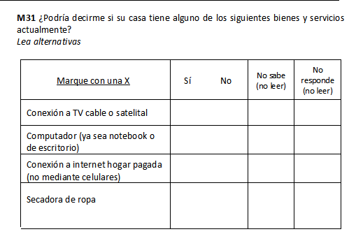
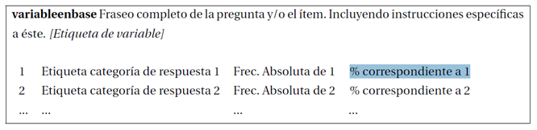
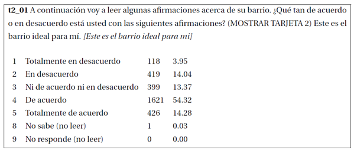
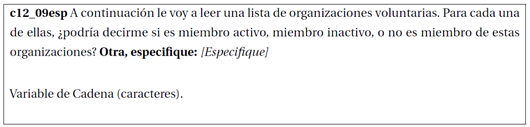
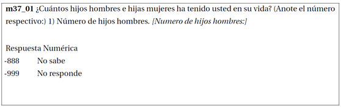

# Libro de Códigos Base de Datos ELSOC 2016 {#libro}

Para un uso adecuado de la base de datos de la primera ola de ELSOC COES se recomienda a los investigadores trabajar con el libro de códigos, el cual se presenta a continuación. Este apartado detalla el fraseo de cada uno de los ítemes incluidos, las distintas categorías de respuestas asociadas a éste, y el nombre de las variables como las etiquetas incorporadas en la base de datos. Ahora se incorporan recomendaciones generales para el uso de la base de datos y los libros de códigos.

## Variables ELSOC Ola 1 {#variablesola}

La base de datos de ELSOC Ola 1 (2016) contiene una fila por cada entrevistado (son 2983 casos) y una columna por cada variable. Las variables corresponden a los ítemes incluidos en el cuestionario del estudio. Ahora, es necesario que el usuario comprenda plenamente qué es un ítem.

La Figura 3 presenta, a modo de ejemplo, la pregunta M31 del cuestionario de ELSOC, dónde se consulta a los entrevistados si posee alguno de los siguientes bienes y servicios. En esta pregunta, se incluyen 4 ítemes distintos, correspondientes a cada uno de los cuatro bienes o servicios. En el ejemplo, el primer ítem corresponde a: “Conexión a TV cable o satelital". Cada ítem corresponde a una variable incluida en la base de datos. El nombre de las variables de la base de datos se construye combinando:

* El código de la variable en el cuestionario, en letrasminúsculas (en el ejemplo corresponde
a m31).
* Valores numéricos correlativos al orden de los ítems, tal como aparecen en el cuestionario
(01, 02, 03 y 04), separado por un guión bajo _ (en el primer caso, sería m31_01).

```{r item, echo=FALSE, fig.align='center', fig.height=1, out.height="75%", out.width="75%", fig.cap='Ejemplo de Pregunta con Múltiples Ítemes en Panel COES.'}


```

El libro de códigos fue diseñado de modo de que sintetice toda la información relevante sobre las variables de la base de datos en un formato común para facilitar su uso. De manera genérica, las variables incluidas en la base de datos tienen el siguiente formato:

```{r instvar, echo=FALSE, fig.align='center', fig.height=1, out.height="90%", out.width="90%",  fig.cap='Ejemplo Variable de la Base de Datos'}

```


A continuación, se presenta un ejemplo para clarificar dicha estructura. En este caso, **t2_01** es el nombre de dicho item del cuestionario en la base de datos (como variable). Pormedio de estos códigos se pueden identificar los distintos ítemes incluidos. **Se recomienda rastrear las variables en el Libro de Códigos y en la base de datos según dicho nombre**. Junto a este código aparece la etiqueta de variable incluida en la base de datos ELSOC. En este caso es *Este es el barrio ideal para mí*. Las etiquetas fueron diseñadas por el equipo ELSOC con el objetivo de describir demodo sucinto el fenómeno o dimensión a medir ^[Se intenta preservar el ítem original. Los cambios introducidos se hicieron por motivos de espacio.], eliminando tildes y otros símbolos no incluidos en todos los softwares estadísticos (por ejemplo, la ñ).

Los distintos valores listados corresponden a las categorías de respuesta asociadas al ítem. En la construcción de la base de datos, dichas categorías fueron ingresadas como valores numéricos y se incluyeron etiquetas de valores. En el ejemplo anterior, si una persona se manifiesta totalmente en desacuerdo con el enunciado, en la encuesta a su respuesta se le asignará un valor numérico de 1, por lo que se podrán realizar operaciones aritméticas con esta respuesta. De todos modos, se incluye una etiqueta para indicar que el valor 1 corresponde con la respuesta ”Totalmente en desacuerdo”.


```{r echo=FALSE, fig.align='center', fig.height=1, out.height="80%", out.width="80%", fig.cap='Ejemplo Variable t2_01'}


```


Por último, es importante también tener en cuenta la información no incluida en este libro de códigos. *“A continuación voy a leer algunas afirmaciones acerca de su barrio. ¿Qué tan de acuerdo o en desacuerdo está usted con las siguientes afirmaciones?"* corresponde la fraseo exacto de la pregunta, (MOSTRAR TARJETA 2) aparece entre paréntesis y corresponde a una instrucción para el encuestador. Estos elementos son incluidos demanera completa en el Cuestionario y el Listado de Variables correspondiente.

Las variables que poseen categorías residuales de no respuesta (No Sabe y No Responde), generalmente se codifican como 8/9 o 88/99, dependiendo de la anchura de la variable. **La base de datos de ELSOC 2016 homologa todos las respuestas No Sabe a -888 y No Responde a -999** y chequea la naturaleza de los valores perdidos restantes (los cuales corresponden en su totalidad a la aplicación de filtros). Las respuestas No Sabe y No Responde no fueron eliminadas ni transformadas en valores perdidos en la base de datos, de modo que los usuarios deben decidir qué hacer con dichos valores de respuesta. La etiqueta de valores de éstos incluye la instrucción de no ser leídos por el encuestador. En el caso de que la pregunta contenga un filtro, los valores no relevantes (filtrados) aparecen en la última línea y no tienen asignado valores ni etiquetas (son valores perdidos por el sistema).

Las variables de cadena (texto) no presentan códigos, ya que presentan los verbatim literales de lasmenciones por parte de los encuestados ^[Los ítemes m03, m04, m22 y m23 son de respuesta abierta, y el CMD elaboró nuevas variables (cod_m03, cod_m04,cod_m22 y cod_m23), las cuales corresponden a recodificaciones de éstas siguiendo el protocolo de Clasificación Internacional de Ocupaciones Uniforme CIOU 88.]. El único cambio introducido -y fue realizado por motivos de compatibilidad entre softwares- fue la eliminación de símbolos tales como tildes, diéresis y otros caracteres especiales. A continuación se presenta el ejemplo de una de dichas preguntas:

```{r echo=FALSE, fig.align='center', fig.height=1, out.height="90%", out.width="90%", fig.cap='Ejemplo Variable c12_09'}


```


En el caso de los ítems dónde se pide una respuesta numérica tampoco existen categorías de respuesta, registrándose el valor indicado por el entrevistado. De todos modos se incluyen etiquetas de valores para los valores perdidos. A continuación, un ejemplo de un ítem de este tipo:


```{r echo=FALSE, fig.align='center', fig.height=1, out.height="90%", out.width="90%", fig.cap='Ejemplo Variable m37_01'}


```


## Características Base de Datos ELSOC Ola 1 {#caracterbase}

La versión actual de la base de datos (2.0) contiene información para los 2983 entrevistados (N definitivo tras supervisión) en relación a los 336 items del cuestionario (cada una corresponde a una variable en la base de datos) y un conjunto adicional de variables:

1. **Identificadoras de Casos**: id de la encuesta, comuna de residencia y región de residencia.

2. **Caracterización del Hogar**: las variables sexo, edad, tamaño del hogar, miembroi_sexo y miembroi_edad fueron obtenidas en base a la información reunida en la Tabla Kish utilizada dentro del proceso de selección de encuestados.

3. **Variables Codificadas**: codificación en base a CIOU 88 del oficio y actividad del entrevistado y del jefe del hogar (en caso de que el entrevistado no sea el jefe del hogar). Dicha codificación fue realizada por el CentroMicro Datos.

4. **De Diseño Muestral Complejo**: ponderadores (y factores de expansión), estrato y segmento para incorporar el diseño complejo de la encuesta.

Dentro de las variables de diseñomuestral complejo, el estrato identifica a los seis previamente definidos ^[Los estratos 4, 5 y 6 tienen sub-estratos Norte y Sur.]: Gran Santiago (1), Gran Valparaíso (2), Gran Concepción (3), Ciudades Grandes(4), Ciudades Medianas (5) y Ciudades Pequeñas (6). La variable segmento1 representa lasmanzanas/ bloques, pero los valores son artificiales (generados por MicroDatos y no corresponden a los valores reales) de modo de garantizar la privacidad de los entrevistados.

**De manera genérica se recomienda la utilización de los ponderadores 01 y 02 correspondientes a ponderadores muestrales que ajustan en base a la probabilidad de selección, no respuesta y población objetivo estimada a nivel regional. El ponderador 02 también ajusta en base a la población estimada según sexo. Sin embargo, la versión 3.0 no contiene los ponderadores muestrales definitivos acordes a la eliminación de las entrevistas falsificadas. Se recomienda discreción a los investigadores** 

Aún no se encuentran disponibles en la base de datos las variables georreferenciadas que proveerá el Centro de Inteligencia Territorial (CIT), siendo estomotivo de una nueva versión de la base de datos.

Las bases de datos se encuentran disponibles en formatos .dta (compatibles con versiones Stata 13 y 14), .sav (compatibles con SPSS) y .RData (compatibles con R, los objetos contienen como atributos etiquetas de variables y valores). El Equipo de Encuestas COES también cuenta con bases de datos adicionales sobre la encuesta (en formato .dta y/o .xlsx):

1. Casos supervisados.
2. Capacitaciones a encuestadores.
3. Duración de entrevistas.
4. Códigos de disposición final muestra completa.
5. Diseño y selección muestra.
6. Tabla Kish.
7. Construcción de ponderadores.

Sin embargo, los archivos anteriormente listados deben ser solicitados al Equipo de Encuestas, justificando el uso que se darán a los datos requeridos. El Equipo de Encuestas COES decidirá la pertinencia de dichas solicitudes y se reserva el derecho para entregar dichos datos.

Las variables sexo y edad del entrevistado, caracterización de todos los miembros del hogar (sexo y edad) y número de integrantes del hogar no formaron parte del cuestionario del estudio. Dicha información presente en la base de datos fue obtenidas de la Tabla Kish de registro de miembros del hogar para la selección aleatoria del entrevistado. Debe tenerse en consideración que en 55 encuestas **no hay correspondencia entre la variable de tamaño del hogar (nhogar) y el conteo de miembros descritos**. No fue posible determinar el origen de los problemas de registro, por lo que se deja en manos de los investigadores el modo en que aborden dicha discrepancia. En el Cuadro \@ref(tab:caracthogar) se detallan los 55 casos problemáticos, indicando el tamaño del hogar correspondiente a la variable nhogar y el resultante de contar las variables descriptoras de miembros del hogar (conteo miembros). La columna final detalla la diferencia resultante: para 48 casos hay una diferencia de 1, tres con una diferencia de 2, dos con 3 casos y dos con 4 casos.

```{r echo=FALSE, message=FALSE, warning=FALSE}
library(pacman)
pacman::p_load(tidyverse,knitr,kableExtra,dplyr,tinytex)

caract_hogar <- tibble(ID_Encuesta = c("1101132"),
                  "Tamaño Hogar (nhogar)" = c("4"),
                  "Tamaño Hogar (conteo miembros)" = c("3"),
                  "Diferencia" = c("1")) %>% 
  add_row(ID_Encuesta = c("2101041"),
                  "Tamaño Hogar (nhogar)" = c("6"),
                  "Tamaño Hogar (conteo miembros)" = c("5"),
                  "Diferencia" = c("1")) %>%
    add_row(ID_Encuesta = c("3101143"),
                  "Tamaño Hogar (nhogar)" = c("9"),
                  "Tamaño Hogar (conteo miembros)" = c("8"),
                  "Diferencia" = c("1")) %>% 
     add_row(ID_Encuesta = c("3301233"),
                  "Tamaño Hogar (nhogar)" = c("7"),
                  "Tamaño Hogar (conteo miembros)" = c("6"),
                  "Diferencia" = c("1")) %>% 
    add_row(ID_Encuesta = c("4204012"),
                  "Tamaño Hogar (nhogar)" = c("4"),
                  "Tamaño Hogar (conteo miembros)" = c("3"),
                  "Diferencia" = c("1")) %>% 
     add_row(ID_Encuesta = c("4301221"),
                  "Tamaño Hogar (nhogar)" = c("3"),
                  "Tamaño Hogar (conteo miembros)" = c("2"),
                  "Diferencia" = c("1")) %>%
  add_row(ID_Encuesta = c("5101154"),
                  "Tamaño Hogar (nhogar)" = c("6"),
                  "Tamaño Hogar (conteo miembros)" = c("5"),
                  "Diferencia" = c("1")) %>%
  add_row(ID_Encuesta = c("5101154"),
                  "Tamaño Hogar (nhogar)" = c("6"),
                  "Tamaño Hogar (conteo miembros)" = c("5"),
                  "Diferencia" = c("1")) %>%
  add_row(ID_Encuesta = c("5101403"),
                  "Tamaño Hogar (nhogar)" = c("5"),
                  "Tamaño Hogar (conteo miembros)" = c("4"),
                  "Diferencia" = c("1")) %>%
  add_row(ID_Encuesta = c("5101536"),
                  "Tamaño Hogar (nhogar)" = c("5"),
                  "Tamaño Hogar (conteo miembros)" = c("4"),
                  "Diferencia" = c("1")) %>%
  add_row(ID_Encuesta = c("5103033"),
                  "Tamaño Hogar (nhogar)" = c("5"),
                  "Tamaño Hogar (conteo miembros)" = c("4"),
                  "Diferencia" = c("1")) %>%
  add_row(ID_Encuesta = c("5109152"),
                  "Tamaño Hogar (nhogar)" = c("5"),
                  "Tamaño Hogar (conteo miembros)" = c("4"),
                  "Diferencia" = c("1")) %>%
  add_row(ID_Encuesta = c("5109242"),
                  "Tamaño Hogar (nhogar)" = c("6"),
                  "Tamaño Hogar (conteo miembros)" = c("5"),
                  "Diferencia" = c("1")) %>%
  add_row(ID_Encuesta = c("5402021"),
                  "Tamaño Hogar (nhogar)" = c("3"),
                  "Tamaño Hogar (conteo miembros)" = c("2"),
                  "Diferencia" = c("1")) %>%
  add_row(ID_Encuesta = c("5701143"),
                  "Tamaño Hogar (nhogar)" = c("3"),
                  "Tamaño Hogar (conteo miembros)" = c("2"),
                  "Diferencia" = c("1")) %>%
  add_row(ID_Encuesta = c("5801044"),
                  "Tamaño Hogar (nhogar)" = c("8"),
                  "Tamaño Hogar (conteo miembros)" = c("7"),
                  "Diferencia" = c("1")) %>%
  add_row(ID_Encuesta = c("5801081"),
                  "Tamaño Hogar (nhogar)" = c("4"),
                  "Tamaño Hogar (conteo miembros)" = c("3"),
                  "Diferencia" = c("1")) %>%
  add_row(ID_Encuesta = c("6101191"),
                  "Tamaño Hogar (nhogar)" = c("7"),
                  "Tamaño Hogar (conteo miembros)" = c("6"),
                  "Diferencia" = c("1")) %>%
  add_row(ID_Encuesta = c("8101128"),
                  "Tamaño Hogar (nhogar)" = c("4"),
                  "Tamaño Hogar (conteo miembros)" = c("3"),
                  "Diferencia" = c("1")) %>%
  add_row(ID_Encuesta = c("8101225"),
                  "Tamaño Hogar (nhogar)" = c("5"),
                  "Tamaño Hogar (conteo miembros)" = c("4"),
                  "Diferencia" = c("1")) %>%
  add_row(ID_Encuesta = c("8106021"),
                  "Tamaño Hogar (nhogar)" = c("4"),
                  "Tamaño Hogar (conteo miembros)" = c("3"),
                  "Diferencia" = c("1")) %>%
    add_row(ID_Encuesta = c("8107035"),
                  "Tamaño Hogar (nhogar)" = c("4"),
                  "Tamaño Hogar (conteo miembros)" = c("3"),
                  "Diferencia" = c("1")) %>% 
     add_row(ID_Encuesta = c("8110014"),
                  "Tamaño Hogar (nhogar)" = c("4"),
                  "Tamaño Hogar (conteo miembros)" = c("3"),
                  "Diferencia" = c("1")) %>% 
    add_row(ID_Encuesta = c("8110053"),
                  "Tamaño Hogar (nhogar)" = c("15"),
                  "Tamaño Hogar (conteo miembros)" = c("14"),
                  "Diferencia" = c("1")) %>% 
     add_row(ID_Encuesta = c("8112012"),
                  "Tamaño Hogar (nhogar)" = c("7"),
                  "Tamaño Hogar (conteo miembros)" = c("6"),
                  "Diferencia" = c("1")) %>%
  add_row(ID_Encuesta = c("8305031"),
                  "Tamaño Hogar (nhogar)" = c("4"),
                  "Tamaño Hogar (conteo miembros)" = c("3"),
                  "Diferencia" = c("1")) %>%
  add_row(ID_Encuesta = c("8305052"),
                  "Tamaño Hogar (nhogar)" = c("5"),
                  "Tamaño Hogar (conteo miembros)" = c("4"),
                  "Diferencia" = c("1")) %>%
  add_row(ID_Encuesta = c("8413072"),
                  "Tamaño Hogar (nhogar)" = c("4"),
                  "Tamaño Hogar (conteo miembros)" = c("3"),
                  "Diferencia" = c("1")) %>%
  add_row(ID_Encuesta = c("9102082"),
                  "Tamaño Hogar (nhogar)" = c("5"),
                  "Tamaño Hogar (conteo miembros)" = c("4"),
                  "Diferencia" = c("1")) %>%
  add_row(ID_Encuesta = c("9108111"),
                  "Tamaño Hogar (nhogar)" = c("6"),
                  "Tamaño Hogar (conteo miembros)" = c("5"),
                  "Diferencia" = c("1")) %>%
  add_row(ID_Encuesta = c("9201232"),
                  "Tamaño Hogar (nhogar)" = c("5"),
                  "Tamaño Hogar (conteo miembros)" = c("4"),
                  "Diferencia" = c("1")) %>%
  add_row(ID_Encuesta = c("9201233"),
                  "Tamaño Hogar (nhogar)" = c("11"),
                  "Tamaño Hogar (conteo miembros)" = c("10"),
                  "Diferencia" = c("1")) %>%
  add_row(ID_Encuesta = c("9201242"),
                  "Tamaño Hogar (nhogar)" = c("6"),
                  "Tamaño Hogar (conteo miembros)" = c("5"),
                  "Diferencia" = c("1")) %>%
  add_row(ID_Encuesta = c("13101157"),
                  "Tamaño Hogar (nhogar)" = c("5"),
                  "Tamaño Hogar (conteo miembros)" = c("4"),
                  "Diferencia" = c("1")) %>%
  add_row(ID_Encuesta = c("13104011"),
                  "Tamaño Hogar (nhogar)" = c("5"),
                  "Tamaño Hogar (conteo miembros)" = c("4"),
                  "Diferencia" = c("1")) %>%
  add_row(ID_Encuesta = c("13112046"),
                  "Tamaño Hogar (nhogar)" = c("5"),
                  "Tamaño Hogar (conteo miembros)" = c("4"),
                  "Diferencia" = c("1")) %>%
  add_row(ID_Encuesta = c("13118031"),
                  "Tamaño Hogar (nhogar)" = c("6"),
                  "Tamaño Hogar (conteo miembros)" = c("5"),
                  "Diferencia" = c("1")) %>%
  add_row(ID_Encuesta = c("13118042"),
                  "Tamaño Hogar (nhogar)" = c("7"),
                  "Tamaño Hogar (conteo miembros)" = c("6"),
                  "Diferencia" = c("1")) %>%
  add_row(ID_Encuesta = c("13121036"),
                  "Tamaño Hogar (nhogar)" = c("7"),
                  "Tamaño Hogar (conteo miembros)" = c("6"),
                  "Diferencia" = c("1")) %>%
  add_row(ID_Encuesta = c("13125012"),
                  "Tamaño Hogar (nhogar)" = c("7"),
                  "Tamaño Hogar (conteo miembros)" = c("6"),
                  "Diferencia" = c("1")) %>%
    add_row(ID_Encuesta = c("13125022"),
                  "Tamaño Hogar (nhogar)" = c("6"),
                  "Tamaño Hogar (conteo miembros)" = c("5"),
                  "Diferencia" = c("1")) %>% 
     add_row(ID_Encuesta = c("13125051"),
                  "Tamaño Hogar (nhogar)" = c("6"),
                  "Tamaño Hogar (conteo miembros)" = c("5"),
                  "Diferencia" = c("1")) %>% 
    add_row(ID_Encuesta = c("13125057"),
                  "Tamaño Hogar (nhogar)" = c("5"),
                  "Tamaño Hogar (conteo miembros)" = c("4"),
                  "Diferencia" = c("1")) %>% 
     add_row(ID_Encuesta = c("13503055"),
                  "Tamaño Hogar (nhogar)" = c("7"),
                  "Tamaño Hogar (conteo miembros)" = c("6"),
                  "Diferencia" = c("1")) %>%
  add_row(ID_Encuesta = c("13603044"),
                  "Tamaño Hogar (nhogar)" = c("6"),
                  "Tamaño Hogar (conteo miembros)" = c("5"),
                  "Diferencia" = c("1")) %>%
  add_row(ID_Encuesta = c("13603101"),
                  "Tamaño Hogar (nhogar)" = c("4"),
                  "Tamaño Hogar (conteo miembros)" = c("3"),
                  "Diferencia" = c("1")) %>%
  add_row(ID_Encuesta = c("13603221"),
                  "Tamaño Hogar (nhogar)" = c("6"),
                  "Tamaño Hogar (conteo miembros)" = c("5"),
                  "Diferencia" = c("1")) %>%
  add_row(ID_Encuesta = c("14201101"),
                  "Tamaño Hogar (nhogar)" = c("5"),
                  "Tamaño Hogar (conteo miembros)" = c("4"),
                  "Diferencia" = c("1")) %>%
  add_row(ID_Encuesta = c("5701032"),
                  "Tamaño Hogar (nhogar)" = c("4"),
                  "Tamaño Hogar (conteo miembros)" = c("2"),
                  "Diferencia" = c("2")) %>%
  add_row(ID_Encuesta = c("13108036"),
                  "Tamaño Hogar (nhogar)" = c("11"),
                  "Tamaño Hogar (conteo miembros)" = c("9"),
                  "Diferencia" = c("2")) %>%
  add_row(ID_Encuesta = c("13603051"),
                  "Tamaño Hogar (nhogar)" = c("7"),
                  "Tamaño Hogar (conteo miembros)" = c("5"),
                  "Diferencia" = c("2")) %>%
  add_row(ID_Encuesta = c("5101203"),
                  "Tamaño Hogar (nhogar)" = c("10"),
                  "Tamaño Hogar (conteo miembros)" = c("7"),
                  "Diferencia" = c("3")) %>%
  add_row(ID_Encuesta = c("13122025"),
                  "Tamaño Hogar (nhogar)" = c("8"),
                  "Tamaño Hogar (conteo miembros)" = c("5"),
                  "Diferencia" = c("3")) %>%
  add_row(ID_Encuesta = c("9201043"),
                  "Tamaño Hogar (nhogar)" = c("10"),
                  "Tamaño Hogar (conteo miembros)" = c("6"),
                  "Diferencia" = c("4")) %>%
  add_row(ID_Encuesta = c("9201183"),
                  "Tamaño Hogar (nhogar)" = c("10"),
                  "Tamaño Hogar (conteo miembros)" = c("6"),
                  "Diferencia" = c("4"))
  


caract_hogar%>%
  kable(booktabs = TRUE, longtab=T, caption="\\label{tab:caracthogar}Discrepancias en Caracterización del Hogar, Primera Ola ELSOC") %>%
  column_spec(c(1), width = "5cm") %>%
  column_spec(c(2,3), width = "3cm") %>%
  column_spec(c(4), width = "2cm") %>%
  row_spec(1:55, background = "white") %>% 
  kable_classic(full_width = F)

```


