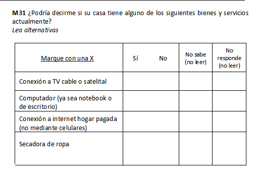
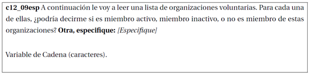
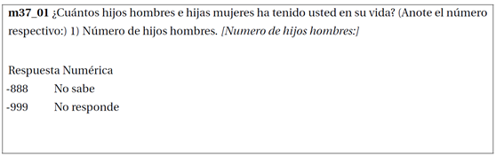

--- 
title: <center>ESTUDIO LONGITUDINAL SOCIAL DE CHILE (ELSOC 2016)</center>
author: <center> Roberto González, Matías Bargsted, Daniel Miranda, Benjamín Muñoz, Alejandro Plaza </center>
date: "`r Sys.Date()`"
output:
  bookdown::pdf_book:
    toc: yes
    includes:
      in_header: preamble.tex
      before_body: portada.tex
site: bookdown::bookdown_site
documentclass: book
bibliography:
- book.bib
- packages.bib
biblio-style: apalike
link-citations: yes
subtitle:  <center>MANUAL DE USUARIO DE BASE DE DATOS CORTE TRANSVERSAL</center>
---

  

# Presentación {#present}

```{r echo=FALSE, fig.align='center', fig.height=1, out.height="60%", out.width="60%"}

```


El Estudio Longitudinal Social de Chile (ELSOC) es una encuesta desarrollada para analizar intertemporalmente la evolución del conflicto y cohesión en la sociedad chilena, basándose en modelos conceptuales descritos en la literatura nacional e internacional. De este modo, se orienta a examinar los principales antecedentes, factores moderadores y mediadores, así como las principales consecuencias asociadas al desarrollo de distintas formas de conflicto y cohesión social en Chile. Por lo tanto, su objetivo fundamental es constituirse en un insumo empírico para la comprensión de las creencias, actitudes y percepciones de los chilenos hacia las distintas dimensiones de la convivencia y el conflicto, y como éstas cambian a lo largo del tiempo.

Esta encuesta fue diseñada por investigadores pertenecientes al Centro de Estudios de Conflicto y Cohesión Social (COES). El Centro está patrocinado por la Universidad de Chile y la Pontificia Universidad Católica de Chile y cuenta como instituciones asociadas a la Universidad Diego Portales y la Universidad Adolfo Ibáñez. Si desea obtener más información sobre el Centro, visite nuestra [página web](http://www.coes.cl/). COES es una iniciativa que desde 2013 cuenta con el financiamiento ^[Proyecto CONICYT/FONDAP/15130009] del Fondo de Financiamiento de Centros de Investigación en Áreas Prioritarias (FONDAP) de la Comisión Nacional de Investigación Científica y Tecnológica (CONICYT), organismo dependiente del Ministerio de Educación de Chile. El levantamiento de datos de ELSOC (primera ola de medición 2016) estuvo a cargo del CentroMicroDatos (CMD) de la Universidad de Chile.

El presente documento contiene información relevante para los usuarios de la base de datos de la primera ola del estudio panel, correspondiente al año 2016, enfatizando su dimensión de corte transversal. El Manual se estructura en torno a secciones temáticas. La siguiente sección describe brevemente el diseño del instrumento, lo cual es complementado con una ficha técnica del estudio. La tercera sección reseña el diseño muestral general del panel como también los detalles específicos de la primera ola del estudio. En el siguiente apartado se resumen los principales aspectos del trabajo de campo y ejecución del estudio. El quinto apartado corresponde al registro de versiones de la base de datos y detalla el protocolo de uso de ésta. Por último, se incluye un apartado con orientaciones básicas para el análisis y el libro de códigos de las variables incluidas en la base de datos

<!--chapter:end:index.Rmd-->

---
output:
  pdf_document: default
  html_document: default
---
# Diseño del instrumento {#dis_ins}

A continuación se presenta el desarrollo del cuestionario del ELSOC. El instrumento de recolección de información consiste en un cuestionario estructurado (tipo encuesta) aplicado cara a cara a todos los participantes. Dicha aplicación se hace utilizando el sistema CAPI (Encuestas personales asistidas por computadores). El cuestionario fue diseñado paramedir una serie de aspectos conceptualmente relevantes para caracterizar el conflicto y cohesión social en Chile, enfatizando su evolución a lo largo del tiempo. Los principales temas de interés analítico abordados por la encuesta corresponden a losmódulos en los cuales se estructura:

1. **Ciudadanía y Democracia.**
2. **Redes sociales e Interacciones inter-grupales.**
3. **Legitimidad y desigualdad social.**
4. **Conflicto social.**
5. **Dimensión barrial y territorial.**
6. **Salud y bienestar.**
7. **Caracterización Socio demográfica.**

## Proceso de Diseño

Buena parte de las preguntas, escalas y/o items incluidos en cada módulo de ELSOC provienen de otros estudios de opinión pública, investigaciones -en psicología, sociología, economía, ciencia política- y encuestas sociales conducidos en Chile y otros países. En forma complementaria, algunas escalas fueron desarrolladas por los miembros del equipo COES y/o han sido adaptadas de estudios anteriores de éstos. De manera genérica, el cuestionario fue diseñado aprovechando las principales recomendaciones técnicas y el estado del arte en las distintas áreas de estudio incluidas.

Con el objetivo de satisfacer los criterios y estándares de calidad para cuestionarios y compatibilizar la multiplicidad de agendas de investigación desarrolladas por COES, se optó por elaborar un procedimiento de trabajo para la construcción de éste. Este proceso se desarrolló en distintas fases:

1. Se solicitó a los investigadores asociados a COES proponer proyectos de investigación que contemplen un planteamiento teórico e hipótesis que fundamenten las escalas propuestas para ser incluidas en el cuestionario. Las propuestas podían ser presentadas de manera individual o colectiva y no existían restricciones en el número de ítems a proponer. Sólo se exigía una fundamentación teórica explícita y una operacionalización de los constructos a medir en los distintos items propuestos.

2. El procedimiento anterior implicó la recepción y organización de un elevado número de agendas de investigación, los que se materializan en más 750 itemes (preguntas únicas o parte de una escala). El equipo panel sistematizó las propuestas recibidas, clasificando los items en áreas temáticas. A la vez, se diseñaron mecanismos para reducir el número de items y coordinaron reuniones entre los investigadores COES para decidir sobre éstos. Los criterios de selección fueron principalmente teóricos, priorizando las preguntas fundamentales para el análisis longitudinal de los proyectos de investigación como su concordancia con la agenda sustantiva de COES ^[También se incluyeron criterios prácticos, relativos a la eliminación de itemes idénticos o muy semejantes; evidencia previa sobre la calidad de los items (encuestas anteriores, especialmente la encuesta de corte transversal desarrollada por COES el año 2014) y el diseño general del estudio (diseño muestral, unidad de análisis, tipo de informante, etc.).].

3. Luego de una selección de las escalas más relevantes para cada tema propuesto, se realizó un estudio piloto del cuestionario desarrollado. Esto implicó pilotear 430 itemes -el Centro MicroDatos de la Universidad de Chile se encargó de su ejecución. En base a los resultados de dicho piloto, el equipo panel realizó ajustes a algunos items y elaboró una propuesta de reducción de ítems que fue evaluada con los investigadores del Centro.

4. La última etapa de ajuste del cuestionario se centró en identificar los aspectos conceptualmente más relevantes para COES y ponderar los requerimientos metodológicos para su evaluación empírica. De este modo, se clasificaron los items según el número de mediciones requeridas, distinguiendo entre items permanentes (que serán medidos en todas las olas, ya que constituyen el núcleo analítico del estudio) e intercalados (que serán medidos una única vez o una ola por medio).

La versión final del instrumento de recolección de información consiste en un cuestionario estructurado (tipo encuesta) que se aplicará cara a cara a todos los participantes con una periodicidad anual. Sin embargo, debe tenerse presente que existen diferencias entre los cuestionarios de las distintas olas producto de la inclusión de los items intercalados3. Luego, en el Cuadro 1 se resumen los conceptos que se incluyeron en cada sección del cuestionario de la primera ola del estudio longitudinal COES. Paramás detalles sobre el Cuestionario se debe revisar la sección de  \@ref(label) Libro de Códigos y el  \@ref(label) Listado de Variables de ELSOC.

```{r echo=FALSE, message=FALSE, warning=FALSE}
library(pacman)
pacman::p_load(tidyverse,knitr,kableExtra,dplyr,tinytex)

#HAY QUE CAMBIAR EL NOMBRE DE LA TABLA

temas_conceptos <- tibble(Sección = 
                            c("Territorio"),
                          Temas = 
                            c("Cohesión barrial, elección de hogar/barrio, estigmatización residencial,   
                          intención de movilidad residencial, percepción de transformación del
                          barrio, datisfacción con el barrio, satisfacción con la vivienda, seguridad
                          del Barrio, sociabilidad barrial, transporte y violencia barrial.")) %>% 
  add_row(Sección = 
            c("Redes y Actitudes Sociales"),
          Temas = 
            c("Actitudes intergrupales (Ansiedad intergrupal, calidad de Contacto, cantidad de contacto,
            contacto negativo, normas intergrupales, frecuencia
            de contacto, percepción de similitud). También se incluye una batería de
            redes sociales secundarias/lejanas que incluye: ocupaciones, nombres, grupos sociales,
            relación con las ocupaciones, etc.")) %>% 
  add_row(Sección = 
            c("Ciudadanía y Democracia"),
          Temas = 
            c("Confianza interpersonal, intergrupal, política e institucional; actitudes hacia el cambio
          constitucional, actitudes políticas (dominancia, autoritarismo,
          identidad nacional, sociabilidad, percepción de movimientos
          sociales), interés político, participación convencional y no convencional,
          satisfacción y actitudes hacia la democracia, posición política.")) %>%
  add_row(Sección = 
            c("Legitimidad y Desigualdad"),
          Temas = c("Percepción de distribución de ingresos, estatus subjetivo, percepción de
          distribución de impuestos, justicia distributiva y meritocracia, antagonismo
          de clases sociales.")) %>%
  add_row(Sección = 
            c("Conflicto social"),
          Temas = 
            c("Agresividad física, aversión conflicto, fuerza de conflictos, justificación de
            uso de violencia (de género, interpersonal o institucional) y percepción
            violencia.")) %>%
  add_row(Sección = 
            c("Salud y Bienestar"),
          Temas = 
            c("Satisfacción vital, estado de ánimo (Escala de depresión), estresores, problemas
          de salud recientes, consumo de sustancias (alcohol, tabaco), red
          de apoyo, interacción con el sistema de salud y peso/estatura.")) %>% 
  add_row(Sección = 
            c("Socio Demográfica"),
          Temas = 
            c("Descripción ocupacional, nivel educacional, estado civil, ingreso individual
            y del hogar, bienes del hogar, descripción de la composición del hogar,
            satisfacción con el ingreso, descripción de condiciones de deuda, caracterización
            de la vivienda y adscripción y practicancia religiosa.")) 


temas_conceptos %>%
  kable(booktabs = TRUE,  caption="\\label{tab:temas_conceptos}Temas y Conceptos medidos en ELSCO Ola 1") %>%
  column_spec(c(1), width = "6cm") %>%
  column_spec(c(2), width = "14cm") %>%
  row_spec(0:7, background = "white") %>% 
  kable_classic(full_width = F)
```


## Ficha Técnica

En este apartado se presenta la Ficha Técnica (Ver Cuadro 2), dónde se sintetizan las principales características del Estudio Longitudinal Social de Chile (ELSOC COES) y de la implementación de la primera ola de esta encuesta. Los siguientes apartados entregan mayores detalles sobre el diseño muestral del panel y en específico de su primera ola, como de la ejecución y trabajo de campo.

```{r echo=FALSE, message=FALSE, warning=FALSE}
library(pacman)
pacman::p_load(tidyverse,knitr,kableExtra,dplyr)

ficha_técnica <- tibble(Características = 
                            c("Objetivo"),
                          ELSOC_2016 = 
                            c("Analizar longitudinalmente la evolución del conflicto y cohesión
                              en la sociedad chilena.")) %>% 
  add_row(Características = 
            c("Diseño"),
          ELSOC_2016 = 
            c("Estudio cuantitativo por medio de un cuestionario estructurado.")) %>% 
  add_row(Características = 
            c("Instrumento"),
          ELSOC_2016 = 
            c("Cuestionario compuesto por preguntas cerradas de carácter simple
            y múltiple junto a algunas preguntas abiertas. Combina preguntas
            permanentes (todas las olas) e intercaladas.")) %>%
  add_row(Características = 
            c("Cobertura Temática"),
          ELSOC_2016 = c("Contiene siete módulos temáticos: Territorio, Redes y actitudes
          sociales, Ciudadanía y democracia, Desigualdad y legitimidad,
          Conflicto social, Salud y bienestar y Caracterización sociodemográfica.")) %>%
  add_row(Características = 
            c("Unidad de Análisis"),
          ELSOC_2016 = 
            c("Individuos.")) %>%
  add_row(Características = 
            c("Población Objetivo"),
          ELSOC_2016 = 
            c("Hombres y mujeres de 18 a 75 años, residentes habituales de viviendas
              particulares ocupadas, localizadas en 40 ciudades (92 comunas) del país.")) %>% 
  add_row(Características = 
            c("Marco Muestral"),
          ELSOC_2016 = 
            c("Marco demuestreo de manzanas del pre-censo 2011, trabajo elaborado
            por el Centro de Inteligencia Territorial (CIT) de la Universidad Adolfo Ibáñez.")) %>% 
  add_row(Características = 
            c("Diseño Muestral"),
          ELSOC_2016 = 
            c("Probabilístico, estratificado, por conglomerados y multietápico.")) %>% 
  add_row(Características = 
            c("Unidades de Muestreo"),
          ELSOC_2016 = 
            c("Primero se eligen ciudades (UPM), luego manzanas (USM), y subbloques
              y viviendas (UTM). La unidad final de selección es la persona.")) %>%
  add_row(Características = 
            c("Período de Aplicación"),
          ELSOC_2016 = 
            c("Agosto a Diciembre de 2016 (20 semanas corridas).")) %>% 
  add_row(Características = 
            c("Periodicidad"),
          ELSOC_2016 = 
            c("Anual.Muestra de refresco al 3er año.")) %>% 
  add_row(Características = 
            c("Modo de Aplicación"),
          ELSOC_2016 = 
            c("Encuesta presencial en vivienda del entrevistado. Entrevista personal
            aplicada por un encuestador por medio de una tablet (Sistema CAPI:
            Computer Assisted Personal Interview.)")) %>% 
  add_row(Características = 
            c("Informante"),
          ELSOC_2016 = 
            c("Hombre o mujer residente en la vivienda, con edad entre 18 y 75 años."))  %>% 
   add_row(Características = 
            c("Aspectos Éticos"),
          ELSOC_2016 = 
            c("Entrevista voluntaria. Se solicitan datos de contacto de entrevistados,
            pero no son accesibles (confidenciales). Información georreferenciada
            también se reserva de manera confidencial. Base de acceso público.")) %>% 
  add_row(Características = 
            c("Duración Promedio"),
          ELSOC_2016 = 
            c("55 minutos.")) %>% 
  add_row(Características = 
            c("Control de Calidad"),
          ELSOC_2016 = 
            c("Supervisión interna de 20% de la muestra lograda.")) %>%
  add_row(Características = 
            c("Representatividad"),
          ELSOC_2016 = 
            c("Aproximadamente el 77% de la población total del país y 93% de la
              población urbana.")) %>% 
  add_row(Características = 
            c("Tasa de Respuesta"),
          ELSOC_2016 = 
            c("62.0% (RR1)")) %>% 
  add_row(Características = 
            c("Tasa de Cooperación"),
          ELSOC_2016 = 
            c("85.8% (COOP1)")) %>% 
  add_row(Características = 
            c("Tasa de Rechazo"),
          ELSOC_2016 = 
            c("9.0% (REF1)")) %>%
    add_row(Características = 
            c("Tasa de Contacto"),
          ELSOC_2016 = 
            c("72.2% (CON1)"))  %>% 
   add_row(Características = 
            c("Tamaño Muestral"),
          ELSOC_2016 = 
            c("3025 encuestas hechas, 2927 individuos en base de datos definitiva.")) %>% 
  add_row(Características = 
            c("Organismo Responsable"),
          ELSOC_2016 = 
            c("Centro de Estudios del Conflicto y Cohesión Social (COES).")) %>% 
  add_row(Características = 
            c("Organismo Ejecutor"),
          ELSOC_2016 = 
            c("Consultora Stephanie Eckman y Centro de Inteligencia Territorial (CIT)
            de la Universidad Adolfo Ibáñez (diseño muestral). CentroMicroDatos
            (CMD) de la Universidad de Chile (levantamiento, procesamiento de
            la información y construcción de factores de expansión).")) 

ficha_técnica %>%
  kable(booktabs = TRUE,caption="\\label{tab:ficha}Ficha Técnica ELSOC COES, Ola 1 (2016)") %>%
  column_spec(c(1), width = "5cm") %>%
  column_spec(c(2), width = "15cm") %>%
  row_spec(0:24, background = "white") %>% 
  kable_classic(full_width = F)
```


<!--chapter:end:01-dis-instrumento.Rmd-->

# Diseño Muestral del Estudio

El diseño muestral de la primera ola de ELSOC COES tuvo como objetivo conciliar los múltiples intereses de investigación de los investigadores asociados al Centro. Entre las consideraciones más relevantes destacaron las siguientes:

1. Un diseño muestral que permitiera combinar las variables medidas en el cuestionario con las variables espaciales, registradas a nivel de manzana y comuna, contenidas en las bases de datos desarrolladas por el Centro de Inteligencia Territorial (CIT) de la Universidad Aldolfo Ibáñez. Dado que los datos del CIT no están disponibles para todas las manzanas del país, particularmente aquellas ubicadas en localidades rurales, se decidió incorporar en la muestra únicamente zonas urbanas. Esta consideración también coincidió con las preferencias de muchos investigadores del Centro, quiénes manifestaron estar principalmente interesados en una muestra de carácter urbano.

2. Algunos investigadores solicitaron un diseño que permitiera estimar modelos multi-nivel (o jerárquicos) agrupados por ciudad y comuna, y por tanto, se estableció que la muestra contuviera un número suficiente de ciudades y comunas, así como un número suficiente de casos dentro de cada cuidad y comuna, que permitiera tal análisis (Snijders & Bosker, Capítulo 10).

3. Otros investigadores estaban interesados en comparar a los habitantes de las tres ciudades más grandes del país, lo que se tradujo en un diseño no proporcional que incrementara el número de encuestados en las zonas del Gran Valparaíso (ciudades de Viña delMar y Valparaíso) y Gran Concepción (Concepción, Talcahuano y otras).

4. Finalmente, algunos investigadores solicitaron un diseño que permitiera comparar a los encuestados que vivieran en ciudades grandes y pequeñas, lo que favoreció incrementar el tamaño de la muestra de hogares en ciudades pequeñas (Kish, 1965, Sección 3.5), particularmente aquellas con entre 30 mil y 100mil habitantes. Los investigadores de COES trabajaron con la encargada del diseño muestral, Stephanie Eckman, para desarrollar un diseño que pudiera, razonablemente, cumplir con estas necesidades e intereses sustantivos. El diseño muestral final de la ronda 1 de ELSOC COES proporciona una cobertura adecuada de las ciudades más grandes del país (Gran Santiago, Gran Valparaíso y Gran Concepción), así como ciudades más pequeñas, y también asegura la representación de personas en el norte y sur del país. En términos globales, el diseño muestral alcanza una representatividad aproximada del 77% de la población total del país, y del 93% de la población urbana. Las siguientes subsecciones detallan los distintos pasos del diseño de la muestra.

## Preparación del Marco Muestral

El proceso demuestreo se realizó en base a los datos del pre-censo del año 2011, los cuales fueron formateados por el CIT. Aunque los recuentos de población del censo de 2012 no son precisos, el trabajo del pre-censo recolectando información sobre los hogares en todos las manzanas (bloques) es de calidad. El conjunto de datos contenía un total de 155,757 bloques, pero se eliminaron cuatro tipos diferentes antes de que comenzara con la selección.

1. Siguiendo los intereses analíticos de los investigadores del Centro, sólo se utilizaron bloques urbanos. Para determinar qué bloques eran urbanos, se empleó la codificación del tipo de localidad (urbana o rural) contenida en la base de datos del pre-censo de 2011. Consecuentemente, 22.188 (14,2%) bloques fueron excluidos en este paso.

2. Nuevamente, en función de los intereses analíticos de los investigadores del Centro, sólo los bloques que habían sido previamente geo-referenciados por el CIT se conservaron para el muestreo. Esto implica que un total de 1.971 (1,5% de los bloques urbanos) que no estaban geo-referenciados fueron removidos en este paso.

3. Sólo los bloques que contenían cinco o más hogares (de acuerdo con el pre-censo de 2011) fueron retenidos. 503 bloques (menos del 1% de los bloques restantes tras los pasos 1 y 2) no alcanzaron este umbral y fueron eliminados.

4. Sólo los bloques en las ciudades con más de 10.000 personas eran elegibles para la selección. 10.238 bloques (7.8% de los bloques restantes) fueron excluidos delmarco muestral.

De esta forma, el marco muestral final contiene 120.857 bloques. La muestra de COES representará solamente estos bloques y no aquellos que fueron excluidos. Las estimaciones derivadas de los datos de lamuestra se aplicarán únicamente a esta población objetivo y no deben aplicarse a toda la población chilena. El proceso de selección de entrevistados se desarrolló en cinco etapas, aunque durante el trabajo de campo se añadió una sexta etapa.

## Etapa 1: Selección de Ciudades

El universo de bloques (los 120.857 bloques mencionados) fue agregado al nivel de la ciudad, resultando en 122 ciudades. Las tres ciudades más grandes (Gran Santiago, Viña delMar - Valparaiso y Concepción - Talcahuano) fueron seleccionadas con certeza. Las ciudades restantes son estratificadas por la población. La Tabla 3 muestra las definiciones de los estratos y los tamaños de población (N) y muestra (n) en cada uno.


```{r echo=FALSE, message=FALSE, warning=FALSE}

library(pacman)
pacman::p_load(tidyverse,knitr,kableExtra,dplyr,tinytex)

estratos_2016 <- tibble(Estrato = c("Gran Santiago"),
                  "Definición N habitantes" = c(" "),
                  "N ciudades" = c("1"),
                  "n ciudades" = c("1"),
                  "N Norte" = c("-"),
                  "n Norte" = c("-"),
                  "N Sur" = c("-"),
                  "n Sur" = c("-")) %>% 
  add_row(Estrato = c("Gran Valparaíso"),
                  "Definición N habitantes" = c(" "),
                  "N ciudades" = c("1"),
                  "n ciudades" = c("1"),
                  "N Norte" = c("-"),
                  "n Norte" = c("-"),
                  "N Sur" = c("-"),
                  "n Sur" = c("-")) %>% 
  add_row(Estrato = c("Gran Concepción"),
                  "Definición N habitantes" = c(" "),
                  "N ciudades" = c("1"),
                  "n ciudades" = c("1"),
                  "N Norte" = c("-"),
                  "n Norte" = c("-"),
                  "N Sur" = c("-"),
                  "n Sur" = c("-")) %>% 
    add_row(Estrato = c("Ciudades Grandes"),
                  "Definición N habitantes" = c("> 100 mil "),
                  "N ciudades" = c("18"),
                  "n ciudades" = c("8"),
                  "N Norte" = c("8"),
                  "n Norte" = c("4"),
                  "N Sur" = c("10"),
                  "n Sur" = c("4")) %>% 
     add_row(Estrato = c("Ciudades Medianas"),
                  "Definición N habitantes" = c("> 30 mil "),
                  "N ciudades" = c("28"),
                  "n ciudades" = c("10"),
                  "N Norte" = c("15"),
                  "n Norte" = c("6"),
                  "N Sur" = c("13"),
                  "n Sur" = c("4")) %>% 
    add_row(Estrato = c("Ciudades Pequeñas"),
                  "Definición N habitantes" = c("> 10 mil "),
                  "N ciudades" = c("73"),
                  "n ciudades" = c("19"),
                  "N Norte" = c("24"),
                  "n Norte" = c("6"),
                  "N Sur" = c("49"),
                  "n Sur" = c("13")) 


estratos_2016 %>%
  kable(booktabs = TRUE,  caption="\\label{tab:estratos}Población por ciudad y tamaños de muestra, por estrato") %>%
  column_spec(c(1), width = "4cm") %>%
  column_spec(c(2,3,4), width = "1cm") %>%
  column_spec(c(5,6,7,8), width = "2cm") %>%
  row_spec(0:6, background = "white") %>% 
  add_header_above(c(" " = 1, " " = 3, "Sub-estrato Norte" = 2, "Sub-estrato Sur" = 2))%>% 
  kable_classic(full_width = F)

```


Los estratos 4, 5 y 6 fueron estratificados geográficamente por Norte / Sur para asegurar que la muestra contuviera ciudades del norte y sur de Chile. Esto redunda en un total de nueve estratos. La muestra se asignó entre las dos áreas en proporción al tamaño de su población en el universo. Véase la Tabla 3 para ver el detalle acerca de los tamaños de población y muestra en cada uno de los estratos norte y sur.
La selección de ciudades dentro de cada uno de estos estratos finales se realizó en forma proporcional al tamaño de la población de cada ciudad. Este método da mayores probabilidades de selección a las grandes ciudades.

La probabilidad de selección de una ciudad i dentro del estrato $h$ fue:

$$\pi_i=\frac{(nc_h)(pop_i)}{\sum_h pop}$$

donde $nc_h$ es el número de ciudades seleccionadas en el estrato $h$ y $pop_i$ es la población de ciudad $i$.

## Etapa 2: Selección de Bloques (Manzanas)

Las 40 ciudades seleccionadas contenían 87.839 bloques. En la segunda etapa se seleccionaron bloques en cada ciudad con población proporcional al tamaño, donde el tamaño fue determinado a partir del recuento de unidades de vivienda del pre-censo. La selección fue sistemática: la lista de bloques en las ciudades seleccionadas se ordenó según sub-distrito censal y número de bloque para asegurar que los bloques seleccionados se extendieran por toda la
ciudad ^[Los números de bloques y distritos censales fueron entregados porMatías Garretón, investigador de CIT. Los sub-distritos censales son unidades geográficas más pequeñas que la comuna, pero más grandes que los bloques.]

La Tabla 4 muestra el número de bloques seleccionados en cada ciudad. La muestra de bloques se asignó de manera desproporcionada para que las áreas fuera de Santiago estuvieran sobre-representadas en relación con su tamaño en la población objetivo. Varios investigadores COES solicitaron esta asignación para asegurar que la muestra fuera diversa con respecto al tamaño de la ciudad.

La probabilidad de selección de un bloque $j$ en la ciudad $i$, condicionada a la selección de la ciudad, fue:

$$\pi_{j|i}=\frac{(nb_i)(hu_j)}{\sum_i hu}$$

donde nbi es el número de bloques seleccionadas en la ciudad $i$ y $hu_j$ es la población de la ciudad $i$.

```{r echo=FALSE, message=FALSE, warning=FALSE}
library(pacman)
pacman::p_load(tidyverse,knitr,kableExtra,dplyr,tinytex)

bloques_2016 <- tibble(Estrato = c("Gran Santiago"),
                  "Definición (N° habitantes)" = c(" "),        
                  "n ciudades" = c("1"),
                  "n bloques por ciudad" = c("200")) %>% 
  add_row(Estrato = c("Gran Valparaíso"),
                  "Definición (N° habitantes)" = c(" "),        
                  "n ciudades" = c("1"),
                  "n bloques por ciudad" = c("100")) %>% 
    add_row(Estrato = c("Gran Concepción"),
                  "Definición (N° habitantes)" = c(" "),        
                  "n ciudades" = c("1"),
                  "n bloques por ciudad" = c("100")) %>% 
     add_row(Estrato = c("Ciudades Grandes"),
                  "Definición (N° habitantes)" = c("> 100 mil"),
                  "n ciudades" = c("8"),
                  "n bloques por ciudad" = c("26")) %>% 
    add_row(Estrato = c("Ciudades Medianas"),
                  "Definición (N° habitantes)" = c("> 30 mil"),
                  "n ciudades" = c("10"),
                  "n bloques por ciudad" = c("25")) %>% 
     add_row(Estrato = c("Ciudades Pequeñas"),
                  "Definición (N° habitantes)" = c("> 10 mil"),
                  "n ciudades" = c("19"),
                  "n bloques por ciudad" = c("11")) %>% 
     add_row(Estrato = c("TOTAL"),
                  "Definición (N° habitantes)" = c(" "),
                  "n ciudades" = c("40"),
                  "n bloques por ciudad" = c("1,067"))

bloques_2016 %>%
  kable(booktabs = TRUE,  caption="\\label{tab:bloques}Distribución de los bloques por estrato") %>%
  column_spec(c(1), width = "4cm") %>%
  column_spec(c(2), width = "3cm") %>%
  column_spec(c(3,4), width = "2cm") %>%
  row_spec(0:6, background = "white") %>% 
  kable_classic(full_width = F)

```

En cuatro ciudades, algunos bloques eran tan grandes que fueron selecciones certeras. Es decir, los recuentos de unidades de vivienda eran mayores que el intervalo de selección y se seleccionarían en cualquier muestra, e incluso podrían seleccionarse dos veces. Para evitar selecciones duplicadas, estos bloques se eligieron primero con certeza y luego se seleccionaron bloques adicionales entre los restantes para aquellas ciudades, de modo de alcanzar el tamaño de muestra total deseado para la ciudad (ver Tabla 4). ¼j ji para estas ciudades es 1.

Los 1.067 bloques seleccionados en las 40 ciudades elegidas fueron enpadronados en terreno, con la finalidad de realizar la selección de los hogares con la información más actualizada posible. El CIT proporcionó mapas de cada bloque seleccionado. El personal de campo de CMD visitó cada bloque y creó una lista de todas las unidades de vivienda. Los listados fueron revisados cuidadosamente para detectar cualquier error o duplicado.

## Etapa 3: Selección de sub - bloques

Durante el proceso de empadronamiento, el Centro deMicrodatos encontró que algunos bloques tenían más de 100 viviendas, lo que dificulta excesivamente el proceso de empadronamiento. Consecuentemente, se dividieron estos bloques en sub-bloques de tamaño aproximadamente igual (40 a 50 viviendas) y seleccionaron uno para ser empadronado. Debido a que los sub-bloques fueron creados para ser casi igual tamaño, estos fueron seleccionados en base a igual probabilidad. En total, 301 bloques fueron submuestreados. Los bloques restantes no se vieron afectados por esta etapa.

## Etapa 4: Selección de viviendas

El número de viviendas seleccionadas en cada bloque varió según el estrato, como se muestra en la Tabla 5. Este diseño resultó en 4.001 unidades de vivienda, con lo cual se pretendieron obtener aproximadamente 3.000 entrevistas completas, bajo el supuesto de una tasa de respuesta del 75% para todos los estratos.

```{r echo=FALSE, message=FALSE, warning=FALSE}
library(pacman)
pacman::p_load(tidyverse,knitr,kableExtra,dplyr,tinytex)

HHs <- tibble(Estrato = c("Gran Santiago"),
                  "Definición (N° habitantes)" = c(" "),        
                  "n HHs" = c("5")) %>% 
  add_row(Estrato = c("Gran Valparaíso"),
                  "Definición (N° habitantes)" = c(" "),        
                  "n HHs" = c("5")) %>% 
    add_row(Estrato = c("Gran Concepción"),
                  "Definición (N° habitantes)" = c(" "),        
                  "n HHs" = c("5")) %>% 
     add_row(Estrato = c("Ciudades Grandes"),
                  "Definición (N° habitantes)" = c("> 100 mil"),
                  "n HHs" = c("3")) %>% 
    add_row(Estrato = c("Ciudades Medianas"),
                  "Definición (N° habitantes)" = c("> 30 mil"),
                  "n HHs" = c("3")) %>% 
     add_row(Estrato = c("Ciudades Pequeñas"),
                  "Definición (N° habitantes)" = c("> 10 mil"),
                  "n HHs" = c("3")) %>% 
     add_row(Estrato = c("TOTAL"),
                  "Definición (N° habitantes)" = c(" "),
                  "n HHs" = c("4001"))

HHs %>%
  kable(booktabs = TRUE,  caption="\\label{tab:bloques}Distribución de los bloques por estrato") %>%
  column_spec(c(1), width = "4cm") %>%
  column_spec(c(2), width = "4cm") %>%
  column_spec(c(3), width = "2cm") %>%
  row_spec(0:6, background = "white") %>% 
  kable_classic(full_width = F)
```


Se realizó una muestra aleatoria simple de viviendas en cada bloque. La combinación de la población proporcional al tamaño demuestreo en las dos primeras etapas y elmuestreo aleatorio simple en la tercera y cuarta etapas dio lugar a una muestra de viviendas con aproximadamente igual probabilidad dentro de cada uno de los nueve estratosmostrados en la Tabla 3.

La probabilidad de selección de un hogar k en el bloque $j$ en la ciudad $i$ y el estrato $h$ fue:

$$\pi_{k|j,i}=\frac{nh_j}{NH_j}$$

donde $nh_j$ es el número de viviendas seleccionadas en el bloque $j$, y $NH_j$ corresponde al número de viviendas alistadas en el bloque $j$.

## Etapa 5: Selección de personas

Los encuestadores visitaron cada hogar seleccionado e intentaron llevar a cabo la entrevista. El primer paso en el proceso de la entrevista fue identificar al entrevistado objetivo. Cuando había más de un adulto en el hogar, uno fue seleccionado usando una muestra aleatoria simple, usando una tabla de Kish.

La probabilidad de selección de una persona en el hogar $k$ fue:

$$\pi_{l|k,j,i}=\frac{1}{NP_j}$$

donde $NP_j$ es el número de adultos (mayores a 18 años y menores de 75 años) que habitan la vivienda $j$.

## Etapa 6: Aumento del tamaño muestral

Durante el trabajo de campo se observó que el supuesto de una tasa de respuesta del 75% para todos los estratos era incorrecta. En primer lugar, hubo variabilidad significativa por región, y en segundo lugar, la tasa de respuesta fue inferior al 75%. Debido a esta información, se decidió aumentar el número de hogares por bloque para lograr efectivamente las 3.000 entrevistas.

Este aumento en el número de hogares por bloque tiene un efecto limitado sobre la probabilidad de selección de cada vivienda. Sólo afecta a la probabilidad calculada en la Etapa 4, y que el número de hogares disponibles es menor, pero no hay cambios en las probabilidades calculadas en la Etapa 1 y la Etapa 2. Esto ocurre porque los bloques seleccionados (en la Etapa 2) fueron usados, y no se introdujeron nuevos bloques.

Durante este proceso un total de 1.082 nuevos hogares, ubicados dentro de los bloques seleccionados, se añadieron a la muestra del estudio. La asignación de estos nuevos hogares no fue uniforme en todos los bloques del país. En cambio, se concentraron en cuatro regiones (Coquimbo, O´Higgins, RegiónMetropolitana, y Biobío) donde los encuestadores tenían muchos problemas para contactar a los encuestados. La tabla 6 detalla las comunas en que se aumentó el número de hogares, junto con el número total de hogares incorporados y por bloque.

```{r echo=FALSE, message=FALSE, warning=FALSE}

library(pacman)
pacman::p_load(tidyverse,knitr,kableExtra,dplyr,tinytex)

viviendas <- tibble(Región = c(" "),
                  Comuna = c("Coquimbo", "La Serena", "Salamanca"),
                  "Total viviendas agregadas" = c(24,28,22),
                  "Viviendas agregadas por bloque" = c(2,2,2))%>% 
  add_row(Región = c(" "),
                  Comuna = c("Doñihue", "Rancagua", "Santa Cruz"),
                  "Total viviendas agregadas" = c(10,42,11),
                  "Viviendas agregadas por bloque" = c(1,2,1))%>% 
  add_row(Región = c(" "),
                  Comuna = c("Chiguanyante", "Concepción", "Coronel", "Penco", 
                             "Quillón", "San Pedro de la Paz"),
                  "Total viviendas agregadas" = c(24,75,11,4,6,28),
                  "Viviendas agregadas por bloque" = c(3,3,1,1,1,2))%>%
  add_row(Región = c(" "),
                  Comuna = c("Cerrillos", "Colina", "Curacaví", "El Bosque", 
                             "Estación Central", "Huechuraba", "Independencia", 
                             "Isla de Maipo ", "La Cisterna", "La Florida", 
                             "La Granja", "La Pintana", "La Reina", "Las Condes", 
                             "Lo Barnechea", "Lo Espejo", "Lo Prado",  "Macul", 
                             "Maipú", "Ñuñoa", "Padre Hurtado", "Pedro Aguirre Cerda" , 
                             "Peñaflor" ,"Peñalolén", "Providencia", "Pudahuel", 
                             "Puente Alto","Quilicura", "San Bernardo", "San Joaquín", 
                             "San Miguel", "San Ramón", "Santiago", "Vitacura"),
                 "Total viviendas agregadas" = c(9,12,14,8,12,6,6,39,9,24,6,12,
                                                 9,33,9,6,6,8,32,16,6,6,30,14,7,
                                                 14,32,12,16,6,9,6,120,9),
                  "Viviendas agregadas por bloque" = c(3,3,2,2,3,2,2,3,3,2,2,2,3,
                                                       3,3,2,2,2,2,2,3,2,2,2,3,2,
                                                       2,2,2,2,3,2,3,3))


viviendas %>%
  kable(booktabs = TRUE,  caption="\\label{tab:hogares}Número de hogares agregados a la muestra según región y comuna") %>%
  column_spec(c(1), width = "3cm") %>%
  column_spec(c(2), width = "3cm") %>%
  column_spec(c(3,4), width = "3cm") %>%
  row_spec(0:46, background = "white") %>% 
  pack_rows("Coquimbo", 1, 3) %>%
  pack_rows("O’Higgins", 4, 6) %>%
  pack_rows("Biobío", 7, 12) %>%
  pack_rows("Metropolitana", 13, 46) %>%
  kable_classic(full_width = F)

```

## Diseño de Ponderadores de la Muestra

Considerando que a partir de las entrevistas efectivamente realizadas se desea extrapolar a la población objetivo respectiva, es necesario ponderar adecuadamente a cada encuestado según su representación en la población objetivo. Dicha ponderación corresponde al inverso de su probabilidad de selección o inclusión en la muestra. En este caso la probabilidad de selección del individuo $i$ de la vivienda $j$ que pertenece a la manzana $l$ del estrato $k$, $P_{ijlk}$ viene dado por:

$$P_{iklk} = \pi_i|_{jlk}\pi_j|_{lk}\pi_{lk}$$

Dónde:

* $\pi_i|_{jkl}$ es la probabilidad de que el individuo $i$ sea seleccionado en lamuestra dado que la vivienda dónde vive y la manzana dónde se localiza fueron seleccionados.
* $\pi_j|_{lk}$ es la probabilidad de que la vivienda $j$ sea seleccionada en la muestra dado que la manzana $l$ (que contiene a la vivienda $j$) fue seleccionada.
* $\pi_lk$ es la probabilidad de que lamanzana $l$ del estrato $k$ sea seleccionada en la muestra.

Se define el ponderador de diseño o teórico $w_{ijlk}$ al inverso de la probabilidad de selección:

$$P_{ijlk}=\frac{1}{w_{ijlk}}$$

El valor de las antes mencionadas probabilidades es:


$$\pi_{lk} = n_k\frac{M_{kl}}{M_k}$$

$$\pi_{j|lk} = \frac{m_{lk}}{M'_k}$$

$$\pi_{i|jlk} = \frac{1}{N_{jlk}}$$

Dónde se tiene que $n_k$ es el número de manzanas a seleccionar del estrato $k$, $_lk$ es el número de viviendas de la manzana $l$ del estrato $k$, $M_k$ es el número total de viviendas del estrato $k$, $m_{lk}$ es el número de viviendas a encuestar dentro de la manzana $l$, $M'_k$ es el número actualizado de viviendas de la manzana $l$ post-empadronamiento, $N_{jlk}$ es el número de personas de la
población objetivo que vive en la vivienda $j$ de la manzana $l$ del estrato $k$.

En base a lo anterior se diseñaron ponderadores que ajustan en base a las probabilidades base, con ajuste de no respuesta, con ajuste al número de casos ^[Corresponde a considerar la población total objetivo entre 18 y 75 años en base a las proyecciones de población
regional.] y con ajuste al número de casos y la variable sexo ^[Los cuatro ponderadores diseñados son acumulativos. A modo de ejemplo, el segundo ponderador ajusta en base las probabilidades de selección e incorpora **también** el ajuste por no respuesta.].


<!--chapter:end:02-dis-muestral.Rmd-->

# Implementación de la Encuesta

COES realizó una licitación pública para la ejecución del ELSOC. El Centro Micro Datos (CMD) de la Facultad de Economía y Negocios de la Universidad de Chile se adjudicó dicho concurso y se encargará del desarrollo de la encuesta, incluyendo el trabajo de campo durante las primeras tres olas. El acuerdo conMicro Datos contempla los más altos estándares de calidad y asegura un adecuado resguardo de los datos personales de contacto de los participantes del estudio panel.

El diseño muestral fue desarrollado por la consultora internacional Stephanie Eckman y el Centro de Inteligencia Territorial (CIT) en base a los criterios definidos por COES. De todos modos, el Centro MicroDatos apoyó en el diseño muestral y planteó observaciones relevantes para la implementación del estudio. A su vez, fueron los encargados de elaborar la propuesta de aumento muestral durante el levantamiento.

## Empadronamiento

El levantamiento de datos por parte del CMD se inicia con el desarrollo de un empadronamiento que tiene como objetivo identificar y listar todas las viviendas elegibles (USM) en las manzanas elegidas. Dentro de este proceso de empadronamiento,MicroDatos detectó que en un número de importante de manzanas existían más de 100 viviendas, motivo por el cual se desarrolló un procedimiento de visita para enumerar las viviendas y definir submanzanas. Las manzanas con menos de 100 viviendas fueron empadronadas directamente, mientras las otras fueron visitadas para su enumeración y verificación de que éstas se componen de viviendas particulares. Posteriormente se subdividen en grupos de viviendas en un rango de 40 a 50 según las características de la manzana ^[Más detalles se encuentran disponibles en el Informe Anual de Servicios para el Levantamiento del Estudio Longitudinal sobre Conflicto y Cohesión Social (COES) elaborado por MicroDatos.].

El objetivo del empadronamiento es contar con un listado actualizado de direcciones junto con información cartográfica relevante e indicaciones de referencia útiles para el trabajo del encuestador. El empadronamiento fue desarrollado de manera presencial. Los encargados contaron con pautas para el empadronamiento de viviendas.

Posteriormente se selecciona una vivienda ^[Se define operacionalmente vivienda como un espacio físico que en su interior habita una familia o grupo de personas que vive bajo el mismo techo. Existen protocolos sobre la definición de vivienda relativos a la identificación de éstas y casos específicos (viviendas pareadas, viviendas ampliadas, viviendas con más de una entrada, etc.). No se incluyen espacios físicos dónde no viven grupos familiares como locales comerciales, oficinas, iglesias, centros comunitarios, etc.] al azar por manzana y las cuatro restantes utilizando el procedimiento de salto sistemático.

El procedimiento anterior da lugar al desarrollo de croquis que permiten identificar visualmente las viviendas seleccionadas junto a indicaciones -en caso de ser necesarias- para señalizar su ubicación. Lo anterior se ve complementado con una codificación de los inmuebles incluidos en el recorrido, de modo de distinguir las viviendas particulares ocupadas de otros tipos de construcciones y de facilitar la planificación del trabajo de campo. La etapa final de este procedimiento es la georreferenciación de lamuestra seleccionada para contar con la ubicación geográfica asociada a cada levantamiento.

## Pilotaje del Cuestionario

En paralelo al proceso de empadronamiento se desarrolló la preparación definitiva del cuestionario de ELSOC. COES y CMD colaboraron en la revisión final del cuestionario, lo cual tuvo como productos la diagramación en papel del cuestionario y su posterior programación para que fuera aplicada en tablets (el cuestionario fue aplicado de manera presencial utilizando el sistema CAPI). Posteriormente se realizó una versión piloto del estudio con el fin de testear el instrumento como evaluar el funcionamiento operativo del levantamiento de datos.

El piloto se realizó con una lista de 130 direcciones, distintas a las cuales se les aplicó el cuestionario final. Dicho pre-testeo fue ejecutado exclusivamente en la regiónMetropolitana, durante 15 días corridos. Posteriormente se desarrolló un focus group con encuestadores orientado a obtener recomendaciones relevantes para el levantamiento final de la encuesta.

Los resultados de dichos estudios permitieron estimar de mejor modo los tiempos requeridos para el desarrollo de la entrevista por parte del encuestador, afinar el fraseo del cuestionario y dimensionar de mejor modo los esfuerzos requeridos para el levantamiento de datos. En caso de que desee obtener más información sobre el piloto, puede solicitar dicha información a
encuestacoes@gmail.com.

## Planificación y Ejecución del Campo

El CMD elaboró un Manual del Encuestador para la implementación del Estudio Panel y en conjunto con COES preparó documentos orientadores y protocolos para la aplicación del cuestionario. Esto incluye:

1. **Protocolo de Visita**: primer contacto con la vivienda, primer contacto con el hogar y concertación de entrevistas en casos en que no se puede realizar entrevista al momento de visita.

2. **Protocolo ante Casos Difíciles**: escenario de negaciones, escenario de más de 4 intentos presenciales sin contacto, barreras de acceso a la vivienda, no contacto con la vivienda. También contempla estrategias de recuperación.

3. **Protocolo de Aplicación del Cuestionario**: descripción del estudio, consentimiento informado, aplicación de preguntas, manejo de interrupciones, entrega de gift cards.

4. **Protocolo de Campo**: respaldo de información, control de avances, registro de contactos.

El CMD se encargó de la selección y capacitación del personal requerido (coordinadores y encuestadores). La implementación del entrenamiento se hizo por áreas geográficas, de modo de garantizar la calidad del levantamiento de datos. Se dispuso de 4 sedes de trabajo (2 en la Región Metropolitana, una en Valparaíso y otra en Biobío) administradas por coordinadores de zona. La capacitación de los encuestadores en el levantamiento se realizó en cada sede y hubo encuestadores apoderados, quienes posteriormente se encargaron de capacitar a los encuestadores en las regiones en que no hubo sedes (áquellas con menos de 400 encuestas a realizar).

El levantamiento de información fue realizado en un período de aproximadamente 20 semanas -contadas desde la entrega de material a los encuestadores tras la capacitación-, durante los meses de Agosto, Septiembre, Octubre, Noviembre y Diciembre de 2016. Para la ejecución del terreno se contó con 132 encuestadores distribuidos en las sedes de trabajo antes referidas. Todos fueron debidamente capacitados, para posteriormente ser citados para retirar el material de trabajo (hojas de ruta, citas concertadas, croquis de ubicación y tablet).

El encuestador utiliza el protocolo de entrevista para conformar un listado de las personas que son residentes habituales de la vivienda y cumplen con los criterios de edad del estudio. En base a dicho listado, se selecciona aleatoriamente a una persona en cada vivienda que cumpla los requisitos de elegibilidad utilizando el Método de Kish. Claro está, las encuestas se realizaron cara a cara en las viviendas de los entrevistados seleccionados. Las respuestas de los entrevistados fueron almacenadas en tablets provistas por CMD. La información recolectada era subida por los encuestadores a una plataforma web utilizando la tablet de CMD.

De todos modos, ocurrieron imprevistos en el terreno. Principalmente se tuvo que extender la duración planificada del trabajo de campo (de orginalmente 8 a 12 semanas a finalmente un horizonte de entre 19 y 20 semanas). Lo anterior se debe a que producto de dificultades de acceso de la muestra y dispersión no se lograron los avances semanales planificados. Buena parte de los problemas asociados se concentraron en la Región Metropolitana. Para abordar los problemas de implementación fue necesario diseñar un aumento de lamuestra entre COES y CMD.

Por otra parte hubo problemas para la convocatoria y permanencia de los encuestadores en el proyecto. Lo anterior hizo necesario ajustar los pagos propuestos a los encuestadores.

## Supervisión del Trabajo de Campo

El Centro MicroDatos desarrolló un proceso de supervisión del trabajo en terreno involucrando tres etapas:

1. Supervisión del 100% de las encuestas recopiladas, realizado de manera simultánea por el Coordinador de Grupo. Para esto se utilizó una aplicación web diseñada para estos fines. Esto implicó la verificación del sujeto entrevistado, revisión de variables claves, revisión del resultado de visita y revisión de duración de entrevista.

2. Retroalimentación de encuestadores de manera periódica por parte del jefe de zona como revisión de los datos recolectados por el equipo central deMicroDatos. Esto dio lugar a reportes periódicos de avance del levantamiento de datos.

3. Supervisión de encuestas por uso de CAPI. El software desarrollado para el cuestionario
permite manejar de mejor modo la no respuesta, validar internamente el flujo del
cuestionario (evitar problemas con filtros) y recolectar información sobre el tiempo de
aplicación.

4. Revisión de casos especiales y validación ex post. Finalmente CMD revisó el funcionamiento del flujo de respuestas y descartó casos por no cumplir con elmínimo de 300 respuestas a items o por tiempos de aplicación demasiado cortos (inferiores a 30 minutos).

En paralelo a la revisión y/o eliminación de casos, CMD desarrolló un proceso de validación de los valores de entrevistados a distintas preguntas abiertas del cuestionario. Lo anterior involucró la imputación de valores o la asignación de valores perdidos. Más detalles de dicho procedimiento se encuentran en el “Reporte de Validación de datos ex post”, el cual puede ser solicitado al Equipo Encuesta COES.

## Códigos de Disposición Final de Casos

Siguiendo los estándares de la Asociación Americana de Investigación en Opinión Pública (AAPOR por su sigla en inglés), se asoció a cada uno de los 5156 casos de la muestra completa un código de disposición final (Ver Cuadro 7).

En base a dicha información, la primera ola del Panel COES tiene las siguientes tasas de resultados:

* Tasa de Respuesta (RR2) de 62.4%.
* Tasa de Rechazo (REF2) de 8.9%.
* Tasa de Cooperación (COOP2) de 86.0%.
*¨Tasa de Contacto (CON2) de 72.6%.

Si desea conocer más detalles sobre la determinación de los códigos de disposición final de casos
y el cálculo de las tasas de resultados, dirigirse a [http://www.aapor.org/AAPOR_Main/media/
publications/Standard-Definitions20169theditionfinal.pdf](http://www.aapor.org/AAPOR_Main/media/
publications/Standard-Definitions20169theditionfinal.pdf).

```{r echo=FALSE, message=FALSE, warning=FALSE}
library(pacman)
pacman::p_load(tidyverse,knitr,kableExtra,dplyr,tinytex)

disp <- tibble(Codigo_General = c(" ", ""),
                  "Código Específico" = c("Entrevistado", ""),
                  " " = c("Completo", "Parcial"),
                  "Casos" = c("2927","18")) %>% 
  add_row(Codigo_General = c(" ", "",""),
                  "Código Específico" = c("No Entrevistado","",""),
                  " " = c("Rechazo", "No contacto", "Otro"),
                  "Casos" = c("426", "1229", "43")) %>%
    add_row(Codigo_General = c("",""),
                  "Código Específico" = c("",""),
                  " " = c("",""),
                  "Casos" = c("79","")) %>% 
     add_row(Codigo_General = c("",""),
                  "Código Específico" = c("",""),
                  " " = c("",""),
                  "Casos" = c("332","")) %>% 
    add_row(Codigo_General = c("",""),
                  "Código Específico" = c("",""),
                  " " = c("",""),
                  "Casos" = c("5054","")) 


disp%>%
  kable(booktabs = TRUE,  caption="\\label{tab:estratos}Códigos de Disposición Final de Casos") %>%
  column_spec(c(1), width = "6cm") %>%
  column_spec(c(2,3), width = "3cm") %>%
  column_spec(c(4), width = "2cm") %>%
  row_spec(1:11, background = "white") %>% 
  pack_rows("Elegible", 1,5) %>%
  pack_rows("Elegibilidad descononocida", 6,7) %>%
  pack_rows("No elegible", 8,9) %>%
  pack_rows("TOTAL", 10,11) %>%
  kable_classic(full_width = F)

```


## Futuras Olas del Estudio Longitudinal

El CentroMicro Datos ha diseñado una estrategia de seguimiento de los entrevistados con el fin de fidelizarlos y minimizar la atrición. En paralelo, ha desarrollado un plan de trabajo con el objetivo de ajustar el diseño muestral del estudio y mantener los estándares de calidad en la ejecución de la encuesta. El trabajo de campo de la segunda ola de ELSOC fue desarrollado entre Julio y Octubre de 2017. Los resultados de la segunda ola de ELSOC están disponibles, pero se encuentran bajo embargo. Acorde a la política de liberación de datos de ELSOC, éstos se liberarán de manera parcelada. Si desea obtener información adicional sobre esto, puede escribir a encuestacoes@gmail.com.

Un aspecto esencial de la planificación de ELSOC desde sus orígenes fue la atrición presupuestada. Desde la etapa de diseño se contemplaron distintos escenarios potenciales de atrición y se definió el diseño muestral acorde a las conclusiones de dicho examen (Ver Figura 1). A su vez, los escenarios de atrición fueron parte de los objetivos que guiaron el diseño de la licitación del estudio y el trabajo con CMD. En ELSOC 2017 se recuperó un 84.49% de lamuestra de 2016, porcentaje de atrición mejor al esperado.

 
```{r echo=FALSE, fig.align='center', fig.height=1, out.height="75%", out.width="75%", fig.cap='Diseño Muestral de ELSOC según Ola.'}
knitr::include_graphics("imagenes/attrition_01.png")
```

Según el plan de trabajo contemplado por COES, durante el 2018 se levantará la tercera ola de ELSOC. En esta tercera ola se volverá a entrevistar a las personas encuestadas en la primera ola (2016), donde además se integrará una muestra de refresco de 1400 casos. El objetivo de la muestra de refresco es corregir la subcobertura de ciertos grupos poblacionales y ajustar por la pérdida de casos dado la atrición. Los resultados de la tercera ola estáran disponibles durante el primer semestre del 2019.

```{r echo=FALSE, fig.align='center', fig.height=1, out.height="85%", out.width="85%", fig.cap='Diseño Muestral de ELSOC según Ola.'}
knitr::include_graphics("imagenes/Sample_Design.png")
```


<!--chapter:end:03-implement-encuesta.Rmd-->

# Registro de Versiones Base de Datos

Las versiones adjuntadas de la base de datos, como el presenteManual de Usuario fueron elaborados por el Equipo de Encuestas COES. Sin embargo, **no pueden ser consideradas como definitivas**, ya que como equipo estamos constantemente revisando la calidad de éstos. En caso que como usuario detecté problemas con la base de datos, comuníquese con encuestacoes@gmail.com. A su vez, los miembros del listado de emails de ELSOC recibirán, en caso de que sean necesarios, los cambios introducidos en el estudio. **Ni las bases de datos ni el Manual pueden ser entregados a terceros que no sean parte de COES**. Los datos y documentos deben ser obtenidos desde el sitio oficial del estudio. En esta sección se resumen las versiones existentes, a la fecha, de la base de datos correspondiente a la primera ola del estudio longitudinal (Ver Cuadro 8). A su vez, se reseñan las diferencias entre dichas versiones y los cambios introducidos.


## Casos Falsificados

Durante la realización del trabajo de campo de ELSOC 2018, el equipo de CentroMicro Datos, junto al equipo de Encuestas COES detectó que 56 entrevistas correspondientes a la ola 2016 fueron falsificadas. Producto de lo anterior, dichas respuestas fueron eliminadas de la base de datos en la versión 3.0 del 28 de Diciembre de 2018. El problema representa menos del 1% del tamaño muestral original y, en los análisis realizados por el equipo de Encuestas COES, no se detectaron cambios sustantivos en la distribución de las variables tras su eliminación.

```{r echo=FALSE, message=FALSE, warning=FALSE}
library(pacman)
pacman::p_load(tidyverse,knitr,kableExtra,dplyr,tinytex)

versiones <- tibble(Versión = c("0.0"),
                  "Fecha" = c("20/12/2016"),        
                  "Nombre Archivo" = c("BBDD COES Entrega 1"),
                  "Características" = c("Base original entregada por Centro 
                                        Micro Datos a COES. Contiene
                                        respuestas de 2983 entrevistados (N final)
                                        a preguntas del cuestionario.")) %>% 
  add_row(Versión = c("0.5"),
                  "Fecha" = c("12/01/2017"),        
                  "Nombre Archivo" = c("Base Datos Entrevistado 20170111"),
                  "Características" = c("Base de datos ajustada a solicitudes
                                        de COES: nuevos nombres variables,
                                        reetiquetamiento, ajuste de valores
                                        perdidos. Variables de sexo y edad.")) %>% 
    add_row(Versión = c("1.0"),
                  "Fecha" = c("23/03/2017"),        
                  "Nombre Archivo" = c("COESW1_Stata14_V3"),
                  "Características" = c("Base de datos elaborada por COES
                                        uniendo información de ponderadores 
                                        provistos por CMD.")) %>% 
     add_row(Versión = c("2.0"),
                  "Fecha" = c("23/04/2018"),        
                  "Nombre Archivo" = c("ELSOC_W01_v2.00"),
                  "Características" = c("Base de datos elaborada por COES con 
                                        correcciones introducidas durante 2017 y
                                        homologación con base de ELSOC ola 2.")) %>% 
      add_row(Versión = c("3.0"),
                  "Fecha" = c("28/12/2018"),        
                  "Nombre Archivo" = c("ELSOC_W01_v3.00"),
                  "Características" = c("Base de datos elaborada por COES con
                                        correcciones introducidas tras eliminación 
                                        de 56 entrevistas falsificadas."))

versiones %>%
  kable(booktabs = TRUE,  
        caption="\\label{tab:bloques}DVersiones de Base de Datos ELSOC Ola 1 (2016)") %>%
  column_spec(c(1), width = "2cm") %>%
  column_spec(c(2), width = "3cm") %>%
  column_spec(c(3), width = "6cm") %>%
  column_spec(c(4), width = "8cm") %>%
  row_spec(0:5, background = "white") %>% 
  kable_classic(full_width = F)

```


<!--chapter:end:04-versiones-datos.Rmd-->

# Protocolo de Uso de Base de Datos

Desde la liberación de la base de datos de ELSOC COES Ola 1, éstos se encuentran bajo un período de embargo, por lo que el acceso de la comunidad académica general se encuentra restringido. Los datos se irán liberando de manera modular durante el año 2017, en la medida que se realizan las presentaciones de éstos. Concluido lo anterior, se liberará la base de datos completa. Los datos de ELSOC **sólo pueden ser utilizados con fines de docencia y/o investigación**. En caso de que se deseen utilizar para otros fines, es necesario solicitar autorización expresa al Equipo de Encuestas de COES. A su vez, cualquier publicación que incluya para su realización el uso de la base de datos (en cualquiera de sus versiones) de los datos del Panel COES debe citar la fuente de la siguiente forma:


<table style="border-collapse:collapse;border-spacing:0" class="tg"><thead><tr><th style="border-color:#000000;border-style:solid;border-width:1px;font-family:Arial, Helvetica, sans-serif !important;;font-size:14px;font-weight:normal;overflow:hidden;padding:10px 5px;text-align:center;vertical-align:top;word-break:normal">Centro de Estudios de Conflicto y Cohesión Social (2018). Estudio Longitudinal Social de Chile, Primera Ola (ELSOC_W01_v3.00) . [Archivo de datos]. Santiago, Chile: Centro de Estudios de Conflicto y Cohesión Social (COES). www.coes.cl <br></th></tr></thead></table>

Por último, en caso de que se desee citar el presente Manual de Usuario

<table style="border-collapse:collapse;border-spacing:0" class="tg"><thead><tr><th style="border-color:#000000;border-style:solid;border-width:1px;font-family:Arial, Helvetica, sans-serif !important;;font-size:14px;font-weight:normal;overflow:hidden;padding:10px 5px;text-align:center;vertical-align:top;word-break:normal">Centro de Estudios de Conflicto y Cohesión Social (2018). Manual de Usuario de Estudio Longitudinal Social de Chile, Primera Ola (2016). Corte Transversal. Versión 3.0. Santiago, Chile: Centro de Estudios de Conflicto y Cohesión Social (COES).<br></th></tr></thead></table>


<!--chapter:end:05-protocolo-datos.Rmd-->


# Dudas y Consultas

En caso de que detecte problemas con la base de datos, desee plantear solicitudes y/o tenga dudas sobre aspectos no cubiertos por el presente Manual de Usuario, las cuales no puedan ser resueltas por otros medios, puede comunicarse con el Equipo de Encuestas COES al correo electrónico encuestacoes@gmail.com. El equipo procesará su solicitud y tratará de contestar en el más breve plazo.

<!--chapter:end:06-dudas-consultas.Rmd-->


# Libro de Códigos Base de Datos ELSOC 2016

Para un uso adecuado de la base de datos de la primera ola de ELSOC COES se recomienda a los investigadores trabajar con el libro de códigos, el cual se presenta a continuación. Este apartado detalla el fraseo de cada uno de los ítemes incluidos, las distintas categorías de respuestas asociadas a éste, y el nombre de las variables como las etiquetas incorporadas en la base de datos. Ahora se incorporan recomendaciones generales para el uso de la base de datos y los libros de códigos.

## Variables ELSOC Ola 1

La base de datos de ELSOC Ola 1 (2016) contiene una fila por cada entrevistado (son 2983 casos) y una columna por cada variable. Las variables corresponden a los ítemes incluidos en el cuestionario del estudio. Ahora, es necesario que el usuario comprenda plenamente qué es un ítem.

La Figura 3 presenta, a modo de ejemplo, la pregunta M31 del cuestionario de ELSOC, dónde se consulta a los entrevistados si posee alguno de los siguientes bienes y servicios. En esta pregunta, se incluyen 4 ítemes distintos, correspondientes a cada uno de los cuatro bienes o servicios. En el ejemplo, el primer ítem corresponde a: “Conexión a TV cable o satelital". Cada ítem corresponde a una variable incluida en la base de datos. El nombre de las variables de la base de datos se construye combinando:

* El código de la variable en el cuestionario, en letrasminúsculas (en el ejemplo corresponde
a m31).
* Valores numéricos correlativos al orden de los ítems, tal como aparecen en el cuestionario
(01, 02, 03 y 04), separado por un guión bajo _ (en el primer caso, sería m31_01).

```{r echo=FALSE, fig.align='center', fig.height=1, out.height="75%", out.width="75%", fig.cap='Ejemplo de Pregunta con Múltiples Ítemes en Panel COES.'}

```

El libro de códigos fue diseñado de modo de que sintetice toda la información relevante sobre las variables de la base de datos en un formato común para facilitar su uso. De manera genérica, las variables incluidas en la base de datos tienen el siguiente formato:

```{r echo=FALSE, fig.align='center', fig.height=1, out.height="90%", out.width="90%"}
knitr::include_graphics("imagenes/inst_var.png")
```


A continuación, se presenta un ejemplo para clarificar dicha estructura. En este caso, **t2_01** es el nombre de dicho item del cuestionario en la base de datos (como variable). Pormedio de estos códigos se pueden identificar los distintos ítemes incluidos. **Se recomienda rastrear las variables en el Libro de Códigos y en la base de datos según dicho nombre**. Junto a este código aparece la etiqueta de variable incluida en la base de datos ELSOC. En este caso es *Este es el barrio ideal para mí*. Las etiquetas fueron diseñadas por el equipo ELSOC con el objetivo de describir demodo sucinto el fenómeno o dimensión a medir ^[Se intenta preservar el ítem original. Los cambios introducidos se hicieron por motivos de espacio.], eliminando tildes y otros símbolos no incluidos en todos los softwares estadísticos (por ejemplo, la ñ).

Los distintos valores listados corresponden a las categorías de respuesta asociadas al ítem. En la construcción de la base de datos, dichas categorías fueron ingresadas como valores numéricos y se incluyeron etiquetas de valores. En el ejemplo anterior, si una persona se manifiesta totalmente en desacuerdo con el enunciado, en la encuesta a su respuesta se le asignará un valor numérico de 1, por lo que se podrán realizar operaciones aritméticas con esta respuesta. De todos modos, se incluye una etiqueta para indicar que el valor 1 corresponde con la respuesta ”Totalmente en desacuerdo”.

```{r echo=FALSE, fig.align='center', fig.height=1, out.height="90%", out.width="90%"}
knitr::include_graphics("imagenes/t2_01.png")
```


Por último, es importante también tener en cuenta la información no incluida en este libro de códigos. *“A continuación voy a leer algunas afirmaciones acerca de su barrio. ¿Qué tan de acuerdo o en desacuerdo está usted con las siguientes afirmaciones?"* corresponde la fraseo exacto de la pregunta, (MOSTRAR TARJETA 2) aparece entre paréntesis y corresponde a una instrucción para el encuestador. Estos elementos son incluidos demanera completa en el Cuestionario y el Listado de Variables correspondiente.

Las variables que poseen categorías residuales de no respuesta (No Sabe y No Responde), generalmente se codifican como 8/9 o 88/99, dependiendo de la anchura de la variable. **La base de datos de ELSOC 2016 homologa todos las respuestas No Sabe a -888 y No Responde a -999** y chequea la naturaleza de los valores perdidos restantes (los cuales corresponden en su totalidad a la aplicación de filtros). Las respuestas No Sabe y No Responde no fueron eliminadas ni transformadas en valores perdidos en la base de datos, de modo que los usuarios deben decidir qué hacer con dichos valores de respuesta. La etiqueta de valores de éstos incluye la instrucción de no ser leídos por el encuestador. En el caso de que la pregunta contenga un filtro, los valores no relevantes (filtrados) aparecen en la última línea y no tienen asignado valores ni etiquetas (son valores perdidos por el sistema).

Las variables de cadena (texto) no presentan códigos, ya que presentan los verbatim literales de lasmenciones por parte de los encuestados ^[Los ítemes m03, m04, m22 y m23 son de respuesta abierta, y el CMD elaboró nuevas variables (cod_m03, cod_m04,cod_m22 y cod_m23), las cuales corresponden a recodificaciones de éstas siguiendo el protocolo de Clasificación Internacional de Ocupaciones Uniforme CIOU 88.]. El único cambio introducido -y fue realizado por motivos de compatibilidad entre softwares- fue la eliminación de símbolos tales como tildes, diéresis y otros caracteres especiales. A continuación se presenta el ejemplo de una de dichas preguntas:

```{r echo=FALSE, fig.align='center', fig.height=1, out.height="90%", out.width="90%"}

```

En el caso de los ítems dónde se pide una respuesta numérica tampoco existen categorías de respuesta, registrándose el valor indicado por el entrevistado. De todos modos se incluyen etiquetas de valores para los valores perdidos. A continuación, un ejemplo de un ítem de este tipo:


```{r echo=FALSE, fig.align='center', fig.height=1, out.height="90%", out.width="90%"}

```

## Características Base de Datos ELSOC Ola 1

La versión actual de la base de datos (2.0) contiene información para los 2983 entrevistados (N definitivo tras supervisión) en relación a los 336 items del cuestionario (cada una corresponde a una variable en la base de datos) y un conjunto adicional de variables:

1. **Identificadoras de Casos**: id de la encuesta, comuna de residencia y región de residencia.

2. **Caracterización del Hogar**: las variables sexo, edad, tamaño del hogar, miembroi_sexo y miembroi_edad fueron obtenidas en base a la información reunida en la Tabla Kish utilizada dentro del proceso de selección de encuestados.

3. **Variables Codificadas**: codificación en base a CIOU 88 del oficio y actividad del entrevistado y del jefe del hogar (en caso de que el entrevistado no sea el jefe del hogar). Dicha codificación fue realizada por el CentroMicro Datos.

4. **De Diseño Muestral Complejo**: ponderadores (y factores de expansión), estrato y segmento para incorporar el diseño complejo de la encuesta.

Dentro de las variables de diseñomuestral complejo, el estrato identifica a los seis previamente definidos ^[Los estratos 4, 5 y 6 tienen sub-estratos Norte y Sur.]: Gran Santiago (1), Gran Valparaíso (2), Gran Concepción (3), Ciudades Grandes(4), Ciudades Medianas (5) y Ciudades Pequeñas (6). La variable segmento1 representa lasmanzanas/ bloques, pero los valores son artificiales (generados por MicroDatos y no corresponden a los valores reales) de modo de garantizar la privacidad de los entrevistados.


<style type="text/css">.tg-sort-header::-moz-selection{background:0 0}.tg-sort-header::selection{background:0 0}.tg-sort-header{cursor:pointer}.tg-sort-header:after{content:'';float:right;margin-top:7px;border-width:0 5px 5px;border-style:solid;border-color:#404040 transparent;visibility:hidden}.tg-sort-header:hover:after{visibility:visible}.tg-sort-asc:after,.tg-sort-asc:hover:after,.tg-sort-desc:after{visibility:visible;opacity:.4}.tg-sort-desc:after{border-bottom:none;border-width:5px 5px 0}</style><table id="tg-b9xPu" style="border-collapse:collapse;border-spacing:0;margin:0px auto" class="tg"><tbody><tr><td style="border-color:black;border-style:solid;border-width:1px;font-family:Arial, sans-serif;font-size:14px;overflow:hidden;padding:10px 5px;text-align:left;vertical-align:top;word-break:normal"><span style="font-weight:bold">De manera genérica se recomienda la utilización de los ponderadores 01 y 02 correspondientes a ponderadores muestrales que ajustan en base a la probabilidad de selección, no respuesta y población objetivo estimada a nivel regional. El ponderador 02 también ajusta en base a la población estimada según sexo. Sin embargo, la versión 3.0 no contiene los ponderadores muestrales definitivos acordes a la eliminación de las entrevistas falsificadas. Se recomienda discreción a los investigadores</span></td></tr></tbody></table><script charset="utf-8">var TGSort=window.TGSort||function(n){"use strict";function r(n){return n?n.length:0}function t(n,t,e,o=0){for(e=r(n);o<e;++o)t(n[o],o)}function e(n){return n.split("").reverse().join("")}function o(n){var e=n[0];return t(n,function(n){for(;!n.startsWith(e);)e=e.substring(0,r(e)-1)}),r(e)}function u(n,r,e=[]){return t(n,function(n){r(n)&&e.push(n)}),e}var a=parseFloat;function i(n,r){return function(t){var e="";return t.replace(n,function(n,t,o){return e=t.replace(r,"")+"."+(o||"").substring(1)}),a(e)}}var s=i(/^(?:\s*)([+-]?(?:\d+)(?:,\d{3})*)(\.\d*)?$/g,/,/g),c=i(/^(?:\s*)([+-]?(?:\d+)(?:\.\d{3})*)(,\d*)?$/g,/\./g);function f(n){var t=a(n);return!isNaN(t)&&r(""+t)+1>=r(n)?t:NaN}function d(n){var e=[],o=n;return t([f,s,c],function(u){var a=[],i=[];t(n,function(n,r){r=u(n),a.push(r),r||i.push(n)}),r(i)<r(o)&&(o=i,e=a)}),r(u(o,function(n){return n==o[0]}))==r(o)?e:[]}function v(n){if("TABLE"==n.nodeName){for(var a=function(r){var e,o,u=[],a=[];return function n(r,e){e(r),t(r.childNodes,function(r){n(r,e)})}(n,function(n){"TR"==(o=n.nodeName)?(e=[],u.push(e),a.push(n)):"TD"!=o&&"TH"!=o||e.push(n)}),[u,a]}(),i=a[0],s=a[1],c=r(i),f=c>1&&r(i[0])<r(i[1])?1:0,v=f+1,p=i[f],h=r(p),l=[],g=[],N=[],m=v;m<c;++m){for(var T=0;T<h;++T){r(g)<h&&g.push([]);var C=i[m][T],L=C.textContent||C.innerText||"";g[T].push(L.trim())}N.push(m-v)}t(p,function(n,t){l[t]=0;var a=n.classList;a.add("tg-sort-header"),n.addEventListener("click",function(){var n=l[t];!function(){for(var n=0;n<h;++n){var r=p[n].classList;r.remove("tg-sort-asc"),r.remove("tg-sort-desc"),l[n]=0}}(),(n=1==n?-1:+!n)&&a.add(n>0?"tg-sort-asc":"tg-sort-desc"),l[t]=n;var i,f=g[t],m=function(r,t){return n*f[r].localeCompare(f[t])||n*(r-t)},T=function(n){var t=d(n);if(!r(t)){var u=o(n),a=o(n.map(e));t=d(n.map(function(n){return n.substring(u,r(n)-a)}))}return t}(f);(r(T)||r(T=r(u(i=f.map(Date.parse),isNaN))?[]:i))&&(m=function(r,t){var e=T[r],o=T[t],u=isNaN(e),a=isNaN(o);return u&&a?0:u?-n:a?n:e>o?n:e<o?-n:n*(r-t)});var C,L=N.slice();L.sort(m);for(var E=v;E<c;++E)(C=s[E].parentNode).removeChild(s[E]);for(E=v;E<c;++E)C.appendChild(s[v+L[E-v]])})})}}n.addEventListener("DOMContentLoaded",function(){for(var t=n.getElementsByClassName("tg"),e=0;e<r(t);++e)try{v(t[e])}catch(n){}})}(document)</script>


Aún no se encuentran disponibles en la base de datos las variables georreferenciadas que proveerá el Centro de Inteligencia Territorial (CIT), siendo estomotivo de una nueva versión de la base de datos.

Las bases de datos se encuentran disponibles en formatos .dta (compatibles con versiones Stata 13 y 14), .sav (compatibles con SPSS) y .RData (compatibles con R, los objetos contienen como atributos etiquetas de variables y valores). El Equipo de Encuestas COES también cuenta con bases de datos adicionales sobre la encuesta (en formato .dta y/o .xlsx):

1. Casos supervisados.
2. Capacitaciones a encuestadores.
3. Duración de entrevistas.
4. Códigos de disposición final muestra completa.
5. Diseño y selección muestra.
6. Tabla Kish.
7. Construcción de ponderadores.

Sin embargo, los archivos anteriormente listados deben ser solicitados al Equipo de Encuestas, justificando el uso que se darán a los datos requeridos. El Equipo de Encuestas COES decidirá la pertinencia de dichas solicitudes y se reserva el derecho para entregar dichos datos.

Las variables sexo y edad del entrevistado, caracterización de todos los miembros del hogar (sexo y edad) y número de integrantes del hogar no formaron parte del cuestionario del estudio. Dicha información presente en la base de datos fue obtenidas de la Tabla Kish de registro de miembros del hogar para la selección aleatoria del entrevistado. Debe tenerse en consideración que en 55 encuestas **no hay correspondencia entre la variable de tamaño del hogar (nhogar) y el conteo de miembros descritos**. No fue posible determinar el origen de los problemas de registro, por lo que se deja en manos de los investigadores el modo en que aborden dicha discrepancia. En el Cuadro 9 se detallan los 55 casos problemáticos, indicando el tamaño del hogar correspondiente a la variable nhogar y el resultante de contar las variables descriptoras de miembros del hogar (conteo miembros). La columna final detalla la diferencia resultante: para 48 casos hay una diferencia de 1, tres con una diferencia de 2, dos con 3 casos y dos con 4 casos.

```{r echo=FALSE, message=FALSE, warning=FALSE}
library(pacman)
pacman::p_load(tidyverse,knitr,kableExtra,dplyr,tinytex)

caract_hogar <- tibble(ID_Encuesta = c("1101132"),
                  "Tamaño Hogar (nhogar)" = c("4"),
                  "Tamaño Hogar (conteo miembros)" = c("3"),
                  "Diferencia" = c("1")) %>% 
  add_row(ID_Encuesta = c("2101041"),
                  "Tamaño Hogar (nhogar)" = c("6"),
                  "Tamaño Hogar (conteo miembros)" = c("5"),
                  "Diferencia" = c("1")) %>%
    add_row(ID_Encuesta = c("3101143"),
                  "Tamaño Hogar (nhogar)" = c("9"),
                  "Tamaño Hogar (conteo miembros)" = c("8"),
                  "Diferencia" = c("1")) %>% 
     add_row(ID_Encuesta = c("3301233"),
                  "Tamaño Hogar (nhogar)" = c("7"),
                  "Tamaño Hogar (conteo miembros)" = c("6"),
                  "Diferencia" = c("1")) %>% 
    add_row(ID_Encuesta = c("4204012"),
                  "Tamaño Hogar (nhogar)" = c("4"),
                  "Tamaño Hogar (conteo miembros)" = c("3"),
                  "Diferencia" = c("1")) %>% 
     add_row(ID_Encuesta = c("4301221"),
                  "Tamaño Hogar (nhogar)" = c("3"),
                  "Tamaño Hogar (conteo miembros)" = c("2"),
                  "Diferencia" = c("1")) %>%
  add_row(ID_Encuesta = c("5101154"),
                  "Tamaño Hogar (nhogar)" = c("6"),
                  "Tamaño Hogar (conteo miembros)" = c("5"),
                  "Diferencia" = c("1")) %>%
  add_row(ID_Encuesta = c("5101154"),
                  "Tamaño Hogar (nhogar)" = c("6"),
                  "Tamaño Hogar (conteo miembros)" = c("5"),
                  "Diferencia" = c("1")) %>%
  add_row(ID_Encuesta = c("5101403"),
                  "Tamaño Hogar (nhogar)" = c("5"),
                  "Tamaño Hogar (conteo miembros)" = c("4"),
                  "Diferencia" = c("1")) %>%
  add_row(ID_Encuesta = c("5101536"),
                  "Tamaño Hogar (nhogar)" = c("5"),
                  "Tamaño Hogar (conteo miembros)" = c("4"),
                  "Diferencia" = c("1")) %>%
  add_row(ID_Encuesta = c("5103033"),
                  "Tamaño Hogar (nhogar)" = c("5"),
                  "Tamaño Hogar (conteo miembros)" = c("4"),
                  "Diferencia" = c("1")) %>%
  add_row(ID_Encuesta = c("5109152"),
                  "Tamaño Hogar (nhogar)" = c("5"),
                  "Tamaño Hogar (conteo miembros)" = c("4"),
                  "Diferencia" = c("1")) %>%
  add_row(ID_Encuesta = c("5109242"),
                  "Tamaño Hogar (nhogar)" = c("6"),
                  "Tamaño Hogar (conteo miembros)" = c("5"),
                  "Diferencia" = c("1")) %>%
  add_row(ID_Encuesta = c("5402021"),
                  "Tamaño Hogar (nhogar)" = c("3"),
                  "Tamaño Hogar (conteo miembros)" = c("2"),
                  "Diferencia" = c("1")) %>%
  add_row(ID_Encuesta = c("5701143"),
                  "Tamaño Hogar (nhogar)" = c("3"),
                  "Tamaño Hogar (conteo miembros)" = c("2"),
                  "Diferencia" = c("1")) %>%
  add_row(ID_Encuesta = c("5801044"),
                  "Tamaño Hogar (nhogar)" = c("8"),
                  "Tamaño Hogar (conteo miembros)" = c("7"),
                  "Diferencia" = c("1")) %>%
  add_row(ID_Encuesta = c("5801081"),
                  "Tamaño Hogar (nhogar)" = c("4"),
                  "Tamaño Hogar (conteo miembros)" = c("3"),
                  "Diferencia" = c("1")) %>%
  add_row(ID_Encuesta = c("6101191"),
                  "Tamaño Hogar (nhogar)" = c("7"),
                  "Tamaño Hogar (conteo miembros)" = c("6"),
                  "Diferencia" = c("1")) %>%
  add_row(ID_Encuesta = c("8101128"),
                  "Tamaño Hogar (nhogar)" = c("4"),
                  "Tamaño Hogar (conteo miembros)" = c("3"),
                  "Diferencia" = c("1")) %>%
  add_row(ID_Encuesta = c("8101225"),
                  "Tamaño Hogar (nhogar)" = c("5"),
                  "Tamaño Hogar (conteo miembros)" = c("4"),
                  "Diferencia" = c("1")) %>%
  add_row(ID_Encuesta = c("8106021"),
                  "Tamaño Hogar (nhogar)" = c("4"),
                  "Tamaño Hogar (conteo miembros)" = c("3"),
                  "Diferencia" = c("1")) %>%
    add_row(ID_Encuesta = c("8107035"),
                  "Tamaño Hogar (nhogar)" = c("4"),
                  "Tamaño Hogar (conteo miembros)" = c("3"),
                  "Diferencia" = c("1")) %>% 
     add_row(ID_Encuesta = c("8110014"),
                  "Tamaño Hogar (nhogar)" = c("4"),
                  "Tamaño Hogar (conteo miembros)" = c("3"),
                  "Diferencia" = c("1")) %>% 
    add_row(ID_Encuesta = c("8110053"),
                  "Tamaño Hogar (nhogar)" = c("15"),
                  "Tamaño Hogar (conteo miembros)" = c("14"),
                  "Diferencia" = c("1")) %>% 
     add_row(ID_Encuesta = c("8112012"),
                  "Tamaño Hogar (nhogar)" = c("7"),
                  "Tamaño Hogar (conteo miembros)" = c("6"),
                  "Diferencia" = c("1")) %>%
  add_row(ID_Encuesta = c("8305031"),
                  "Tamaño Hogar (nhogar)" = c("4"),
                  "Tamaño Hogar (conteo miembros)" = c("3"),
                  "Diferencia" = c("1")) %>%
  add_row(ID_Encuesta = c("8305052"),
                  "Tamaño Hogar (nhogar)" = c("5"),
                  "Tamaño Hogar (conteo miembros)" = c("4"),
                  "Diferencia" = c("1")) %>%
  add_row(ID_Encuesta = c("8413072"),
                  "Tamaño Hogar (nhogar)" = c("4"),
                  "Tamaño Hogar (conteo miembros)" = c("3"),
                  "Diferencia" = c("1")) %>%
  add_row(ID_Encuesta = c("9102082"),
                  "Tamaño Hogar (nhogar)" = c("5"),
                  "Tamaño Hogar (conteo miembros)" = c("4"),
                  "Diferencia" = c("1")) %>%
  add_row(ID_Encuesta = c("9108111"),
                  "Tamaño Hogar (nhogar)" = c("6"),
                  "Tamaño Hogar (conteo miembros)" = c("5"),
                  "Diferencia" = c("1")) %>%
  add_row(ID_Encuesta = c("9201232"),
                  "Tamaño Hogar (nhogar)" = c("5"),
                  "Tamaño Hogar (conteo miembros)" = c("4"),
                  "Diferencia" = c("1")) %>%
  add_row(ID_Encuesta = c("9201233"),
                  "Tamaño Hogar (nhogar)" = c("11"),
                  "Tamaño Hogar (conteo miembros)" = c("10"),
                  "Diferencia" = c("1")) %>%
  add_row(ID_Encuesta = c("9201242"),
                  "Tamaño Hogar (nhogar)" = c("6"),
                  "Tamaño Hogar (conteo miembros)" = c("5"),
                  "Diferencia" = c("1")) %>%
  add_row(ID_Encuesta = c("13101157"),
                  "Tamaño Hogar (nhogar)" = c("5"),
                  "Tamaño Hogar (conteo miembros)" = c("4"),
                  "Diferencia" = c("1")) %>%
  add_row(ID_Encuesta = c("13104011"),
                  "Tamaño Hogar (nhogar)" = c("5"),
                  "Tamaño Hogar (conteo miembros)" = c("4"),
                  "Diferencia" = c("1")) %>%
  add_row(ID_Encuesta = c("13112046"),
                  "Tamaño Hogar (nhogar)" = c("5"),
                  "Tamaño Hogar (conteo miembros)" = c("4"),
                  "Diferencia" = c("1")) %>%
  add_row(ID_Encuesta = c("13118031"),
                  "Tamaño Hogar (nhogar)" = c("6"),
                  "Tamaño Hogar (conteo miembros)" = c("5"),
                  "Diferencia" = c("1")) %>%
  add_row(ID_Encuesta = c("13118042"),
                  "Tamaño Hogar (nhogar)" = c("7"),
                  "Tamaño Hogar (conteo miembros)" = c("6"),
                  "Diferencia" = c("1")) %>%
  add_row(ID_Encuesta = c("13121036"),
                  "Tamaño Hogar (nhogar)" = c("7"),
                  "Tamaño Hogar (conteo miembros)" = c("6"),
                  "Diferencia" = c("1")) %>%
  add_row(ID_Encuesta = c("13125012"),
                  "Tamaño Hogar (nhogar)" = c("7"),
                  "Tamaño Hogar (conteo miembros)" = c("6"),
                  "Diferencia" = c("1")) %>%
    add_row(ID_Encuesta = c("13125022"),
                  "Tamaño Hogar (nhogar)" = c("6"),
                  "Tamaño Hogar (conteo miembros)" = c("5"),
                  "Diferencia" = c("1")) %>% 
     add_row(ID_Encuesta = c("13125051"),
                  "Tamaño Hogar (nhogar)" = c("6"),
                  "Tamaño Hogar (conteo miembros)" = c("5"),
                  "Diferencia" = c("1")) %>% 
    add_row(ID_Encuesta = c("13125057"),
                  "Tamaño Hogar (nhogar)" = c("5"),
                  "Tamaño Hogar (conteo miembros)" = c("4"),
                  "Diferencia" = c("1")) %>% 
     add_row(ID_Encuesta = c("13503055"),
                  "Tamaño Hogar (nhogar)" = c("7"),
                  "Tamaño Hogar (conteo miembros)" = c("6"),
                  "Diferencia" = c("1")) %>%
  add_row(ID_Encuesta = c("13603044"),
                  "Tamaño Hogar (nhogar)" = c("6"),
                  "Tamaño Hogar (conteo miembros)" = c("5"),
                  "Diferencia" = c("1")) %>%
  add_row(ID_Encuesta = c("13603101"),
                  "Tamaño Hogar (nhogar)" = c("4"),
                  "Tamaño Hogar (conteo miembros)" = c("3"),
                  "Diferencia" = c("1")) %>%
  add_row(ID_Encuesta = c("13603221"),
                  "Tamaño Hogar (nhogar)" = c("6"),
                  "Tamaño Hogar (conteo miembros)" = c("5"),
                  "Diferencia" = c("1")) %>%
  add_row(ID_Encuesta = c("14201101"),
                  "Tamaño Hogar (nhogar)" = c("5"),
                  "Tamaño Hogar (conteo miembros)" = c("4"),
                  "Diferencia" = c("1")) %>%
  add_row(ID_Encuesta = c("5701032"),
                  "Tamaño Hogar (nhogar)" = c("4"),
                  "Tamaño Hogar (conteo miembros)" = c("2"),
                  "Diferencia" = c("2")) %>%
  add_row(ID_Encuesta = c("13108036"),
                  "Tamaño Hogar (nhogar)" = c("11"),
                  "Tamaño Hogar (conteo miembros)" = c("9"),
                  "Diferencia" = c("2")) %>%
  add_row(ID_Encuesta = c("13603051"),
                  "Tamaño Hogar (nhogar)" = c("7"),
                  "Tamaño Hogar (conteo miembros)" = c("5"),
                  "Diferencia" = c("2")) %>%
  add_row(ID_Encuesta = c("5101203"),
                  "Tamaño Hogar (nhogar)" = c("10"),
                  "Tamaño Hogar (conteo miembros)" = c("7"),
                  "Diferencia" = c("3")) %>%
  add_row(ID_Encuesta = c("13122025"),
                  "Tamaño Hogar (nhogar)" = c("8"),
                  "Tamaño Hogar (conteo miembros)" = c("5"),
                  "Diferencia" = c("3")) %>%
  add_row(ID_Encuesta = c("9201043"),
                  "Tamaño Hogar (nhogar)" = c("10"),
                  "Tamaño Hogar (conteo miembros)" = c("6"),
                  "Diferencia" = c("4")) %>%
  add_row(ID_Encuesta = c("9201183"),
                  "Tamaño Hogar (nhogar)" = c("10"),
                  "Tamaño Hogar (conteo miembros)" = c("6"),
                  "Diferencia" = c("4"))
  


caract_hogar%>%
  kable(booktabs = TRUE,  caption="\\label{tab:estratos}Discrepancias en Caracterización del Hogar, Primera Ola ELSOC") %>%
  column_spec(c(1), width = "5cm") %>%
  column_spec(c(2,3), width = "3cm") %>%
  column_spec(c(4), width = "2cm") %>%
  row_spec(1:55, background = "white") %>% 
  kable_classic(full_width = F)

```


<!--chapter:end:07-libro-codigos.Rmd-->

