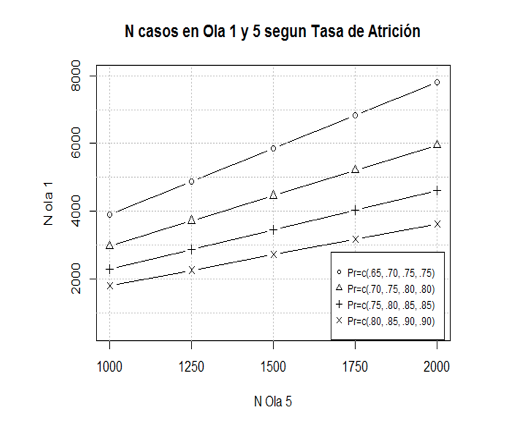

# Implementación de la Encuesta 

COES realizó una licitación pública para la ejecución del ELSOC. El Centro Micro Datos (CMD) de la Facultad de Economía y Negocios de la Universidad de Chile se adjudicó dicho concurso y se encargó del desarrollo de la encuesta, incluyendo el trabajo de campo durante las cuatro primeras olas. El acuerdo con Micro Datos contempla los más altos estándares de calidad y asegura un adecuado resguardo de los datos personales de contacto de los participantes del estudio panel.

Este apartado describe la implementación ELSOC 2019, por lo que se recomienda revisar los Manuales de Usuario de olas anteriores si desea formarse una visión más detallada de la fase de empadronamiento e inicio del trabajo de campo del estudio.

## Estrategia de Seguimiento

COES y Centro MicroDatos definieron una estrategia de fidelización y seguimiento de los encuestados de ELSOC con el objetivo de minimizar la potencial atrición en el estudio. El insumo básico de este procedimiento fue el almacenamiento de información de contacto de los encuestados (además de su nombre de pila, contar con teléfono de contacto y dirección de correo electrónico). 
CMD realizó una ronda de re-contacto con los participantes de ELSOC previo al levantamiento de los datos. Esto fue vía telefónica, con el objetivo de verificar y actualizar los datos de contacto de la muestra y notificar a los contactos efectivos sobre la fecha estimada para la realización de la cuarta ola ELSOC. Dicha información permite contar con un listado de direcciones de residencia de los encuestados ELSOC y la información cartográfica pertinente para facilitar el trabajo de campo del encuestador. Estos insumos fueron cruciales para la planificación del trabajo de campo de 2019.

## Pilotaje del Cuestionario y Capacitación

Con el cuestionario correspondiente a la cuarta ola de ELSOC, previamente elaborado por COES y CMD a cargo de la programación de éste para que fuera aplicada de manera presencial en tablets (sistema CAPI). En una primera fase, el equipo ELSOC chequeó el flujo del cuestionario programado en tablets y propuso ajustes menores. Luego, se coordinó una versión piloto del estudio con el fin de testear el instrumento y evaluar el funcionamiento operativo del instrumento.
El pilotaje se realizó durante el mes de Septiembre 2019, seguido de una ronda de focus group a los encuestadores con el objetivo de obtener recomendaciones relevantes para el levantamiento final de la encuesta. Esto fue utilizado para introducir cambios menores al cuestionario programado en tablets y para definir ajustes al programa de capacitación de los encuestadores.
El CMD se encargó de la selección y capacitación del personal requerido (coordinadores y encuestadores). La capacitación de coordinadores de campo y encuestadores fue ejecutada por CMD con apoyo técnico de COES para aspectos específicos. CMD realizó dicha tarea de manera centralizada, de modo de que los coordinadores fueron capacitados en dependencias de la Facultad de Economía y Negocios (FEN) de la Universidad de Chile en la Región Metropolitana.
Se dispuso de 16 sedes de trabajo administradas por coordinadores de zona. Las sedes permiten recibir a los encuestadores y almacenar los insumos del estudio, contando con conexión a internet para facilitar la carga de las encuestas recolectadas. La capacitación de los encuestadores en el levantamiento se realizó en cada sede.

## Planificación y Ejecución del Campo

Al igual que para las olas anteriores, CMD elaboró un Manual del Encuestador para la implementación de ELSOC y en conjunto con COES preparó documentos orientadores y protocolos para la aplicación del cuestionario. Esto incluye: 

1. **Protocolo de Visita**: primer contacto con la vivienda, primer contacto con el hogar y concertación de entrevistas en casos en que no se puede realizar entrevista al momento de visita.

2. **Protocolo ante Casos Difíciles**: escenario de negaciones, escenario de más de 4 intentos presenciales sin contacto, barreras de acceso a la vivienda, no contacto con la vivienda. También contempla estrategias de recuperación.

3. **Protocolo de Aplicación del Cuestionario**: descripción del estudio, consentimiento informado, aplicación de preguntas, manejo de interrupciones, entrega de gift cards.

4. **Protocolo de Campo**: respaldo de información, control de avances, registro de contactos.

5. **Protocolo de Futuros Seguimientos (cuarta ola)**: se solicita información de contacto para poder re-contactar en otra oportunidad al entrevistado seleccionado.

Los documentos fueron adaptados de modo tal de ajustarse a los requerimientos del seguimiento de una muestra previamente entrevistada. El levantamiento de información fue realizado en un período de aproximadamente 13 semanas entre noviembre 2019 y marzo 2020^[Debido al desgaste propio de la muestra y el equipo en terreno en un contexto de estallido social se decidió hacer una pausa en el levantamiento de datos durante las últimas tres semanas de febrero 2020.]. Para la ejecución del terreno se contó con 143 encuestadores distribuidos en las 16 sedes de trabajo antes referidas. Todos fueron debidamente capacitados, para posteriormente ser citados para retirar el material de trabajo (hojas de ruta, citas concertadas, croquis de ubicación y tablet). Cabe mencionar que, inicialmente, el terreno estaba programado para comenzar el sábado 19 Octubre 2019, sin embargo, debido al estallido social del día anterior el terreno tuvo que ser suspendido hasta el jueves 21 noviembre.

CMD cuenta con información relevante para garantizar un adecuado recontacto (nombre del entrevistado, información de contacto y aspectos básicos para su identificación) y utiliza dicha información para concertar entrevistas y planificar el campo. Cada encuestador recibió del coordinador de sede o encuestador apoderado los datos sobre las citas concertadas con participantes ELSOC y utiliza un protocolo de entrevista específico para re-entrevistas. Las respuestas de los entrevistados fueron almacenadas en tablets provistas por CMD. La información recolectada era subida por los encuestadores a una plataforma web utilizando la tablet de CMD. Al finalizar la entrevista se entrega un incentivo monetario (tarjeta de regalo de 6.000 pesos) y un folleto informativo sobre COES y ELSOC. 

## Supervisión del Trabajo de Campo

El Centro MicroDatos desarrolló un proceso de supervisión del trabajo en terreno involucrando cinco etapas:

1. Supervisión del 100% de las encuestas recopiladas, realizado de manera simultánea por el Coordinador de Grupo. Para esto se utilizó una aplicación web diseñada para estos fines. Esto implicó la verificación del sujeto entrevistado, revisión de variables claves, revisión del resultado de visita y revisión de duración de entrevista.

2. Para verificar la veracidad de las encuestas levantadas se supervisaron al menos el 20% de las encuestas realizadas por cada encuestador. Esto consistió en la aplicación de un cuestionario reducido y de menor duración, lo cual fue organizado por un coordinador y ejecutado de manera centralizada mediante la vía telefónica o visitas en terreno, por personal distinto al que realizó el levantamiento de las encuestas. El objetivo principal fue verificar que los datos de la persona reportados en la encuesta coincidan con la persona del hogar que se le aplicó el estudio, además de la consistencia de un subconjunto de preguntas claves del cuestionario.

3. Sobre la base de la revisión de las encuestas realizadas y los resultados de los controles telefónicos, el coordinador de zona retroalimentó a su equipo (al menos una vez por semana) con observaciones y sugerencias respecto al trabajo de campo, orientadas a ayudar a mejorar su desempeño. Los encuestadores también brindaron observaciones y retroalimentación a sus coordinadores a partir de su experiencia en terreno.

4. Supervisión de encuestas por uso de CAPI. El software desarrollado para el cuestionario permite manejar de mejor modo la no respuesta, validar internamente el flujo del cuestionario (evitar problemas con filtros) y recolectar información sobre el tiempo de aplicación. La validación interna y el chequeo de rango y consistencia de la información minimiza notablemente el error de medición y es una de las ventajas del diseño de ELSOC.

5. Revisión de casos especiales y validación ex post. Finalmente, CMD revisó el funcionamiento del flujo de respuestas y detectó tres situaciones irregulares:

    i. En la comuna de Parral, Región del Maule, durante la supervisión el entrevistado indicó que no había sido encuestado y que se había cambiado de domicilio, situación que le advirtió a la encuestadora cuando lo llamó para agendar la entrevista. Se conversó con la encuestadora y confesó ser el único caso falsificado de los 23 restantes que se supervisaron y no se encontró otra situación anómala. La encuestadora fue marginada del proyecto y desvinculada del Centro de Microdatos.

    ii. En la comuna de Puerto Montt, Región de Los Lagos, se le aplicó la encuesta a otro integrante del hogar y no la persona seleccionada. La encuestadora llevaba 32 encuestas aplicadas, las cuales se revisaron en su totalidad y no se encontraron otras irregularidades. Esta encuestadora fue marginada del proyecto y desvinculada del Centro de Microdatos.

    iii. En la Región de Aysén, se detectó que gran parte de la muestra refresco había sido seleccionada desprolijamente en el año 2018, aplicando las encuestas en manzanas distintas a las seleccionadas. Frente a esto, se decidió enviar a un grupo de encuestadores desde Santiago para revisar la totalidad de la muestra y se rehiciera el trabajo aplicando la encuesta a quienes originalmente había que hacerlo. En este proceso se realizaron 10 encuestas nuevas.

## Incidencias de Terreno y Códigos de Disposición Final de Casos

El trabajo de terreno se desarrolló en un período de 13 semanas, a partir del 21 noviembre 2019. La primera incidencia que tiene relación directa con el terreno fue el surgimiento del estallido social el 18 de Octubre 2019, lo cual implicó retrasar el periodo de aplicación de la encuesta que originalmente partía el 19 de Octubre. Sin embargo, una vez ya en terreno no se presentaron mayores dificultades pese a que era un contexto nacional complejo.

Las incidencias durante el terreno fueron menores, siendo la única modificación mayor la agregación de ciertos códigos de disposición final en el registro de visitas, con el fin de obtener un mayor grado de información cuando el informante no es ubicable o no puede atender (código 2250). Los nuevos códigos son:

*	2251: Informante se cambia a domicilio conocido

*	2252: Informante se cambia a domicilio desconocido

*	2253: Informante se fue fuera del país permanentemente

Gracias a estos nuevos códigos, se pudo detectar que en la muestra seguimiento 118 personas se cambiaron a domicilio desconocido, mientras que 4 informantes se cambiaron a domicilio conocido y 3 se fueron del país permanentemente. En la muestra refresco, 48 personas se cambiaron a domicilio desconocido, 6 personas se cambiaron a domicilio conocido y 1 se fue del país permanentemente.

Siguiendo los estándares de la Asociación Americana de Investigación en Opinión Pública (AAPOR por su sigla en inglés), se asoció a cada uno de los casos de la muestra completa un código de disposición final. En base a dicha información, la cuarta ola de ELSOC tiene las siguientes tasas de resultados:

* Tasa de Respuesta (RR2): 80% muestra seguimiento y 83% muestra refresco.

* Tasa de Rechazo (REF2): 5% muestra seguimiento y 3% muestra refresco.

* Tasa de Contacto (CON2): 86% muestra seguimiento y 87% muestra refresco.

* Tasa de Cooperación (COOP2): 93% muestra seguimiento y 95% muestra refresco.

Si desea conocer más detalles sobre la determinación de los códigos de disposición final de casos y el cálculo de las tasas de resultados, dirigirse a [Standard-Definitions-2016](http://www.aapor.org/AAPOR_Main/media/publications/Standard-Definitions20169theditionfinal.pdf)

## Aspectos Longitudinales y Cuarta Ola del Estudio

Un aspecto esencial de la planificación de ELSOC desde sus orígenes fue la atrición presupuestada. Desde la etapa de diseño se contemplaron distintos escenarios potenciales de atrición y se definió el diseño muestral acorde a las conclusiones de dicho examen (Ver Figura 1). A su vez, los escenarios de atrición fueron parte de los objetivos que guiaron el diseño de la licitación del estudio y el trabajo con CMD.

<center>**Figura 1**: Diseño Muestral de ELSOC según Ola.</center>


```{r echo=FALSE, fig.align='center', fig.height=1, out.height="60%", out.width="60%"}

```

El Cuadro 4 describe la recuperación de casos de la muestra seguimiento ELSOC, a partir de distintas comparaciones de ola, desagregando en sub-grupos claves. Se observa que la muestra de 2017 equivale a un 84.5% de la original, resultado mejor a las estimaciones de un 20% de atrición en la primera ola. Mientras que la muestra seguimiento 2018 corresponde al 76.2% de la muestra original y 90,1% si se compara con los participantes en el año 2017. Finalmente, en la cuarta ola la muestra corresponde al 73,6% de la muestra participante en el año 2016.
Además, se observan diferencias sustantivas en términos de sexo, zona y tramo etario del entrevistado. Por ejemplo, a medida que aumenta la edad se observa un mayor porcentaje recuperado de la muestra y las mujeres tienen menor atrición que los hombres en cada una de las olas.

```{r}
 add_header_above(c(" ", "Group 1" = 2, "Group 2" = 2, "Group 3" = 2)) %>%
  add_header_above(c(" ", "Group 4" = 4, "Group 5" = 2)) %>%
  add_header_above(c(" ", "Group 6" = 6))
```


Cabe recordar que el plan de trabajo de COES contemplaba desde el inicio la incorporación de una muestra refresco de 1400 casos, debido a la atrición propia de los estudios longitudinales (ver figura 2). El objetivo de la muestra de refresco es corregir la sub-cobertura de ciertos grupos poblacionales y ajustar por la pérdida de casos dado la atrición.

<center>**Figura 2**: Diseño Muestral de ELSOC según Ola.</center>

```{r echo=FALSE, fig.align='center', fig.height=1, out.height="60%", out.width="60%"}
knitr::include_graphics("imagenes/design.png")
```

En el cuadro 5 se describe la recuperación de casos de la muestra refresco incorporada en la ola anterior de ELSOC, desagregado en sub-grupos claves. Se observa que la muestra recuperada el año 2019 equivale al 83,4% de la muestra que participó el año 2018. Respecto a los atributos claves, se observa que al igual que en la muestra seguimiento 2016 a medida que aumenta la edad aumenta el porcentaje que se recupera, así también las mujeres presentan mayor porcentaje de recuperación que los hombres. 


