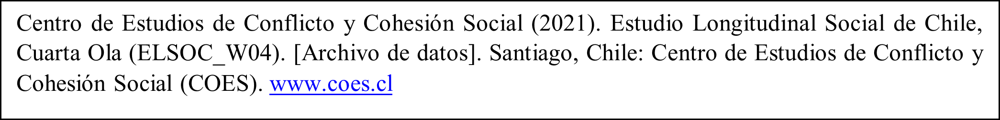
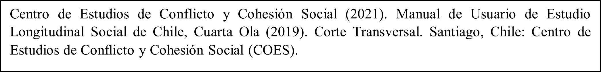

# Acceso y Uso de Base de Datos

Las bases de datos ELSOC de las cuatro olas se encuentran disponibles en el repositorio de COES en https://dataverse.harvard.edu/dataverse/elsoc.

Cualquier publicación que incluya para su realización el uso de la base de datos ELSOC (en cualquiera de sus versiones) debe citar la fuente de la siguiente forma:


```{r echo=FALSE, fig.align='center', fig.height=1, out.height="90%", out.width="90%"}

```

Por último, en caso de que se desee citar el presente Manual de Usuario:


```{r echo=FALSE, fig.align='center', fig.height=1, out.height="100%", out.width="90%"}

```

En caso de que detecte problemas con la base de datos, desee plantear solicitudes y/o tenga dudas sobre aspectos no cubiertos por el presente Manual de Usuario, las cuales no puedan ser resueltas por otros medios, puede comunicarse con el Equipo de Encuestas COES al correo electrónico encuestacoes@gmail.com. El equipo procesará su solicitud y tratará de contestar en el más breve plazo.

