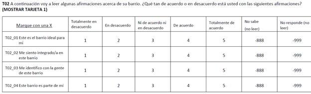
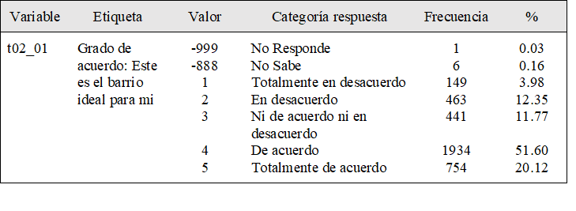
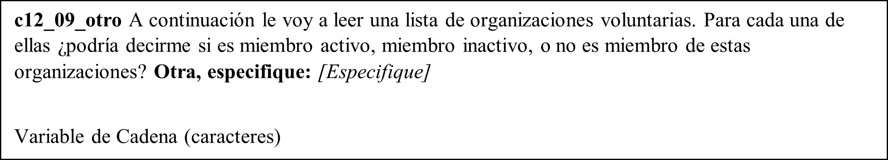
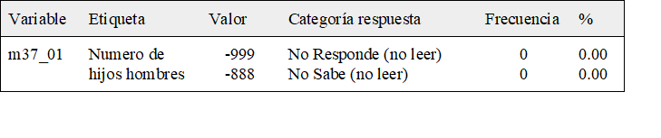

# Libro de Códigos Base de Datos ELSOC Ola 4

Para un uso adecuado de la base de datos de la cuarta ola de ELSOC COES se recomienda a los investigadores trabajar con el libro de códigos, el cual se presenta a continuación. Este apartado detalla el fraseo de cada uno de los ítemes incluidos, las distintas categorías de respuestas asociadas a éste, y el nombre de las variables como las etiquetas incorporadas en la base de datos. Ahora se incorporan recomendaciones generales para el uso de la base de datos y los libros de códigos.

## Variables ELSOC Ola 4

La base de datos de ELSOC Ola 4 (2019) contiene una fila por cada entrevistado (son 3417 casos) y una columna por cada variable. Las variables corresponden a los ítems incluidos en el cuestionario del estudio. Ahora, es necesario que el usuario comprenda plenamente qué es un ítem.

A modo de ejemplo, la pregunta t02 del cuestionario de ELSOC, dónde se consulta a los entrevistados el grado de acuerdo con una serie de afirmaciones respecto a cohesión barrial. En esta pregunta, se incluyen 4 ítems distintos, correspondientes a cuatro aspectos distintos que miden cohesión barrial. En la base de datos, cada ítem corresponde a una variable incluida en la base de datos. Siguiendo el ejemplo, el primer ítem de cohesión barrial dice: “Este es el barrio ideal para mí", de modo que éste quedará codificado como t02_01. Así, el nombre de las variables de la base de datos se construye combinando:

*	El código de la variable en el cuestionario, en letras minúsculas (en el ejemplo corresponde a t02).
*	Valores numéricos correlativos al orden de los ítems, tal como aparecen en el cuestionario (01, 02, 03 y 04), separado por un guion bajo _ (en el primer caso, sería t02_01).

```{r echo=FALSE, fig.align='center', fig.height=1, out.height="90%", out.width="90%"}

```

El libro de códigos fue diseñado de modo de que sintetice toda la información relevante sobre las variables de la base de datos en un formato común para facilitar su uso, incluyendo el nombre de la variable, etiqueta de la variable en la base de datos ELSOC^[Las etiquetas de las variables fueron diseñadas por el equipo ELSOC de modo sucinto para describir el fenómeno o dimensión a medir, eliminando tildes y símbolos no incluidos en todos los softwares estadísticos (por ejemplo, la letra ñ)], categorías de respuesta de cada variable con sus valores asociados, frecuencia y porcentaje de encuestados que contestaron cada una de las categorías de respuesta.

En la construcción de la base de datos, las categorías de respuesta (atributos) fueron ingresadas como valores numéricos y se incluyeron etiquetas de valores. En el ejemplo anterior, si una persona se manifiesta totalmente en desacuerdo con “este es el barrio ideal para mí”, su respuesta quedará codificada con el valor numérico 1, por lo que se podrán realizar operaciones aritméticas con esta respuesta. De todos modos, se incluye una etiqueta para indicar que el valor 1 corresponde con la respuesta “Totalmente en desacuerdo”. Ejemplo:

```{r echo=FALSE, fig.align='center', fig.height=1, out.height="90%", out.width="90%"}

```

Por último, es importante también tener en cuenta la información no incluida en este libro de códigos respecto al fraseo de la pregunta en el cuestionario. Por ejemplo, “A continuación voy a leer algunas afirmaciones acerca de su barrio. ¿Qué tan de acuerdo o en desacuerdo está usted con las siguientes afirmaciones?" corresponde al fraseo exacto de la pregunta, mientras que “(MOSTRAR TARJETA 1)” aparece entre paréntesis y corresponde a una instrucción para el encuestador. Estos elementos son incluidos de manera completa en el Cuestionario y el Listado de Variables correspondiente.

La base de datos de ELSOC 2019 homologa todas las respuestas No Sabe a -888 y No Responde a -999 y chequea la naturaleza de los valores perdidos restantes (los cuales corresponden en su totalidad a la aplicación de filtros). Las respuestas No Sabe y No Responde no fueron eliminadas ni transformadas en valores perdidos en la base de datos, de modo que los usuarios deben decidir qué hacer con dichos valores de respuesta. La etiqueta de valores de éstos incluye la instrucción de no ser leídos por el encuestador. En el caso de que la pregunta contenga un filtro, los valores no relevantes (filtrados) aparecen en la última línea y no tienen asignado valores ni etiquetas (son valores perdidos por el sistema).

Las variables de cadena (texto) no presentan códigos, ya que presentan los verbatim literales de las menciones por parte de los encuestados (visibles en la base de datos, no en libro de códigos pues no tienen códigos). El único cambio introducido -y fue realizado por motivos de compatibilidad entre softwares- fue la eliminación de símbolos tales como tildes, diéresis y otros caracteres especiales. A continuación, se presenta el ejemplo de una de dichas preguntas:

```{r echo=FALSE, fig.align='center', fig.height=1, out.height="90%", out.width="90%"}

```

En el caso de los ítems dónde se pide una respuesta numérica tampoco existen categorías de respuesta, registrándose el valor indicado por el entrevistado (visible en base de datos, no en libro de códigos porque no tienen códigos). De todos modos, se incluyen etiquetas de valores para los valores perdidos. A continuación, un ejemplo de un ítem de este tipo:


```{r echo=FALSE, fig.align='center', fig.height=1, out.height="90%", out.width="90%"}
knitr::include_graphics("imagenes/M37_01.png")
```

Que en el libro de códigos se visualiza así:

```{r echo=FALSE, fig.align='center', fig.height=1, out.height="90%", out.width="90%"}

```

## Características Base de Datos ELSOC Ola 4

La versión actual de la base de datos (2.0) contiene información para los 3748 entrevistados (N definitivo tras supervisión) en relación a los 384 ítems del cuestionario (cada una corresponde a una variable en la base de datos) y un conjunto adicional de variables: **Actualizar párrafo cuando Edgardo envíe la base 2019 definitiva**

1. Identificadoras de Casos: id de la encuesta, comuna de residencia y región de residencia.

2. De Diseño Muestral Complejo: ponderadores (y factores de expansión), estrato y segmento para incorporar el diseño complejo de la encuesta.

Dentro de las variables de diseño muestral complejo, el estrato identifica a los seis previamente definidos: Gran Santiago (1), Gran Valparaíso (2), Gran Concepción (3), Ciudades Grandes (4), Ciudades Medianas (5) y Ciudades Pequeñas (6). La variable segmento1 representa las manzanas/bloques, pero los valores son artificiales (generados por Centro Micro Datos y no corresponden a los valores reales) de modo de garantizar la privacidad de los entrevistados. **Chequear que lo que dice del ponderador 02 en el recuadro de abajo sea verídico**

<center> **Se recomienda la utilización de los ponderadores muestrales que ajustan en base a la probabilidad de selección, no respuesta y población objetivo estimada a nivel regional. El ponderador 02 también ajusta en base a la población estimada según sexo.** </center>
<br>

Aún no se encuentran disponibles en la base de datos las variables georreferenciadas que proveerá el Centro de Inteligencia Territorial (CIT), siendo esto motivo de una nueva versión de la base de datos. Esto implicará un nuevo lanzamiento de la base de datos y todas las facilidades para que los investigadores hagan un uso óptimo de las variables territoriales.

Las bases de datos se encuentran disponibles en formatos .dta (compatibles con versiones Stata 13 y 14), .sav (compatibles con SPSS) y .RData (compatibles con R, los objetos contienen como atributos etiquetas de variables y valores). El Equipo de Encuestas COES también cuenta con bases de datos adicionales sobre la encuesta (en formato .dta y/o .xlsx):

1.	Casos supervisados.
2.	Capacitaciones a encuestadores.
3.	Duración de entrevistas.
4.	Códigos de disposición final muestra completa.
5.	Diseño y selección muestra.
6.	Tabla Kish.
7.	Construcción de ponderadores.

Sin embargo, los archivos anteriormente listados deben ser solicitados al Equipo de Encuestas, justificando el uso que se darán a los datos requeridos. El Equipo de Encuestas COES decidirá la pertinencia de dichas solicitudes y se reserva el derecho para entregar dichos datos.


