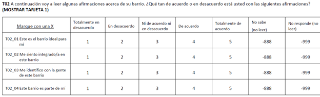
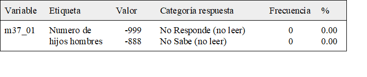

--- 
title: <center>ESTUDIO LONGITUDINAL SOCIAL DE CHILE (ELSOC 2019)</center>
author:
  - name: Roberto González
  - name: Matías Bargsted
  - name: Daniel Miranda
  - name: Benjamín Muñoz
  - name: Alejandro Plaza
date: "`r Sys.Date()`"
output:
  bookdown::pdf_book:
    toc: yes
    includes:
      in_header: preamble.tex
      before_body: portada.tex
site: bookdown::bookdown_site
documentclass: book
subtitle:  <center>MANUAL DE USUARIO DE BASE DE DATOS CORTE TRANSVERSAL</center>
---

# Presentación {#present}

```{r echo=FALSE, fig.align='center', fig.height=1, out.height="60%", out.width="60%"}
#knitr::include_graphics("imagenes/coes_blanco_esp.jpg")
```


El Estudio Longitudinal Social de Chile (ELSOC) es una encuesta desarrollada para analizar intertemporalmente la evolución del conflicto y cohesión en la sociedad chilena, basándose en modelos conceptuales descritos en la literatura nacional e internacional que abordan dichas materias.

De este modo, se orienta a examinar los principales antecedentes, factores moderadores y mediadores, así como las principales consecuencias asociadas al desarrollo de distintas formas de conflicto y cohesión social en Chile. Por lo tanto, su objetivo fundamental es constituirse en un insumo empírico para la comprensión de las creencias, actitudes y percepciones de los chilenos hacia las distintas dimensiones de la convivencia y el conflicto, y como éstas cambian a lo largo del tiempo.

Esta encuesta se aplica desde el año 2016 y fue diseñada por investigadores pertenecientes al Centro de Estudios de Conflicto y Cohesión Social (COES). El Centro está patrocinado por la Universidad de Chile y la Pontificia Universidad Católica de Chile y cuenta como instituciones asociadas a la Universidad Diego Portales y la Universidad Adolfo Ibáñez. Si desea obtener más información sobre el Centro, visite http://www.coes.cl/. COES es una iniciativa que desde 2013 cuenta con el financiamiento^[Proyecto CONICYT/FONDAP/15130009.] del Fondo de Financiamiento de Centros de Investigación en Áreas Prioritarias (FONDAP) de la Comisión Nacional de Investigación Científica y Tecnológica (CONICYT), organismo dependiente del Ministerio de Educación de Chile. El levantamiento de datos de las cuatro primeras olas de ELSOC ha estado a cargo del Centro Micro Datos (CMD) de la Universidad de Chile.

El presente documento contiene información relevante para los usuarios de la base de datos de la cuarta ola del estudio longitudinal, correspondiente al año 2019. Este Manual de Usuario enfatiza la dimensión de corte transversal de ELSOC 2019. Los reportes técnicos relativos a las propiedades longitudinales de ELSOC se encuentran en el Manual de Usuario Longitudinal (ELSOC 2016-2017). De todos modos, algunos aspectos centrales de la evolución inter-olas de ELSOC son descritos. Se recomienda a los usuarios interesados en realizar análisis panel consultar de manera adicional el Manual de Usuario Longitudinal **disponible en (____)**.

Este manual se estructura en torno a secciones temáticas. La siguiente sección describe brevemente el diseño del instrumento, lo cual es complementado con la ficha técnica del estudio. La tercera sección reseña el diseño muestral general del panel. En el cuarto apartado se resumen los principales aspectos del trabajo de campo, enfatizando las particularidades del proceso de re-entrevista a los participantes. El quinto apartado corresponde al registro de versiones de la base de datos. Por último, se incluye un apartado con orientaciones básicas para el análisis y el libro de códigos de las variables incluidas en la base de datos de ELSOC 2019.

<!--chapter:end:index.Rmd-->

# Diseño del Instrumento {#dis_ins}

A continuación, se presenta el desarrollo del cuestionario del ELSOC. El instrumento de recolección de información consiste en un cuestionario estructurado (tipo encuesta) aplicado cara a cara a todos los participantes. Dicha aplicación se hace utilizando el sistema CAPI (Encuestas personales asistidas por computadores). El cuestionario fue diseñado para medir una serie de aspectos conceptualmente relevantes que permiten caracterizar los niveles de conflicto y cohesión social en Chile, enfatizando su evolución a lo largo del tiempo. Los principales temas de interés analítico abordados por la encuesta corresponden a los módulos en los cuales se estructura:

1. *Ciudadanía y Democracia*
2. *Redes sociales e Interacciones inter-grupales*
3. *Legitimidad y desigualdad social*
4. *Sociabilidad política*
5. *Conflicto social*
6. *Dimensión barrial y territorial*
7. *Género*
8. *Salud y bienestar*
9. *Caracterización Sociodemográfica*

Los cuestionarios oficiales ELSOC correspondiente a la cuarta ola (y olas anteriores) están disponibles en [https://dataverse.harvard.edu/dataverse/elsoc](https://dataverse.harvard.edu/dataverse/elsoc).

## Proceso de Diseño {#proc-dis}

El proceso de diseño del cuestionario de ELSOC se desarrolló durante el año 2015 y abarcó las cuatro primeras olas. Por lo tanto, el proceso de trabajo aquí descrito coincide con el presentado en el Manual de Usuario de ELSOC 2016. Las diferencias menores entre el cuestionario de la tercera y cuarta ola son descritas en el siguiente apartado.

La mayoría de las preguntas, escalas y/o ítems incluidos en los módulos de ELSOC 2019 provienen de otros estudios de opinión pública, investigaciones -en psicología, sociología, economía, ciencia política- realizadas por académicos nacionales e internacionales y encuestas sociales conducidas en Chile y otros países. En forma complementaria, algunas escalas fueron desarrolladas por los miembros del equipo COES y/o han sido adaptadas de estudios anteriores de éstos. De manera genérica, el cuestionario fue diseñado aprovechando las principales recomendaciones técnicas y el estado del arte en las distintas áreas de estudio incluidas.

Con el objetivo de satisfacer los criterios y estándares de calidad para cuestionarios y compatibilizar la multiplicidad de agendas de investigación desarrolladas por COES, se optó por elaborar un procedimiento de trabajo para la construcción de éste. Este proceso se desarrolló durante el año 2015 en distintas fases:

1. Se solicitó a los investigadores vinculados a COES proponer proyectos de investigación que contemplen un planteamiento teórico e hipótesis que fundamenten las escalas propuestas para ser incluidas en el cuestionario. Las propuestas podían ser presentadas de manera individual o colectiva y no existían restricciones en el número de ítems a proponer. Sólo se exigía una fundamentación teórica explícita que involucre hipótesis longitudinales y una operacionalización de los constructos a medir en los distintos ítems propuestos.

2. El procedimiento anterior implicó la recepción y organización de un elevado número de agendas de investigación, los que se materializan en más 750 ítems (preguntas únicas o parte de una escala). El equipo ELSOC sistematizó las propuestas recibidas, clasificando los ítems en áreas temáticas. A la vez, se diseñaron mecanismos para reducir el número de ítems y coordinaron reuniones entre los investigadores COES para decidir sobre éstos.

Los criterios de selección fueron principalmente teóricos, priorizando las preguntas fundamentales para el análisis longitudinal de los proyectos de investigación como su concordancia con la agenda sustantiva de COES^[También se incluyeron criterios prácticos, relativos a la eliminación de ítems idénticos o muy semejantes; evidencia previa sobre la calidad de los ítems (encuestas anteriores, especialmente la encuesta de corte transversal desarrollada por COES el año 2014) y el diseño general del estudio (diseño muestral, unidad de análisis, tipo de informante, etc.).].

3. Luego de una selección de las escalas más relevantes para cada tema propuesto, se realizó un estudio piloto del cuestionario desarrollado. Esto implicó pilotear 430 ítems, donde el Centro Micro Datos de la Universidad de Chile se encargó de su ejecución. En base a los resultados de dicho piloto, el equipo panel realizó ajustes a algunos ítems y elaboró una propuesta de reducción de ítems que fue evaluada con los investigadores del Centro.

4. La última etapa de ajuste del cuestionario se centró en identificar los aspectos conceptualmente más relevantes para COES y ponderar los requerimientos metodológicos para su evaluación empírica. De este modo, se clasificaron los ítems según el número de mediciones requeridas, distinguiendo entre ítems permanentes (que serán medidos en todas las olas, ya que constituyen el núcleo analítico del estudio) e intercalados (que serán medidos una única vez o una ola por medio).

La versión final del instrumento de recolección de información consiste en un cuestionario estructurado (tipo encuesta) que se aplica cara a cara a todos los participantes con una periodicidad anual. Sin embargo, debe tenerse presente que existen diferencias entre los cuestionarios de las distintas olas producto de la inclusión de los ítems intercalados^[Algunos ítems aparecen una única vez (características invariantes en el tiempo) y otros son rotados (aparecen
en años pares o impares).
]. En el Cuadro 3 se resumen los conceptos que se incluyeron en las distintas secciones del cuestionario de ELSOC 2019. Para más detalles sobre el Cuestionario se debe revisar el último apartado de este manual: Libro de Códigos.

## Preguntas nuevas incorporadas a ELSOC en ola 4 {#nueva-preg}

El Cuadro 1 señala los temas que fueron agregados a la muestra de seguimiento y/o la muestra refresco. Cabe mencionar que se considera como tema agregado aquel que nunca antes se había preguntado en esa muestra ELSOC (muestra seguimiento o refresco, según corresponda), distinguiéndose de los ítems intercalados que fueron preguntados en la muestra seguimiento en ola 2 y en esta ola 4 han regresado. Para mayor detalle de esto, se recomienda revisar el Listado de Variables incluido como una guía útil para contrastar los cuestionarios **(disponible  en _____).**

Cabe mencionar que ad portas de comenzar el terreno de ELSOC surge el estallido social del 18 Octubre, lo que llevó a tomar decisiones urgentes respecto a incorporar preguntas que abordaran aspectos relevantes de la coyuntura nacional del momento.

```{r nuevotemas, echo=FALSE, message=FALSE, warning=FALSE}
library(pacman)
pacman::p_load(tidyverse,knitr,kableExtra,dplyr,tinytex)

nuevo_temas <- tibble("Temas agregados muestra seguimiento 2019" =
                            c("Conflicto territorial 18-O (t15, t16, t17), Confianza redes cercanas (r13), relaciones intergrupales migrantes (r18), se agregan instituciones en pregunta de confianza hacia ellas (c05), participación en cacerolazos (c08_05), agrega alternativa en justicia distributiva y meritocracia (c18_13), temas de discusión pública (c37_06, c37_07 y c37_08), anomia (c40), rabia en temas de sociabilidad política (c41), miedo en sociabilidad política (c42), género (g01 y g02), estatus subjetivo de peruanos/venezolanos (d01_04), elite (d24), mal trato (d25), tolerancia (d26), deprivación relativa (d27), se agregan preguntas sobre justificación de la violencia (f05_09, f05_10 y f05_11), nada que perder (f07), polarización afectiva (f08), cantidad miembros hogar (m54)"),
                          "Temas agregados muestra refresco 2019" = 
                            c("Conflicto territorial 18-O (t15, t16, t17), caracterización red cercana (r13), otras de redes cercanas (r14, r15), relaciones intergrupales con migrantes (r16, r18), se agregan instituciones en pregunta de confianza hacia ellas (c05), participación en cacerolazos (c08_05), agrega alternativa en justicia distributiva y meritocracia (c18_13), temas constitucionales (c26, c27, c28, c29, c30 y c31), anomia (c40), rabia en temas de sociabilidad política (c41), miedo en sociabilidad política (c42), género (g01 y g02), elite (d24), mal trato (d25), tolerancia (d26), deprivación relativa (d27), se agregan preguntas sobre justificación de la violencia (f05_09, f05_10 y f05_11), nada que perder (f07), polarización afectiva (f08), consumo alcohol (s15), edad a la que tuvo el primer hijo (m48_edad), socialización primaria (m49), establecimiento educacional (m50 y m51)")) 


nuevo_temas %>%
  kable(booktabs = TRUE,caption="\\label{tab:difcuest}Preguntas nuevas incorporadas en ELSOC ola 4 (2019)") %>%
  column_spec(c(1), width = "6cm") %>%
  column_spec(c(2), width = "6cm") %>%
  kable_classic(full_width = F) %>%
  kable_styling(latex_options = "HOLD_position")
```


**EL SIGUIENTE CUADRO ESTÁ EN DUDA SI PONERSE O NO**

```{r noincluidas, echo=FALSE, message=FALSE, warning=FALSE}
library(pacman)
pacman::p_load(tidyverse,knitr,kableExtra,dplyr,tinytex)

no_incluidas <- tibble("Muestra Seguimiento" =
                            c("Redes lejanas (r01, r03, r04, r05), confianza en grupos (c06), intención participación (c09), participación ciudadana (c11, c12), roles de género (c19), identidad de clase (c33, c34), percepción de trato justo (c35), voto retrospectivo 2017 (c39), fuerza de conflictos (f01_02, f01_03, f01_06), aversión al conflicto (f02_03, f02_04), agresividad física (f04), practica actividad física (s04), estado de salud (s05, s06, s07, s08, s09, s10), hablar de problemas con amigos/familiares (s12), estresores (s13), tratamiento depresión (s14), metas y planes de vida (s30), sociodemográficas (m03 a m12 y m17 a m26), caracterización del hogar (m33, m34), capital cultural (m35), deuda (m42, m43 y m44), nacionalidad (m45), red apoyo encontrar trabajo (m55, m56). "),
                          "Muestra Refresco" = 
                            c("Redes lejanas (r01, r03, r04), confianza en fiscalía nacional (c05_09), confianza en grupos (c06), intención participación (c09), participación ciudadana (c11, c12), roles de género (c19), voto retrospectivo 2017 (c39), fuerza conflictos (f01_02, f01_03, f01_06), aversión conflicto (f02_03, f02_04), agresividad física (f04), practica actividad física (s04), estado de salud (s05, s06, s07, s08, s09, s10), hablar de problemas con amigos/familiares (s12), estresores (s13), tratamiento depresión (s14), sociodemográficas (m03 a m12 y m17 a m28), caracterización del hogar (m33, m34), capital cultural (m35), cantidad hijos (m37), establecimiento educacional básica (m40), deuda (m42, m43 y m44), nacionalidad (m45)")) 


no_incluidas %>%
  kable(booktabs = TRUE,caption="\\label{tab:difcuest} Preguntas NO incluidas en ELSOC ola 4  (2019) que sí se preguntaron en la ola anterior (2018)") %>%
  column_spec(c(1), width = "6cm") %>%
  column_spec(c(2), width = "6cm") %>%
  kable_classic(full_width = F) %>%
  kable_styling(latex_options = "HOLD_position")
```


```{r temasconceptos, echo=FALSE, message=FALSE, warning=FALSE}

library(pacman)
pacman::p_load(tidyverse,knitr,kableExtra,dplyr,tinytex)

temas_conceptos <- tibble(Muestra = c(" "),
                  Sección = c("Territorio"),
                  "Escalas y temas" = c("Confianza en vecinos, cohesión barrial, sociabilidad
                                        barrial, transformación barrial, movilidad residencial, 
                                        satisfacción residencial, conflicto barrial, seguridad 
                                        barrial, problemas barriales, conflicto territorial 
                                        18-O"))%>% 
  add_row(Muestra = c(" "),
                  Sección = c("Redes y Actitudes"),
                  "Escalas y temas" = c("Relaciones entre chilenos y migrantes, redes
                                        cercanas"))%>% 
  add_row(Muestra = c(" "),
                  Sección = c("Ciudadanía y democracia"),
                  "Escalas y temas" = c("Actitud hacia democracia, confianza interpersonal,
                                        confianza instituciones, participación ciudadana,
                                        autoeficacia política, interés político, identificación
                                        política, temas constitucionales, percepción de
                                        corrupción, anomia"))%>%
  add_row(Muestra = c(" "),
                  Sección = c("Sociabilidad Política"),
                  "Escalas y temas" = c("Comportamiento prosocial, dominancia social,
                                        autoritarismo, justicia distributiva y meritocracia,
                                        desigualdad percibida, movimientos sociales, identidad
                                        nacional, rabia y miedo en temas de sociabilidad
                                        política"))%>% 
  add_row(Muestra = c(" "),
                  Sección = c("Género"),
                  "Escalas y temas" = c("Sexismo benévolo, sexismo hostil, derechos de género,
                                        identidad de género, expectativas y normas de género,
                                        roles de género"))%>%
  add_row(Muestra = c(" "),
                  Sección = c("Desigualdad y legitimidad"),
                  "Escalas y temas" = c("Estatus subjetivo, justicia y bienestar, percepción y
                                        justificación de desigualdad salarial, surgir en la
                                        vida, elite, mal trato, tolerancia, deprivación
                                        relativa"))%>%
  add_row(Muestra = c(" "),
                  Sección = c("Conflicto Social"),
                  "Escalas y temas" = c("Fuerza conflicto, justificación violencia,
                                        punitividad, nada que perder, polarización
                                        afectiva"))%>%
  add_row(Muestra = c(" "),
                  Sección = c("Salud y Bienestar"),
                  "Escalas y temas" = c("Satisfacción vital, estado de salud, 
                                        estado de ánimo, conducta saludable"))%>%
  add_row(Muestra = c(" "),
                  Sección = c("Sociodemográficas"),
                  "Escalas y temas" = c("Sexo, edad, nivel educacional, clase y estatus,
                                        ingresos, religión, justicia distributiva y
                                        meritocracia, ingreso familiar, caracterización
                                        individual, transporte, etnia, cantidad miembros 
                                        del hogar"))%>%
  add_row(Muestra = c(" "),
                  Sección = c("Ciudadanía y democracia"),
                  "Escalas y temas" = c("Temas de discusión pública"))%>%
  add_row(Muestra = c(" "),
                  Sección = c(" "),
                  "Escalas y temas" = c(" "))%>%
  add_row(Muestra = c(" "),
                  Sección = c("Sociabilidad política"),
                  "Escalas y temas" = c("Percepción trato justo"))%>%
  add_row(Muestra = c(" "),
                  Sección = c("Desigualdad y legitimidad"),
                  "Escalas y temas" = c("Conflicto de clase"))%>%
  add_row(Muestra = c(" "),
                  Sección = c("Sociodemográficas"),
                  "Escalas y temas" = c("Bienes, edad a la que tuvo el primer hijo,
                                        establecimiento educación media"))
temas_conceptos %>%
  kable(booktabs = TRUE,  caption="\\label{tab:hogares}Temas y conceptos medidos en ELSOC Ola 4 (2019)") %>%
  column_spec(c(1), width = "5cm") %>%
  column_spec(c(2), width = "4cm") %>%
  column_spec(c(3), width = "6cm") %>%
  row_spec(0:13, background = "white") %>% 
  pack_rows("Muestra de seguimiento 
            y muestra refresco", 1, 9) %>%
  pack_rows("Sólo muestra seguimiento", 10, 11) %>%
  pack_rows("Sólo muestra refresco", 12, 13) %>%
  kable_classic(full_width = F)

```

## Ficha Técnica {#ficha-tecnica}

En este apartado se presenta la Ficha Técnica que sintetiza las principales características del Estudio Longitudinal Social de Chile (ELSOC COES) y de la implementación de la cuarta ola de esta encuesta. Los siguientes apartados entregan mayores detalles sobre el diseño muestral del panel y en específico de su cuarta ola, como de la ejecución y trabajo de campo.

*	Objetivo: Analizar longitudinalmente la evolución del conflicto y cohesión en la sociedad chilena
*	Diseño: Estudio cuantitativo por medio de un cuestionario estructurado
* Instrumento: Cuestionario compuesto por preguntas cerradas de carácter simple y múltiple junto a algunas preguntas abiertas. Combina preguntas permanentes (todas las olas) e intercaladas.
*	Cobertura temática: Contiene nueve módulos temáticos: Territorio, Redes y actitudes sociales, Ciudadanía y democracia, Sociabilidad Política, Género, Desigualdad y legitimidad, Conflicto social, Salud y bienestar y Caracterización sociodemográfica.
*	Unidad de Análisis: Individuos
*	Población objetivo: Hombres y mujeres de 18 a 75 años, residentes habituales de viviendas
*	particulares ocupadas, localizadas en 40 ciudades (92 comunas) del país.
*	Marco muestral: Marco de muestreo de manzanas del pre-censo 2011, trabajo elaborado por el Centro de Inteligencia Territorial (CIT) de la Universidad Adolfo Ibáñez.
*	Diseño Muestral: Probabilístico, estratificado, por conglomerados y multietápico.
*	Unidades de Muestreo inicial: Primero se eligen ciudades (UPM), luego manzanas (USM), y sub-bloques y viviendas (UTM). La unidad final de selección es la persona.
*	Unidades de Muestreo refresco: Primero se eligieron comunas, luego manzanas (USM), después viviendas (UTM) y finalmente la persona.
*	Periodo de aplicación: Noviembre 2019 a Marzo 2020 (13 semanas con periodo de descanso en Febrero)
*	Periodicidad: anual.
*	Modo de Aplicación: Encuesta presencial en vivienda del entrevistado. Entrevista personal aplicada por un encuestador por medio de una tablet (Sistema CAPI: Computer Assisted Personal Interview.)
*	Informante: Hombre o mujer residente en la vivienda, con edad entre 18 y 75 años
*	Aspectos Éticos: entrevista voluntaria. Se solicitan datos de contacto de entrevistados, pero no son accesibles (confidenciales). Información georreferenciada también se reserva de manera confidencial. Base de acceso público.
*	Duración promedio muestra seguimiento 2016: 44.6 minutos
*	Duración promedio muestra refresco 2018: 52.4 minutos
*	Control de calidad: Supervisión interna de 15,6% de la muestra lograda
*	Representatividad: Aproximadamente el 77% de la población total del país y 93% de la población urbana con la muestra de Ola 2016 **(FALTA UN CALCULO EDGARDO)**.
*	Tasa de respuesta muestra seguimiento: 80%
*	Tasa de respuesta muestra refresco: 83%
*	Tasa de cooperación muestra seguimiento: 93%
*	Tasa cooperación muestra refresco: 95%
*	Tasa rechazo en muestra seguimiento: 5%
*	Tasa rechazo en muestra refresco: 3%
*	Tasa de contacto muestra seguimiento: 86%
*	Tasa de contacto muestra refresco: 87%
*	Tamaño muestral: 3.417 individuos. En base de datos definitiva 2.153 individuos de muestra de seguimiento y 1.264 individuos de muestra refresco.
*	Organismo Responsable: Centro de Estudios del Conflicto y Cohesión Social (COES).
*	Organismo Ejecutor: Consultora Stephanie Eckman y Centro de Inteligencia Territorial (CIT) de la Universidad Adolfo Ibáñez (diseño muestral). Centro Micro Datos (CMD) de la Universidad de Chile (levantamiento, procesamiento de la información y construcción de factores de expansión).


<!--chapter:end:01-dis-instrumento.Rmd-->

# Diseño Muestral del Estudio 

En el siguiente apartado se presenta la descripción del diseño muestral de ELSOC, correspondiente a la primera ola del estudio. Durante la cuarta ola del estudio (2019) el objetivo fundamental es volver a entrevistar a las personas encuestadas en la primera ola (2016) y aquellas integradas en la tercera ola (2018).

El diseño de ELSOC tuvo como objetivo conciliar los múltiples intereses de investigación de los investigadores asociados al Centro. Entre las consideraciones más relevantes destacaron las siguientes:

1. Un diseño muestral que permitiera combinar las variables medidas en el cuestionario con las variables espaciales, registradas a nivel de manzana y comuna, contenidas en las bases de datos desarrolladas por el Centro de Inteligencia Territorial (CIT) de la Universidad Adolfo Ibáñez. Dado que los datos del CIT no están disponibles para todas las manzanas del país, particularmente aquellas ubicadas en localidades rurales, se decidió incorporar en la muestra únicamente zonas urbanas. Esta consideración también coincidió con las preferencias de muchos investigadores del Centro, quiénes manifestaron estar principalmente interesados en una muestra de carácter urbano.

2. Algunos investigadores solicitaron un diseño que permitiera estimar modelos multi-nivel (o jerárquicos) agrupados por ciudad y comuna, y por tanto, se estableció que la muestra contuviera un número suficiente de ciudades y comunas, así como un número suficiente de casos dentro de cada cuidad y comuna, que permitiera tal análisis (Snijders & Bosker, Capítulo 10).

3. Otros investigadores estaban interesados en comparar a los habitantes de las tres ciudades más grandes del país, lo que se tradujo en un diseño no proporcional que incrementara el número de encuestados en las zonas del Gran Valparaíso (ciudades de Viña del Mar y Valparaíso) y Gran Concepción (Concepción, Talcahuano y otras).

4. Finalmente, algunos investigadores solicitaron un diseño que permitiera comparar a los encuestados que vivieran en ciudades grandes y pequeñas, lo que favoreció incrementar el tamaño de la muestra de hogares en ciudades pequeñas (Kish, 1965, Sección 3.5), particularmente aquellas con entre 30 mil y 100 mil habitantes.

Los investigadores de COES trabajaron con la encargada del diseño muestral, Stephanie Eckman, para desarrollar un diseño que pudiera, razonablemente, cumplir con estas necesidades e intereses sustantivos. El diseño muestral final de la ola 1 de ELSOC COES proporciona una cobertura adecuada de las ciudades más grandes del país (Gran Santiago, Gran Valparaíso y Gran Concepción), así como ciudades más pequeñas, y también asegura la representación de personas en el norte y sur del país. En términos globales, el diseño muestral alcanza una representatividad aproximada del 77% de la población total del país, y del 93% de la población urbana. Las siguientes subsecciones detallan los distintos pasos del diseño de la muestra.

## Preparación del Marco Muestral 

El proceso de muestreo se realizó en base a los datos del pre-censo del año 2011, los cuales fueron formateados por el CIT. Aunque los recuentos de población del censo de 2012 no son precisos, el trabajo del pre-censo recolectando información sobre los hogares en todas las manzanas (bloques) es de calidad. El conjunto de datos contenía un total de 155,757 bloques, pero se eliminaron cuatro tipos diferentes antes de que comenzara con la selección.

1. Siguiendo los intereses analíticos de los investigadores del Centro, sólo se utilizaron bloques urbanos. Para determinar qué bloques eran urbanos, se empleó la codificación del tipo de localidad (urbana o rural) contenida en la base de datos del pre-censo de 2011. Consecuentemente, 22.188 (14,2%) bloques fueron excluidos en este paso.

2. Nuevamente, en función de los intereses analíticos de los investigadores del Centro, sólo los bloques que habían sido previamente geo-referenciados por el CIT se conservaron para el muestreo. Esto implica que un total de 1.971 (1,5% de los bloques urbanos) que no estaban geo-referenciados fueron removidos en este paso.

3. Sólo los bloques que contenían cinco o más hogares (de acuerdo con el pre-censo de 2011) fueron retenidos. 503 bloques (menos del 1% de los bloques restantes tras los pasos 1 y 2) no alcanzaron este umbral y fueron eliminados.

4. Sólo los bloques en las ciudades con más de 10.000 personas eran elegibles para la selección. 10.238 bloques (7.8% de los bloques restantes) fueron excluidos del marco muestral. 
De esta forma, el marco muestral final contiene 120.857 bloques. La muestra de COES representará solamente estos bloques y no aquellos que fueron excluidos. Las estimaciones derivadas de los datos de la muestra se aplicarán únicamente a esta población objetivo y no deben aplicarse a toda la población chilena. El proceso de selección de entrevistados se desarrolló en cinco etapas, aunque durante el trabajo de campo se añadió una sexta etapa. 

Para mayor detalle del proceso de selección de la muestra inicial (o muestra de seguimiento) en cada etapa revisar el *Manual de Usuario ELSOC 2017 (segunda ola)*. Cabe destacar que aquellas personas que completaron su encuesta en la primera ola, pero no respondieron en la segunda y/o tercera ola (excluyendo casos fallecidos, cambio de domicilio desconocido o cambio de domicilio fuera del país), en esta cuarta oportunidad se hizo el esfuerzo por contactarlos y recuperar la participación de estas personas en el panel.

Para mayor detalle del proceso de selección de la muestra refresco (incorporada en la tercera ola) en cada etapa, se recomienda revisar el *Manual de Usuario ELSOC 2018 (tercera ola)*.

<!--chapter:end:02-dis-muestral.Rmd-->

# Implementación de la Encuesta {#implem_encuest}

COES realizó una licitación pública para la ejecución del ELSOC. El Centro Micro Datos (CMD) de la Facultad de Economía y Negocios de la Universidad de Chile se adjudicó dicho concurso y se encargó del desarrollo de la encuesta, incluyendo el trabajo de campo durante las cuatro primeras olas. El acuerdo con Micro Datos contempla los más altos estándares de calidad y asegura un adecuado resguardo de los datos personales de contacto de los participantes del estudio panel.

Este apartado describe la implementación ELSOC 2019, por lo que se recomienda revisar los Manuales de Usuario de olas anteriores si desea formarse una visión más detallada de la fase de empadronamiento e inicio del trabajo de campo del estudio.

## Estrategia de Seguimiento

COES y Centro MicroDatos definieron una estrategia de fidelización y seguimiento de los encuestados de ELSOC con el objetivo de minimizar la potencial atrición en el estudio. El insumo básico de este procedimiento fue el almacenamiento de información de contacto de los encuestados (además de su nombre de pila, contar con teléfono de contacto y dirección de correo electrónico). 
CMD realizó una ronda de re-contacto con los participantes de ELSOC previo al levantamiento de los datos. Esto fue vía telefónica, con el objetivo de verificar y actualizar los datos de contacto de la muestra y notificar a los contactos efectivos sobre la fecha estimada para la realización de la cuarta ola ELSOC. Dicha información permite contar con un listado de direcciones de residencia de los encuestados ELSOC y la información cartográfica pertinente para facilitar el trabajo de campo del encuestador. Estos insumos fueron cruciales para la planificación del trabajo de campo de 2019.

## Pilotaje del Cuestionario y Capacitación

Con el cuestionario correspondiente a la cuarta ola de ELSOC, previamente elaborado por COES y CMD a cargo de la programación de éste para que fuera aplicada de manera presencial en tablets (sistema CAPI). En una primera fase, el equipo ELSOC chequeó el flujo del cuestionario programado en tablets y propuso ajustes menores. Luego, se coordinó una versión piloto del estudio con el fin de testear el instrumento y evaluar el funcionamiento operativo del instrumento.
El pilotaje se realizó durante el mes de Septiembre 2019, seguido de una ronda de focus group a los encuestadores con el objetivo de obtener recomendaciones relevantes para el levantamiento final de la encuesta. Esto fue utilizado para introducir cambios menores al cuestionario programado en tablets y para definir ajustes al programa de capacitación de los encuestadores.
El CMD se encargó de la selección y capacitación del personal requerido (coordinadores y encuestadores). La capacitación de coordinadores de campo y encuestadores fue ejecutada por CMD con apoyo técnico de COES para aspectos específicos. CMD realizó dicha tarea de manera centralizada, de modo de que los coordinadores fueron capacitados en dependencias de la Facultad de Economía y Negocios (FEN) de la Universidad de Chile en la Región Metropolitana.
Se dispuso de 16 sedes de trabajo administradas por coordinadores de zona. Las sedes permiten recibir a los encuestadores y almacenar los insumos del estudio, contando con conexión a internet para facilitar la carga de las encuestas recolectadas. La capacitación de los encuestadores en el levantamiento se realizó en cada sede.

## Planificación y Ejecución del Campo

Al igual que para las olas anteriores, CMD elaboró un Manual del Encuestador para la implementación de ELSOC y en conjunto con COES preparó documentos orientadores y protocolos para la aplicación del cuestionario. Esto incluye: 

1. **Protocolo de Visita**: primer contacto con la vivienda, primer contacto con el hogar y concertación de entrevistas en casos en que no se puede realizar entrevista al momento de visita.

2. **Protocolo ante Casos Difíciles**: escenario de negaciones, escenario de más de 4 intentos presenciales sin contacto, barreras de acceso a la vivienda, no contacto con la vivienda. También contempla estrategias de recuperación.

3. **Protocolo de Aplicación del Cuestionario**: descripción del estudio, consentimiento informado, aplicación de preguntas, manejo de interrupciones, entrega de gift cards.

4. **Protocolo de Campo**: respaldo de información, control de avances, registro de contactos.

5. **Protocolo de Futuros Seguimientos (cuarta ola)**: se solicita información de contacto para poder re-contactar en otra oportunidad al entrevistado seleccionado.

Los documentos fueron adaptados de modo tal de ajustarse a los requerimientos del seguimiento de una muestra previamente entrevistada. El levantamiento de información fue realizado en un período de aproximadamente 13 semanas entre noviembre 2019 y marzo 2020^[Debido al desgaste propio de la muestra y el equipo en terreno en un contexto de estallido social se decidió hacer una pausa en el levantamiento de datos durante las últimas tres semanas de febrero 2020.]. Para la ejecución del terreno se contó con 143 encuestadores distribuidos en las 16 sedes de trabajo antes referidas. Todos fueron debidamente capacitados, para posteriormente ser citados para retirar el material de trabajo (hojas de ruta, citas concertadas, croquis de ubicación y tablet). Cabe mencionar que, inicialmente, el terreno estaba programado para comenzar el sábado 19 Octubre 2019, sin embargo, debido al estallido social del día anterior el terreno tuvo que ser suspendido hasta el jueves 21 noviembre.

CMD cuenta con información relevante para garantizar un adecuado recontacto (nombre del entrevistado, información de contacto y aspectos básicos para su identificación) y utiliza dicha información para concertar entrevistas y planificar el campo. Cada encuestador recibió del coordinador de sede o encuestador apoderado los datos sobre las citas concertadas con participantes ELSOC y utiliza un protocolo de entrevista específico para re-entrevistas. Las respuestas de los entrevistados fueron almacenadas en tablets provistas por CMD. La información recolectada era subida por los encuestadores a una plataforma web utilizando la tablet de CMD. Al finalizar la entrevista se entrega un incentivo monetario (tarjeta de regalo de 6.000 pesos) y un folleto informativo sobre COES y ELSOC. 

## Supervisión del Trabajo de Campo

El Centro MicroDatos desarrolló un proceso de supervisión del trabajo en terreno involucrando cinco etapas:

1. Supervisión del 100% de las encuestas recopiladas, realizado de manera simultánea por el Coordinador de Grupo. Para esto se utilizó una aplicación web diseñada para estos fines. Esto implicó la verificación del sujeto entrevistado, revisión de variables claves, revisión del resultado de visita y revisión de duración de entrevista.

2. Para verificar la veracidad de las encuestas levantadas se supervisaron al menos el 20% de las encuestas realizadas por cada encuestador. Esto consistió en la aplicación de un cuestionario reducido y de menor duración, lo cual fue organizado por un coordinador y ejecutado de manera centralizada mediante la vía telefónica o visitas en terreno, por personal distinto al que realizó el levantamiento de las encuestas. El objetivo principal fue verificar que los datos de la persona reportados en la encuesta coincidan con la persona del hogar que se le aplicó el estudio, además de la consistencia de un subconjunto de preguntas claves del cuestionario.

3. Sobre la base de la revisión de las encuestas realizadas y los resultados de los controles telefónicos, el coordinador de zona retroalimentó a su equipo (al menos una vez por semana) con observaciones y sugerencias respecto al trabajo de campo, orientadas a ayudar a mejorar su desempeño. Los encuestadores también brindaron observaciones y retroalimentación a sus coordinadores a partir de su experiencia en terreno.

4. Supervisión de encuestas por uso de CAPI. El software desarrollado para el cuestionario permite manejar de mejor modo la no respuesta, validar internamente el flujo del cuestionario (evitar problemas con filtros) y recolectar información sobre el tiempo de aplicación. La validación interna y el chequeo de rango y consistencia de la información minimiza notablemente el error de medición y es una de las ventajas del diseño de ELSOC.

5. Revisión de casos especiales y validación ex post. Finalmente, CMD revisó el funcionamiento del flujo de respuestas y detectó tres situaciones irregulares:

    i. En la comuna de Parral, Región del Maule, durante la supervisión el entrevistado indicó que no había sido encuestado y que se había cambiado de domicilio, situación que le advirtió a la encuestadora cuando lo llamó para agendar la entrevista. Se conversó con la encuestadora y confesó ser el único caso falsificado de los 23 restantes que se supervisaron y no se encontró otra situación anómala. La encuestadora fue marginada del proyecto y desvinculada del Centro de Microdatos.

    ii. En la comuna de Puerto Montt, Región de Los Lagos, se le aplicó la encuesta a otro integrante del hogar y no la persona seleccionada. La encuestadora llevaba 32 encuestas aplicadas, las cuales se revisaron en su totalidad y no se encontraron otras irregularidades. Esta encuestadora fue marginada del proyecto y desvinculada del Centro de Microdatos.

    iii. En la Región de Aysén, se detectó que gran parte de la muestra refresco había sido seleccionada desprolijamente en el año 2018, aplicando las encuestas en manzanas distintas a las seleccionadas. Frente a esto, se decidió enviar a un grupo de encuestadores desde Santiago para revisar la totalidad de la muestra y se rehiciera el trabajo aplicando la encuesta a quienes originalmente había que hacerlo. En este proceso se realizaron 10 encuestas nuevas.

## Incidencias de Terreno y Códigos de Disposición Final de Casos

El trabajo de terreno se desarrolló en un período de 13 semanas, a partir del 21 noviembre 2019. La primera incidencia que tiene relación directa con el terreno fue el surgimiento del estallido social el 18 de Octubre 2019, lo cual implicó retrasar el periodo de aplicación de la encuesta que originalmente partía el 19 de Octubre. Sin embargo, una vez ya en terreno no se presentaron mayores dificultades pese a que era un contexto nacional complejo.

Las incidencias durante el terreno fueron menores, siendo la única modificación mayor la agregación de ciertos códigos de disposición final en el registro de visitas, con el fin de obtener un mayor grado de información cuando el informante no es ubicable o no puede atender (código 2250). Los nuevos códigos son:

*	2251: Informante se cambia a domicilio conocido

*	2252: Informante se cambia a domicilio desconocido

*	2253: Informante se fue fuera del país permanentemente

Gracias a estos nuevos códigos, se pudo detectar que en la muestra seguimiento 118 personas se cambiaron a domicilio desconocido, mientras que 4 informantes se cambiaron a domicilio conocido y 3 se fueron del país permanentemente. En la muestra refresco, 48 personas se cambiaron a domicilio desconocido, 6 personas se cambiaron a domicilio conocido y 1 se fue del país permanentemente.

Siguiendo los estándares de la Asociación Americana de Investigación en Opinión Pública (AAPOR por su sigla en inglés), se asoció a cada uno de los casos de la muestra completa un código de disposición final. En base a dicha información, la cuarta ola de ELSOC tiene las siguientes tasas de resultados:

* Tasa de Respuesta (RR2): 80% muestra seguimiento y 83% muestra refresco.

* Tasa de Rechazo (REF2): 5% muestra seguimiento y 3% muestra refresco.

* Tasa de Contacto (CON2): 86% muestra seguimiento y 87% muestra refresco.

* Tasa de Cooperación (COOP2): 93% muestra seguimiento y 95% muestra refresco.

Si desea conocer más detalles sobre la determinación de los códigos de disposición final de casos y el cálculo de las tasas de resultados, dirigirse a [Standard-Definitions-2016](http://www.aapor.org/AAPOR_Main/media/publications/Standard-Definitions20169theditionfinal.pdf)

## Aspectos Longitudinales y Cuarta Ola del Estudio

Un aspecto esencial de la planificación de ELSOC desde sus orígenes fue la atrición presupuestada. Desde la etapa de diseño se contemplaron distintos escenarios potenciales de atrición y se definió el diseño muestral acorde a las conclusiones de dicho examen (Ver Figura 1). A su vez, los escenarios de atrición fueron parte de los objetivos que guiaron el diseño de la licitación del estudio y el trabajo con CMD.

<center>**Figura 1**: Diseño Muestral de ELSOC según Ola.</center>


```{r echo=FALSE, fig.align='center', fig.height=1, out.height="60%", out.width="60%"}
knitr::include_graphics("imagenes/attrition.png")
```

El Cuadro 4 describe la recuperación de casos de la muestra seguimiento ELSOC, a partir de distintas comparaciones de ola, desagregando en sub-grupos claves. Se observa que la muestra de 2017 equivale a un 84.5% de la original, resultado mejor a las estimaciones de un 20% de atrición en la primera ola. Mientras que la muestra seguimiento 2018 corresponde al 76.2% de la muestra original y 90,1% si se compara con los participantes en el año 2017. Finalmente, en la cuarta ola la muestra corresponde al 73,6% de la muestra participante en el año 2016.
Además, se observan diferencias sustantivas en términos de sexo, zona y tramo etario del entrevistado. Por ejemplo, a medida que aumenta la edad se observa un mayor porcentaje recuperado de la muestra y las mujeres tienen menor atrición que los hombres en cada una de las olas.

```{r atricion_seg, echo=FALSE, message=FALSE, warning=FALSE}

library(pacman)
pacman::p_load(tidyverse,knitr,kableExtra,dplyr,tinytex)

atricion_seg <- tibble(Variable = c("Hombre"),
                  "2016-2017" = c("81.8"),
                  "2017-2018" = c("88.2"),
                  "2016-2018" = c("72.1"),
                  "2016-2019" = c("69.0"))%>% 
  add_row(Variable = c("Mujer"),
                  "2016-2017" = c("86.3"),
                  "2017-2018" = c("91.3"),
                  "2016-2018" = c("78.8"),
                  "2016-2019" = c("76.5"))%>% 
  add_row(Variable = c("Norte"),
                  "2016-2017" = c("85.8"),
                  "2017-2018" = c("91.9"),
                  "2016-2018" = c("78.9"),
                  "2016-2019" = c("73.6"))%>% 
  add_row(Variable = c("Centro"),
                  "2016-2017" = c("84.5"),
                  "2017-2018" = c("92.7"),
                  "2016-2018" = c("78.4"),
                  "2016-2019" = c("74.3"))%>% 
  add_row(Variable = c("Sur"),
                  "2016-2017" = c("85.8"),
                  "2017-2018" = c("90.6"),
                  "2016-2018" = c("77.7"),
                  "2016-2019" = c("77.7"))%>% 
  add_row(Variable = c("Metropolitana"),
                  "2016-2017" = c("83.4"),
                  "2017-2018" = c("85.6"),
                  "2016-2018" = c("71.3"),
                  "2016-2019" = c("69.7"))%>% 
  add_row(Variable = c("18-29 años"),
                  "2016-2017" = c("74.1"),
                  "2017-2018" = c("71.7"),
                  "2016-2018" = c("53.2"),
                  "2016-2019" = c("42.1"))%>% 
  add_row(Variable = c("30-49 años"),
                  "2016-2017" = c("81.1"),
                  "2017-2018" = c("88.2"),
                  "2016-2018" = c("71.5"),
                  "2016-2019" = c("69.1"))%>% 
  add_row(Variable = c("50-64 años"),
                  "2016-2017" = c("91.3"),
                  "2017-2018" = c("94.6"),
                  "2016-2018" = c("86.4"),
                  "2016-2019" = c("85.7"))%>% 
  add_row(Variable = c("65 años y más"),
                  "2016-2017" = c("92.7"),
                  "2017-2018" = c("103.6"),
                  "2016-2018" = c("96.0"),
                  "2016-2019" = c("99.1"))%>% 
  add_row(Variable = c("Total"),
                  "2016-2017" = c("84.5"),
                  "2017-2018" = c("90.1"),
                  "2016-2018" = c("76.2"),
                  "2016-2019" = c("73.6"))
atricion_seg %>%
    kable(booktabs = TRUE,caption="\\label{tab:atricionseg} Análisis de atrición muestra seguimiento según atributos claves")%>%
  column_spec(c(1), width = "4cm") %>%
  column_spec(c(2,3,4,5), width = "3.5cm") %>%
  column_spec(c(3), width = "3cm") %>%
  row_spec(0:11, background = "white") %>% 
  pack_rows(" ", 1, 2) %>%
  pack_rows(" ", 3, 6) %>%
  pack_rows(" ", 7,10) %>%
  add_header_above(c(" ", "Porcentaje Recuperado" = 4)) %>%
  kable_classic(full_width = F)

```


Cabe recordar que el plan de trabajo de COES contemplaba desde el inicio la incorporación de una muestra refresco de 1400 casos, debido a la atrición propia de los estudios longitudinales (ver figura 2). El objetivo de la muestra de refresco es corregir la sub-cobertura de ciertos grupos poblacionales y ajustar por la pérdida de casos dado la atrición.

<center>**Figura 2**: Diseño Muestral de ELSOC según Ola.</center>

```{r echo=FALSE, fig.align='center', fig.height=1, out.height="60%", out.width="60%"}
knitr::include_graphics("imagenes/design.png")
```


En el cuadro 5 se describe la recuperación de casos de la muestra refresco incorporada en la ola anterior de ELSOC, desagregado en sub-grupos claves. Se observa que la muestra recuperada el año 2019 equivale al 83,4% de la muestra que participó el año 2018. Respecto a los atributos claves, se observa que al igual que en la muestra seguimiento 2016 a medida que aumenta la edad aumenta el porcentaje que se recupera, así también las mujeres presentan mayor porcentaje de recuperación que los hombres. 

```{r atricion_ref, echo=FALSE, message=FALSE, warning=FALSE}
library(pacman)
pacman::p_load(tidyverse,knitr,kableExtra,dplyr,tinytex)

atricion_ref <- tibble(Variable = c("Hombre"),
                  "2018-2019" = c(78.9))%>% 
  add_row(Variable = c("Mujer"),
                  "2018-2019" = c(86.1))%>% 
  add_row(Variable = c("Norte"),
                  "2018-2019" = c(85.6))%>% 
  add_row(Variable = c("Centro"),
                  "2018-2019" = c(85.6))%>% 
  add_row(Variable = c("Sur"),
                  "2018-2019" = c(81.1))%>% 
  add_row(Variable = c("Metropolitana"),
                  "2018-2019" = c(79.5))%>% 
  add_row(Variable = c("18-29 años"),
                  "2018-2019" = c(71.6))%>% 
  add_row(Variable = c("30-49 años"),
                  "2018-2019" = c(81.7))%>% 
  add_row(Variable = c("50-64 años"),
                  "2018-2019" = c(90.4))%>% 
  add_row(Variable = c("65 años y más"),
                  "2018-2019" = c(93.4))%>% 
  add_row(Variable = c("Total"),
                  "2018-2019" = c(83.2))
atricion_ref %>%
  kable(booktabs = TRUE,caption="\\label{tab:hogares}Análisis de atrición muestra refresco según atributos claves") %>%
  column_spec(c(1), width = "4cm") %>%
  column_spec(c(2), width = "4cm") %>%
  row_spec(0:11, background = "white") %>% 
  pack_rows(" ", 1, 2) %>%
  pack_rows(" ", 3, 6) %>%
  pack_rows(" ", 7,10) %>%
  kable_classic(full_width = F)
```

<!--chapter:end:03-implement-encuesta.Rmd-->

# Acceso y Uso de Base de Datos

Las bases de datos ELSOC de las cuatro olas se encuentran disponibles en el repositorio de COES en https://dataverse.harvard.edu/dataverse/elsoc.

Cualquier publicación que incluya para su realización el uso de la base de datos ELSOC (en cualquiera de sus versiones) debe citar la fuente de la siguiente forma:

 <br> 
 <center> Centro de Estudios de Conflicto y Cohesión Social (2021). *Estudio Longitudinal Social de Chile, Cuarta Ola (ELSOC_W04)*. [Archivo de datos]. Santiago, Chile: Centro de Estudios de Conflicto y Cohesión Social (COES). www.coes.cl </center>
 <br> 

Por último, en caso de que se desee citar el presente Manual de Usuario:

 <br> 
<center>Centro de Estudios de Conflicto y Cohesión Social (2021). *Manual de Usuario de Estudio Longitudinal Social de Chile, Cuarta Ola (2019). Corte Transversal.* Santiago, Chile: Centro de Estudios de Conflicto y Cohesión Social (COES). </center> 
 <br> 
 
En caso de que detecte problemas con la base de datos, desee plantear solicitudes y/o tenga dudas sobre aspectos no cubiertos por el presente Manual de Usuario, las cuales no puedan ser resueltas por otros medios, puede comunicarse con el Equipo de Encuestas COES al correo electrónico encuestacoes@gmail.com. El equipo procesará su solicitud y tratará de contestar en el más breve plazo.


<!--chapter:end:04-protocolo-datos.Rmd-->

# Libro de Códigos Base de Datos ELSOC Ola 4

Para un uso adecuado de la base de datos de la cuarta ola de ELSOC COES se recomienda a los investigadores trabajar con el libro de códigos, el cual se presenta a continuación. Este apartado detalla el fraseo de cada uno de los ítemes incluidos, las distintas categorías de respuestas asociadas a éste, y el nombre de las variables como las etiquetas incorporadas en la base de datos. Ahora se incorporan recomendaciones generales para el uso de la base de datos y los libros de códigos.

## Variables ELSOC Ola 4

La base de datos de ELSOC Ola 4 (2019) contiene una fila por cada entrevistado (son 3417 casos) y una columna por cada variable. Las variables corresponden a los ítems incluidos en el cuestionario del estudio. Ahora, es necesario que el usuario comprenda plenamente qué es un ítem.

A modo de ejemplo, la pregunta t02 del cuestionario de ELSOC, dónde se consulta a los entrevistados el grado de acuerdo con una serie de afirmaciones respecto a cohesión barrial. En esta pregunta, se incluyen 4 ítems distintos, correspondientes a cuatro aspectos distintos que miden cohesión barrial. En la base de datos, cada ítem corresponde a una variable incluida en la base de datos. Siguiendo el ejemplo, el primer ítem de cohesión barrial dice: “Este es el barrio ideal para mí", de modo que éste quedará codificado como t02_01. Así, el nombre de las variables de la base de datos se construye combinando:

*	El código de la variable en el cuestionario, en letras minúsculas (en el ejemplo corresponde a t02).
*	Valores numéricos correlativos al orden de los ítems, tal como aparecen en el cuestionario (01, 02, 03 y 04), separado por un guion bajo _ (en el primer caso, sería t02_01).

```{r echo=FALSE, fig.align='center', fig.height=1, out.height="90%", out.width="90%"}

```

El libro de códigos fue diseñado de modo de que sintetice toda la información relevante sobre las variables de la base de datos en un formato común para facilitar su uso, incluyendo el nombre de la variable, etiqueta de la variable en la base de datos ELSOC^[Las etiquetas de las variables fueron diseñadas por el equipo ELSOC de modo sucinto para describir el fenómeno o dimensión a medir, eliminando tildes y símbolos no incluidos en todos los softwares estadísticos (por ejemplo, la letra ñ)], categorías de respuesta de cada variable con sus valores asociados, frecuencia y porcentaje de encuestados que contestaron cada una de las categorías de respuesta.

En la construcción de la base de datos, las categorías de respuesta (atributos) fueron ingresadas como valores numéricos y se incluyeron etiquetas de valores. En el ejemplo anterior, si una persona se manifiesta totalmente en desacuerdo con “este es el barrio ideal para mí”, su respuesta quedará codificada con el valor numérico 1, por lo que se podrán realizar operaciones aritméticas con esta respuesta. De todos modos, se incluye una etiqueta para indicar que el valor 1 corresponde con la respuesta “Totalmente en desacuerdo”. Ejemplo:

```{r echo=FALSE, fig.align='center', fig.height=1, out.height="90%", out.width="90%"}
knitr::include_graphics("imagenes/t02_01.png")
```

Por último, es importante también tener en cuenta la información no incluida en este libro de códigos respecto al fraseo de la pregunta en el cuestionario. Por ejemplo, “A continuación voy a leer algunas afirmaciones acerca de su barrio. ¿Qué tan de acuerdo o en desacuerdo está usted con las siguientes afirmaciones?" corresponde al fraseo exacto de la pregunta, mientras que “(MOSTRAR TARJETA 1)” aparece entre paréntesis y corresponde a una instrucción para el encuestador. Estos elementos son incluidos de manera completa en el Cuestionario y el Listado de Variables correspondiente.

La base de datos de ELSOC 2019 homologa todas las respuestas No Sabe a -888 y No Responde a -999 y chequea la naturaleza de los valores perdidos restantes (los cuales corresponden en su totalidad a la aplicación de filtros). Las respuestas No Sabe y No Responde no fueron eliminadas ni transformadas en valores perdidos en la base de datos, de modo que los usuarios deben decidir qué hacer con dichos valores de respuesta. La etiqueta de valores de éstos incluye la instrucción de no ser leídos por el encuestador. En el caso de que la pregunta contenga un filtro, los valores no relevantes (filtrados) aparecen en la última línea y no tienen asignado valores ni etiquetas (son valores perdidos por el sistema).

Las variables de cadena (texto) no presentan códigos, ya que presentan los verbatim literales de las menciones por parte de los encuestados (visibles en la base de datos, no en libro de códigos pues no tienen códigos). El único cambio introducido -y fue realizado por motivos de compatibilidad entre softwares- fue la eliminación de símbolos tales como tildes, diéresis y otros caracteres especiales. A continuación, se presenta el ejemplo de una de dichas preguntas:

```{r echo=FALSE, fig.align='center', fig.height=1, out.height="90%", out.width="90%"}
knitr::include_graphics("imagenes/c12_09_otro.png")
```

En el caso de los ítems dónde se pide una respuesta numérica tampoco existen categorías de respuesta, registrándose el valor indicado por el entrevistado (visible en base de datos, no en libro de códigos porque no tienen códigos). De todos modos, se incluyen etiquetas de valores para los valores perdidos. A continuación, un ejemplo de un ítem de este tipo:


```{r echo=FALSE, fig.align='center', fig.height=1, out.height="90%", out.width="90%"}
knitr::include_graphics("imagenes/M37_01.png")
```

Que en el libro de códigos se visualiza así:

```{r echo=FALSE, fig.align='center', fig.height=1, out.height="90%", out.width="90%"}

```

## Características Base de Datos ELSOC Ola 4

La versión actual de la base de datos (2.0) contiene información para los 3748 entrevistados (N definitivo tras supervisión) en relación a los 384 ítems del cuestionario (cada una corresponde a una variable en la base de datos) y un conjunto adicional de variables: **Actualizar párrafo cuando Edgardo envíe la base 2019 definitiva**

1. Identificadoras de Casos: id de la encuesta, comuna de residencia y región de residencia.

2. De Diseño Muestral Complejo: ponderadores (y factores de expansión), estrato y segmento para incorporar el diseño complejo de la encuesta.

Dentro de las variables de diseño muestral complejo, el estrato identifica a los seis previamente definidos: Gran Santiago (1), Gran Valparaíso (2), Gran Concepción (3), Ciudades Grandes (4), Ciudades Medianas (5) y Ciudades Pequeñas (6). La variable segmento1 representa las manzanas/bloques, pero los valores son artificiales (generados por Centro Micro Datos y no corresponden a los valores reales) de modo de garantizar la privacidad de los entrevistados. **Chequear que lo que dice del ponderador 02 en el recuadro de abajo sea verídico**

<center> **Se recomienda la utilización de los ponderadores muestrales que ajustan en base a la probabilidad de selección, no respuesta y población objetivo estimada a nivel regional. El ponderador 02 también ajusta en base a la población estimada según sexo.** </center>
<br>

Aún no se encuentran disponibles en la base de datos las variables georreferenciadas que proveerá el Centro de Inteligencia Territorial (CIT), siendo esto motivo de una nueva versión de la base de datos. Esto implicará un nuevo lanzamiento de la base de datos y todas las facilidades para que los investigadores hagan un uso óptimo de las variables territoriales.

Las bases de datos se encuentran disponibles en formatos .dta (compatibles con versiones Stata 13 y 14), .sav (compatibles con SPSS) y .RData (compatibles con R, los objetos contienen como atributos etiquetas de variables y valores). El Equipo de Encuestas COES también cuenta con bases de datos adicionales sobre la encuesta (en formato .dta y/o .xlsx):

1.	Casos supervisados.
2.	Capacitaciones a encuestadores.
3.	Duración de entrevistas.
4.	Códigos de disposición final muestra completa.
5.	Diseño y selección muestra.
6.	Tabla Kish.
7.	Construcción de ponderadores.

Sin embargo, los archivos anteriormente listados deben ser solicitados al Equipo de Encuestas, justificando el uso que se darán a los datos requeridos. El Equipo de Encuestas COES decidirá la pertinencia de dichas solicitudes y se reserva el derecho para entregar dichos datos.


<!--chapter:end:05-libro-codigos.Rmd-->

